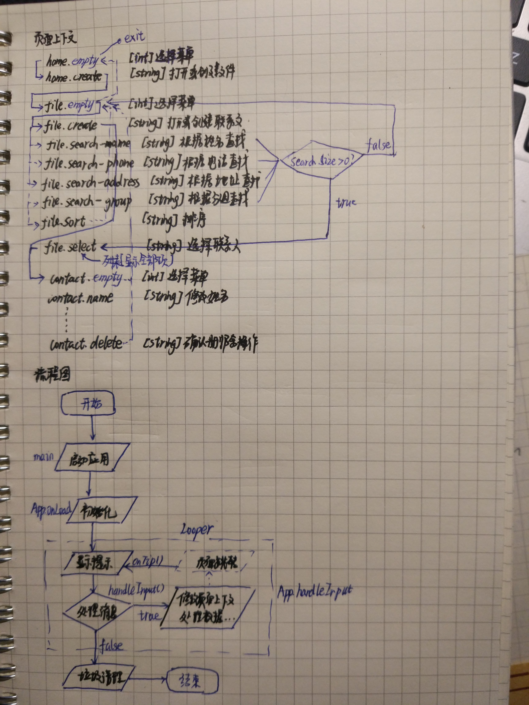
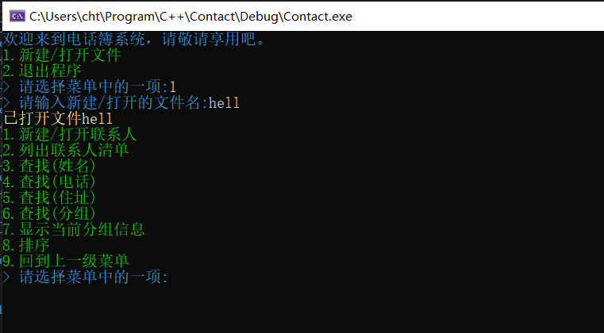
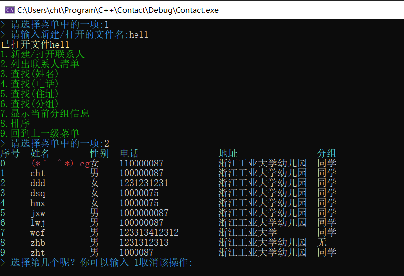
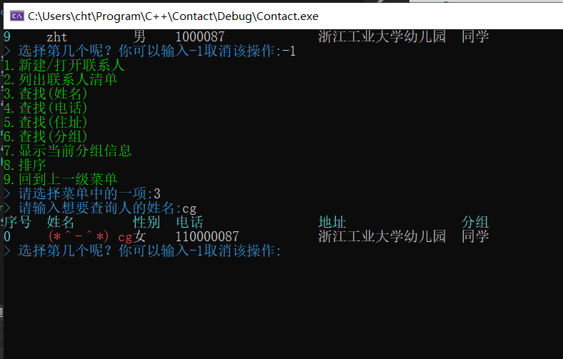
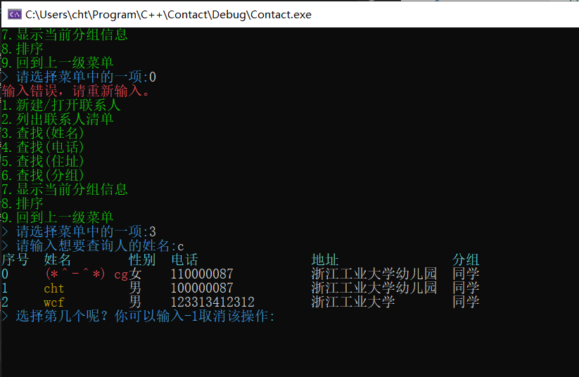
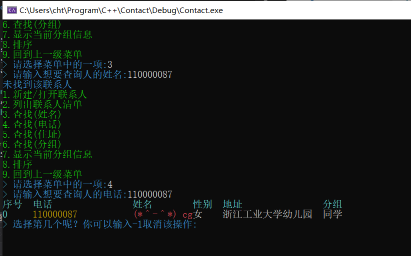
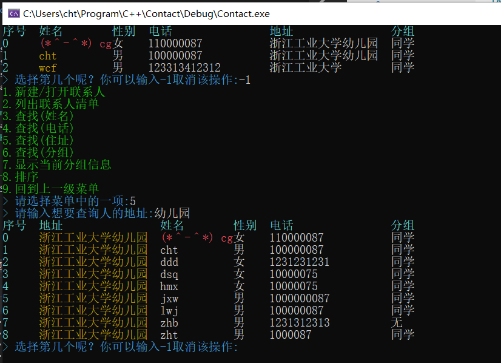
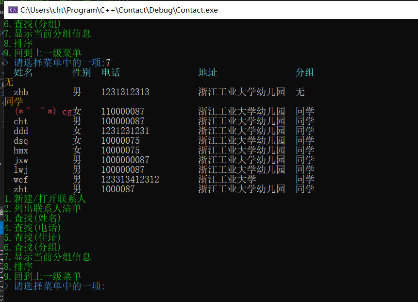
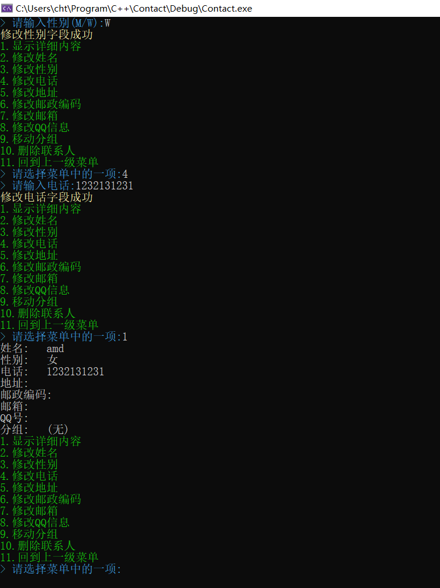

## 课程设计实验报告

### 一、大型实验的内容

通讯录管理系统(CMS：Contact Managerment System)用于进行通讯录的管理。主要功能包括联系人的添加，修改，删除，排序，显示等功能。并且可以实时将信息同步到磁盘文件。

### 二、运行环境

通讯录管理系统在最新的Visual Studio 2019平台下开发，操作系统为最新的Win10专业版。

硬件环境：
- 处理器: Intel(R) Core(TM) i5-8250U CPU @1.60Ghz 1.80Ghz
- 内存：8.00GB
- 系统类型：64位操作系统

### 三、实验课题分析

#### 3.1 主要功能

1. 能够以内存为载体进行联系人的添加，删除和修改。

> 在新建或者打开文件后，可以对联系人进行增删改查操作，并且可以在联系人视图下进行对字段的修改操作，联系人的姓名字段是唯一的。

2. 能够在联系人更改时，及时将其同步到文件。

> 当联系人的内容发生更改时，将会自动将其保存到对应的文件。

3. 支持按照姓名、电话、地址、分组查询联系人。

> 查找将会找出匹配的联系人，并给出查询的列表。

4. 支持按照分组类型显示联系人的内容。

> 先输出分组的信息，然后输出各个联系人的信息。

#### 3.2 系统分析和设计

系统涉及7个基本类，其中与存储有关的类1个(**Contact**)，与交互有关的类3个(**Context,AppBase,App**)，辅助类3个(**Log,Menu,consolecolor**)。

##### Contact

与存储有关的类为Contact，其定义为数据类，仅提供存储数据的基本操作，其字段声明如下。

| 字段 | 含义 | 备注 |
| --- | --- | --- | 
| name | 联系人的姓名 | 字段唯一 |
| sex | 性别 | M/W |
| phone | 电话 | |
| address | 地址 | |
| postCode | 邮政编码 | | 
| email | 邮箱 | |
| qq | QQ号 | |
| type | 分组信息 | |

##### AppBase

以面向对象模式设计的基础类，提供了对CUI输入和输出的封装。其关键函数和作用如下。

| 函数或字段名 | 备注 |
| --- | :--- |
| `Func:` run() | 启动应用程序，这个方法总是最先调用的 | 
| `Func:` handleInput() | 应用程序的核心方法，封装CUI的输入 |
| `Virtual Func:` onTip() | 纯虚函数，用于显示提示内容 |
| `Virtual Func:` onLoad() | 纯虚函数，用于初始化内容 |
| `Virtual Func:` onHandleInput(string) | 通过控制字符来实现和用户的交互 |
| `Func:` getContext() | 获取当前的上下文信息 |

##### Context

上下文信息，主要存储了当前的**页面上下文**，**文件和缓存信息**，从而辅助应用的交互，其关键函数和字段如下。

| 函数或字段名 | 备注 |
| --- | :--- |
| `Field:` menus   以及 getMenu(),getCurrentMenu() | 获取当前的菜单信息 |
| `Field:` page 以及 subpage | 当前的页面上下文 |
| `Field:` fileName | 当前打开的文件名 |
| `Field:` fileState | 文件状态，1表示文件已被更改;0表示文件未打开或者未更改 |
| `Func:` createFile(string),loadFile(string)以及saveFile() | 与外部文件的交互，用于初始化`contacts` | 
| `Field:` contacts | 数据缓存，保存当前所有的联系人信息 |
| `Field:` search | 查找的结果，从而提供查找的跟踪服务 |
| `Func:` searchContact(string) | 按照模式来查找联系人，并将结果写入`search` |
| `Func:` clearSearch | 清空查找的结果 |
| `Func:` sortContact(string) | 按照模式对联系人进行排序 | 

##### App

继承自`AppBase`，是CUI应用的一个具体实现方式，其主要通过和`Context`下字段`page`和`subpage`来进行导航和页面的交互。

##### Menu

菜单存储类。

##### Log

日志类，用于格式控制输出提示字符

##### consolecolor

用于控制文本输出的颜色的一个辅助类，其包括*consoleforecolor,consolecolorhelper,consolebackcolor,consolecolorjoin*四个类。

#### 3.3系统的实现

##### 类的编写

类的结构和注释均在源代码中给出，可以直接打开源代码查看，在这里就不单独列出了，因为没有必要。

##### 实现的相关技术

1. 使用了**MSQ**技术，通过一个函数进行消息的分发和处理，调用其子函数来实现具体的功能。

2. 使用了**监听器模式**，当一个事件引发时，其监听器将会监听到事件，并处理。

3. 使用了系统自带的`sort`函数，因为其第三个参数是一个函数指针，相当于一种比较器，这样就不用自己写函数了，而且排序兼容`vector`这种容器。

4. 使用`vector`容器类，可以摒弃`动态数组`操作的不方便性，也不用蠢蠢的自己设计链表，总之，有轮子总是要抄的（当然课题设计的核心部分还是应该自己来完成）。

5. 分页面模式，主页面**page**表示当前在那个域进行操作，目前为`home`,`file`,`contact`三个域，并提供了子页面**subpage**，用来提高交互的舒适度。

6. 用**字符串**代替`cin`，从而可以规避一部分错误的输入。

##### 增删改查的实现

`contacts`是一个保存`Contact*`的`vector`，这样做是为了让联系人的数据只保留一份，方便进行修改操作。

当你需要进行增加联系人，直接`push_back`就可以添加一条记录了。

删除稍微复杂些，需要用到`vector`节点的指针，需要用到`erase`函数，实际上也不难。

修改只需要把`Contact*`拿出来，单独放一个地方就可以。

排序可以交给`<algorithm>`库中的`sort`函数来实现，就是要稍微用一下**比较器**。

##### 交互的实现

交互的实现是基于**page**和**subpage**两个页面属性来实现的，从而方便打印菜单以及告诉程序接下来应该做什么，下面是整个交互系统的流程图表示。

四、实验调试、测试、运行记录及分析

整个实验基于良好的面向对象设计思路，编写程序非常的方便和快捷，虽然中途遇到了各种小bug，但经过多次的测试后，绝大多数的bug已经被消除。

#### 遇到的问题及解决方案如下

- 问题1：列出所有联系人后选择项时候出现错误

**问题描述**：列出所有联系人后，会发生学号和联系人并不能匹配的问题

**解决方法**：在退出查找后，需要清空查找的缓存，从而能够让程序直到当前正在选择的是所有的联系人。

- 问题2：删除联系人后输出导致内存无法读取的问题

**问题描述**：删除一个联系人后，虽然联系人的内存被回收了，但是指针还在，导致指针指向了不可访问的内存。

**解决方法**：删除联系后，在`contacts`中将其指针也删除掉就可以了。

- 问题3：体验的问题，虽然磁盘中已经有文件存在，但是还是新建了一个文件。

**问题描述**：因为新建文件的时候并没有判断文件是否存在，所以就产生了这个问题。

**解决方法**：判断一下就好了，所以最后将新建和打开文件合并了。

##### 交互截图

###### 打开文件

###### 列出联系人清单

###### 查找(姓名)

###### 查找(电话)

###### 查找(地址)

###### 显示当前分组信息

###### 创建联系人

五、实验总结

我设计的联系人管理系统交互性好，能够筛选大多数错误的输入，容错率高。而且使用了`vector`来管理对象具有稳定性高的特点。并且在显示方面通过**输出的颜色**带给用户美的感受，而且有**一个神奇的彩蛋哦**。

这次课程需求编写的代码前前后后用了差不多3天的事件，最主要的还是在和用户的交互上面花费的事件较多，而且因为编写代码的周期短，难免导致有较多的重复代码，一些关键的而且经常调优的代码没有进行专门的封装，所以这个系统的维护性并不是很高。

这次集合的操作是基于系统内置的`STL`类来操作，这告诉我一个道理，有些轮子能用就用，这时提高生产力的一种方法。而且编程是一个不断调优的过程，需要进行不断的调试。

六、附录：源代码