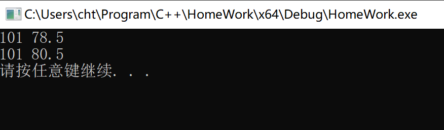
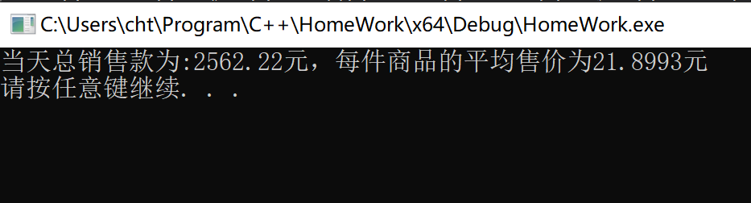
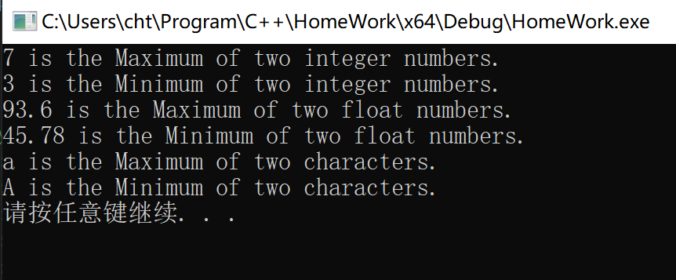
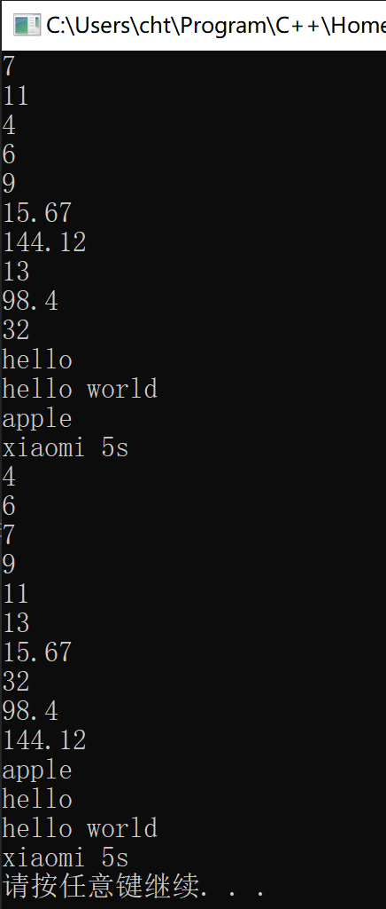
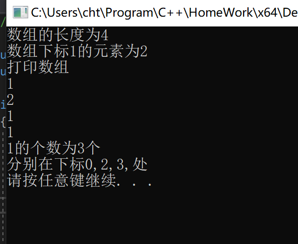
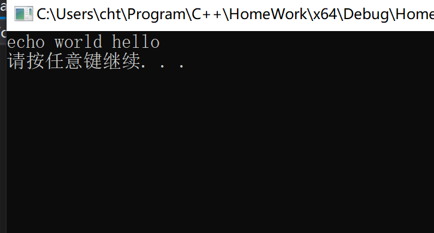

## 第四次实验报告

***

#### 实验题目(摘要)

1. 第9章课后题7。

2. 第9章课后题9。

3. 第9章课后题12。

4. 设计两个函数模板 `sort()` 和 `print()`。

5. 设计一个数组类模板Array。

6. 优化类Stack。

7. 解释`operator<<`为什么不能写成成员函数。

8. 解释有些运算符重载函数为什么只能写成成员函数。

***

#### 实验汇报

1. *第9章课后习题7*

    - 最初代码执行正常

    - 将`main`函数第2行改为`const Student`后，程序无法运行。

    - 可以将`display`函数用`const`来修饰，但是`change`函数需要修改成员，无法将其用`const`来修饰。

    - 其他的程序执行情况和预想的一样。例如`const Student * p`表示指针指向的对象不可以通过指针来修改。而`Student * const p`表示指针的指向不可修改。

2. *解释operator<<不能写成成员函数的原因*

    &emsp;&emsp;`operator<<`称为流操作运算符，其左操作符为`ostream&`对象，而`ostream&`是系统内置的对象，不可能在修改其源代码，如果设计成成员函数，则调用方式为`ostream&.operator(type other)`而这是不可能实现的，所以我们需要将其写成友元函数。

3. *解释有些运算符重载函数为什么只能写成成员函数*

    &emsp;&emsp;有些运算符系统具有默认的实现，当没有额外定义的成员函数时，系统会调用**缺省的函数**，如果设计成友元函数，则编译器将无法确定应该调用哪个函数。因为**友元函数**不属于成员，不能**重写**原来的函数。

***

#### 实验细节以及感受

1. *const类型的问题*

    > 这一问题在上次的实验报告中已经有过详细的描述，再次便简要补充几点。

    - **const成员的初始化**<br/> 
    
        &emsp;&emsp;const成员的初始化必须放在初始化表中进行，在代码主体中复制是不可以的。有一种特殊的成员`reference`也需要按照这种方式进行(因为实际上，引用是用常指针来存储的)。例如以下代码。

        *特别是在类模板中定义的时候，为了兼容引用类型，需要使用初始化表的方式来初始化成员。*

        该段代码能够正常编译

        ```cpp
        class Trait
        {
        public:
        #pragma region code
            Trait(int a,string b):a(a),b(b){}
        #pragma endregion
        private:
            const int a;
            const string b;
        };
        ```

        而该段代码则不能通过编译

        ```cpp
        class Trait
        {
        public:
        #pragma region code
            Trait(int a,string b)
            {
                this->a = a;
                this->b = b;
            }
        #pragma endregion
        private:
            const int a;
            const string b;
        };
        ```
    
    - **const&的问题**

        &emsp;&emsp;这里`const&`指的是常引用，其指向和内部数据都不能改变。这个在拷贝赋值的时候用到最多，所以将一些不需要修改成员的成员函数定义`const`是推荐的做法。 
    
    - **带const的类型转换问题**

        &emsp;&emsp;`非const`类型可以转换成`const`类型，但是反过来就不可以。

2. *在`include`中重定义的问题*

    &emsp;&emsp;在编写项目的时候，我经常会遇到**重定义**的问题，实际上，**重定义**是因为`#include`这个预命令导致的，在`#include`中，会产生文本替换的操作，类的实现可能*重复多次*。
    </br>&emsp;&emsp;
    例如在`Student.h`中类的声明和实现分离。在其他文件中多次`#include"Student.h"`则会发生**重定义**的异常。而解决的方式则是*分文件*。

3. *模板更加强大的功能*

    &emsp;&emsp;模板可以广义的认为是一种*安全的宏替换*，而且当只有生成特定的**模板类**时，编译器才会去检查类型的相关操作是否可以实现(除了明显的语法错误外)，所以，理论和实际上`T`不仅可以指定为`int,double,string...`还可以指定为`int*`,`int&`。因为实际上，指针和引用都是一种*实际的类型*。
    </br>&emsp;&emsp;
    这些是我最近发现的需要生成特定**模板类**才会去检查的语法。

    1. 函数重载

        &emsp;&emsp;假设函数`edic()`只有一个兼容`(int)`的版本，而在模板类中使用例如`edit(T value)`的函数，则当生成`T->int`的版本时，编译器并不会报错。`operator>>`和`operator<<`也是一样的道理。

    2. 类型转换

        &emsp;&emsp;当`T->basetype&`时，因为其**可能的成员**是一个引用，所以必须在初始化时使用*参数表*的方式去初始化，其他方式是不行的。

    &emsp;&emsp;除此之外，C++的**类模板**仅在语法层面具有一定的相似性。其生成的两个特定的**模板类**其实际意义可能是完全不一样的。因为对应的函数可能虽然*名字和参数表*一样，但是其对应的实现完全不同。

4. *引用类型和简单类型*

    &emsp;&emsp;C++默认的更多实现是关于*值的操作*，而一但其对象储存的数据量很大时，*拷贝*操作可能会耗费大量的时间，特别是*传参*的时候，所以，为了节省内存的开销，更多的时候我们采用*引用传参*的方式来提高程序的运行效率。而实际上*模板*也能生成对应的*T为引用的类*，这样就能够提高程序的运行效率，当然，要让模板兼容引用，需要考虑更多的细节。

5. *栈的实现*

    &emsp;&emsp;目前常用的栈的实现方式有三种，一种使用*链表*的方式来实现，另一种是用*动态数组*的方式来实现。其具体实现方式如下。
    
    - *链表：* 因为栈是后进先出的数据结构，所以在存储上只要知道*当前节点的内容*和*上一个节点的地址*便可以完成。

    - *动态数组：* 这种方式其实就是动态地管理内存空间，这种方式实现起来比较方便。

    - *map+定容数组：* `map`用来维护数组的指针，数组的容量按照某种函数来确定，这种实现和第二种有相似之处，但是效率更高一点。

    > 具体实现代码和解释请查看我`github上的一篇文章`。

***

#### 实验截图

1. 第9章课后习题7



2. 第9章课后习题9



3. 第9章课后习题12



4. 设计两个函数模板



5. 数组类模板Array



6. 优化类Stack

