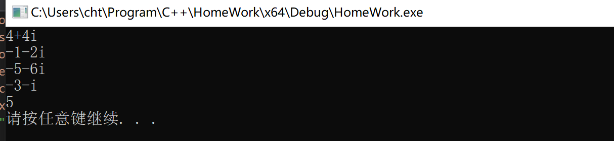
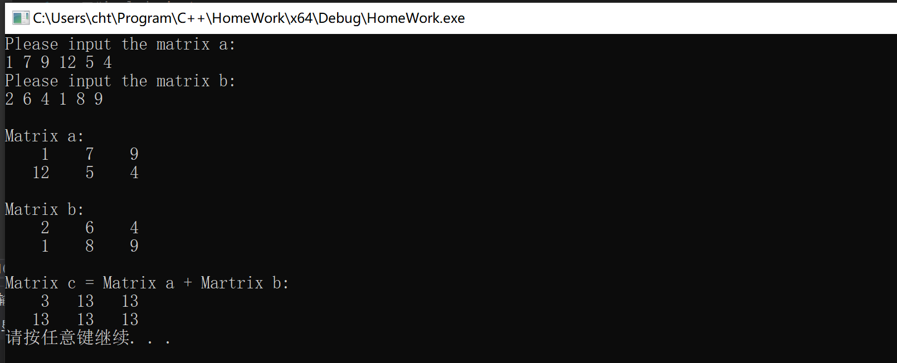
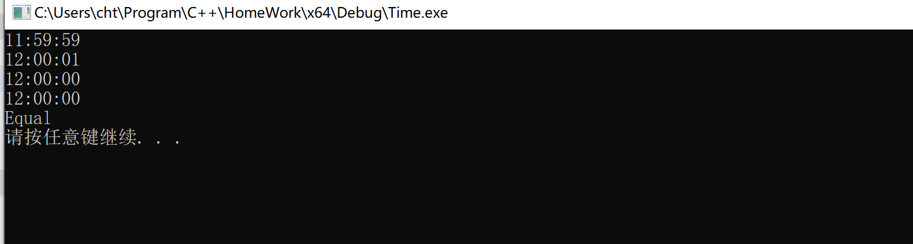
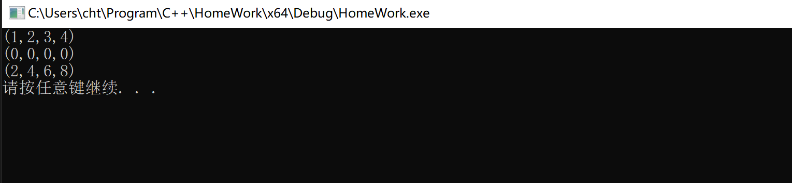

## 第五次实验报告

***

#### 实验题目(摘要)

1. 完成complex类，并重载流运算符和`+-*/`运算符。

2. 简单的matrix类并实现矩阵的相加和重载流运算符。

3. 完成简单的datetime类。

4. 完成vec类，用来表示向量。

> 第3题偷懒了一下，直接把原来的东西再改了当作交的东西。

#### 实验细节及感受

1. *结构域与修饰符*

    &emsp;&emsp;分文件下到底什么东西需要写，什么东西不需要写可能是一个比较麻烦的问题。现整理如下：

    - 一般的修饰符一般都只写在**声明**中，而不写在**实现**中。而且，有很多修饰符，只能写在**声明**中，而不能写在**实现**中，否则就会报错。例如`static`、`explicit`、`friend`、`inline`.

    - `friend`函数不属于任何类，它游离在类外，`friend`只能在类内定义时才能用，在实现部分不能用`friend`加以修饰，所以，友元函数的函数签名前不需要加**结构域限定符**。

    - `inline`是个很奇怪的东西，好像在`Visual Studio`中`inline`只能在同个文件中，而且`inline`只能在代码的实现部分才用，因为`inline`是不常用的语法，所以不补充。

    - **成员函数**在实现的部分需要加上*结构域*，指定是那个类型的成员函数。

2. *complex-浅谈类型转换和双目运算符*

    &emsp;&emsp;类型转换也是个令人头疼的东西，*在系统默认的转换中*，从低精度到高精度是非常自然的，而高精度到低精度则显得有些不自然，可能会损失一定的数据，所以，在系统的参数匹配中，总是先尝试从低精度到高精度的转换以实现参数的匹配。
    <br/>&emsp;&emsp;在这里详细介绍用户自定义类型转换。自定义类型转换主要有两种类型-*单参数构造函数*和*类型转换操作符*，在C++中，类型转换默认是隐式的。若要使其不要隐式的调用，则需要加上`explcit`修饰符

    > 为了防止*单参数*被当作类型转换而降低程序的可读性，通常用`explcit`来修饰单参数构造函数。

    &emsp;&emsp;所以，通过单参数构造函数能够完成`double -> complex`的隐式转换。
    <br/>&emsp;&emsp;其次在讲一下(*双目运算符*)中友元函数和成员函数的区别，其实最主要的是友元函数支持*两个参数*的类型转换，而成员函数只支持*第二个参数*的类型转换。两个版本有这种区别的主要原因是编译器的参数匹配的过程不一样。
    <br/>&emsp;&emsp;友元函数是独立的函数，其两个参数是并列的，其地位是等价的，则自然两个参数都可以通过类型转换来匹配。然而成员函数的匹配过程是先由**左操作元**来确定由谁来调用运算符，这样第一个参数就不能进行类型转换了，所以后期很多语言中，操作符都会统一定义成静态的，主要是很多操作符具有对称性。
    <br/>&emsp;&emsp;当然有时候，`+-*/`等运算符的两个参数并不一定是对称的，这主要用来完成特殊的操作，例如指针的位移，`point2`和`vector2`的相互计算。

3. *怎样才能更好地存储日期时间的信息*

    &emsp;&emsp;存储日期和时间基本上有两种方案(1) 按照`year.month.day...`(2)按照距离一个基准时间的`tick`来存储时间，而在实际应用中，通常采用第二种方案，主要考虑了以下几点

    - 与古老的技术兼容，主要是计算机中的计时器就是按照(2)来存储的。

    - 存储的空间相对较小点(请忽略这一点)

    - 计算两个时刻点的时间间隔要方便很多(实际上，如果计算两个日期之间的间隔的话，其实还是选定一个基准点要比直接推方便)

    &emsp;&emsp;当然，其`tick`和标准时间的转换函数的编写也是比较复杂的，如果不是运用在复杂的场合，还是直接推更粗暴一些。

4. *重载与拷贝有关的操作*

&emsp;&emsp;与拷贝有关的操作主要有两个，一个是`拷贝构造函数`，另外一个是`=`赋值运算符。我们要注意，变量初始化时的`=`调用的时`拷贝构造函数`，一般来说两者的功能应该保持一致。
<br/>&emsp;&emsp;`=`赋值运算符的结构如下，在这里返回类型`T&`主要是为了和`C++`的运算相统一，一般只在成员是指针而且希望`深拷贝`的使用才会去重载。
```cpp
T& operator=(const T& x)
```

#### 实验测试截图

1. complex



2. matrix



3. datetime



4. vector


