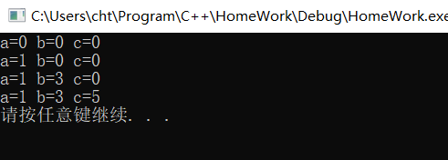
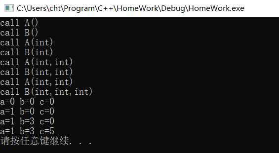
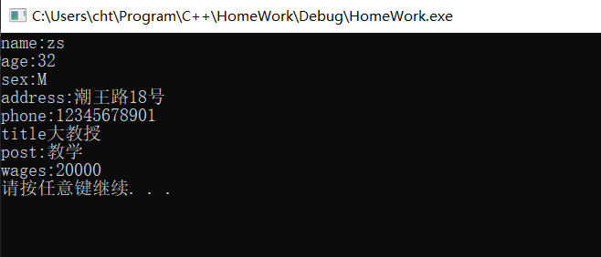
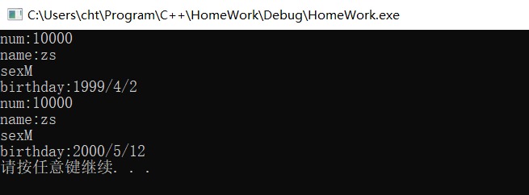
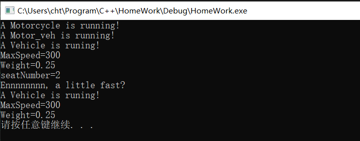
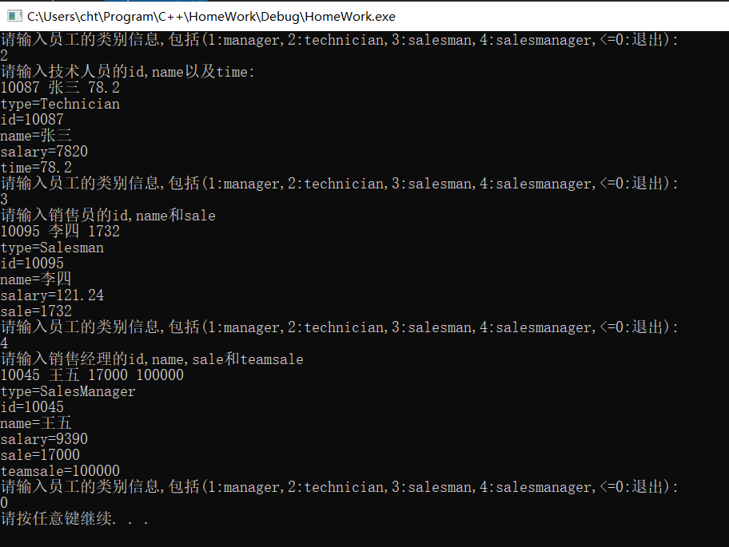

## 第六次实验报告

***

#### 实验题目(摘要)

1. 课后题5

2. 课后题7

3. 课后题9

4. 课后题10

5. 摩托车，自行车以及机动车之间的继承体系

6. 员工之间的继承体系

#### 答题环节

1. 课后题5

(1) 因为类B是从类A`public`继承下来的，所以`public`和`protected`的访问属性被保留。因为是从类外访问成员，所以可以用`b1.i`从派生类中访问基类的成员，而`b1.j`和`b1.k`则不可以。

(2) 都可以，因为通过`public`方式继承保留了`public`和`protected`的访问权限。

(3) `i,j`可以`k`不可以，理由同上，因为`k`在基类中属于`private`访问级别，所以除A类自己外，其他类都不能访问。

(4) 可以的有`i`，其他都不可以，理由同(1)。

(5) 可以的有`f1(),f3(),f4()`，其他的不可以，理由同(1)。

(6) 可以的有`f1(),f2(),f3()`，理由同(2)。

7. 课后题7

(1) 未经过上机测试得出结果应为：

```
 a=0 b=0 c=0
 a=1 b=0 c=0
 a=1 b=3 c=0
 a=1 b=3 c=5
```

(2) 上机测试后发现结果和(1)一致

(3 当调用构造函数时，先调用基类的构造函数，再调用派生类的构造函数，若派生类没有显示定义基类的构造函数，则调用*无参的构造函数*。所以4个对象构造函数的调用过程分别为：

```
B() <- A()
B(int) <- A(int)
B(int,int) <- A(int)
B(int,int,int) <- A(int,int)
```

#### 实验细节和感受

> 由于这部分实验比较简单，这里只将继承体系的逻辑。

1. 继承体系下数据的内存存储和访问机制

    a.派生类从基类中继承的成员属于`自己的成员`，但是其可以转化为`基类`的成员或者通过基类的`指针`或者`引用`来访问，可以用`域限定符`来确定访问的到底是哪个成员。

    ~~b.通过`typeid`可以获取一个对象的**真实类型信息**，但是通过*指针*访问`非虚成员`时，其访问由*指针*的**显式类型**所确定，但通过*指针*访问`虚成员`时，会定位到*指针*所指的对象的**真实类型**的成员。~~

    b. 通过`typeid`可以获取一个对象的**显式类型信息**，访问*虚成员时*，其为重定向到**真实对象的成员**，其编译器原理尚不明确。所以，就算使用`this`来访问`virtual`成员时，也会进行重定向。

    c. 通过**基类的类型信息**无法推断派生类的任何成员，所以，基类的`指针`或者`引用`无法访问派生类的任何成员(除了`虚成员`以外)。

    > 我们可以尝试用`type::call obj funname()`来说明其真实的调用，为演示方便，我们只使用最简单的继承方式类说明。以下为所用到的类代码

    ```cpp
    #file declare.h
    #include... 

	class EA
	{
	public:
		EA() :a(0) {}
		EA(int a) :a(a) {}
		int a;
		string getTypename() //#1
        {  
			return string(typeid(this).name());
		}

		void show()
		{
			cout << getTypename() << endl
				<< "call EA::show() a=" << a << endl;
		}
	};

	class EB:public EA
	{
	public:
		EB() :EA(),a(0) {}
		EB(int a) :EA(a),a(a) {}
		int a;
		string getTypename() //#2 
        {
			return string(typeid(this).name());
		}
		void show()
		{
			cout << getTypename() << endl
			 << "call EB::show() a=" << a << endl;
		}
	};

    #file main.cpp
    #include "declare.h"
    #include...

    int main()
    {
        EA ea(12);
	    EB eb(5);
	    EA* p = &ea;
	    p->show(); //1
	    p = &eb;
	    p->show(); //2
	    EB* pb = &eb;
	    pb->show(); //3

	    return 0;  
    }
    ```

    代码的输出为

    ```md
    class coln::EA *
    call EA::Show() a=12
    class coln::EA *
    call EA::Show() a=5
    class coln::EB *
    call EB::show() a=5
    ```

    其三个核心的调用语句为

    ```
    EA::call [EA]ea:a=12 fun show()
        EA::call [EA]this*:a=12 fun getTypename()
    EA::call [EB]eb:a=5 fun show()
        EA::call [EB]this*:a=5 fun getTypename()
    EB::call [EB]eb:a=5 fun show()
        EB::call [EB]this*:a=5 fun getTypename()
    ```

    这里主要出问题的是第2行，实际上我也说了，调用看的是`显式类型信息`，所以最后调用的是`EA::show()`以及`EA::getTypename()`，所以输出也能够进行解释了。

    若修改代码中的`getTypename()`为虚成员，修改如下

    ```md
    #move #1 
    string getTypename()
    #add #1 
    virtual string getTypename()
    #move #2
    string getTypename()
    #add #2
    virtual string getTypename() override
    ```

    代码的输出为
    ```md
    class coln::EA *
    call EA::Show() a=12
    #change
    class coln::EB *
    call EA::Show() a=5
    class coln::EB *
    call EB::show() a=5
    ```

    因为加了`virtual`关键词，其调用的过程就和原来的不一样了，实际上`this`也存放这真实的类型信息，编译器通过后期绑定类识别最终调用的成员，显然，这里第二次调用`show()`函数时，因为`getTypename()`已经标记为`virtual`，所以会重新定向到`EB::getTypename()`，从而实现了多态。

    d. 当派生类对象给`基类`赋值时，其会截断并生成一个副本，所以此时`虚函数`并没有任何用处，当派生类给`基类`的指针或者引用赋值时，其并没有进行拷贝的操作，若以这时候的`虚函数`是有意义的。

    还是看前面的例子(改成虚函数的版本)，然后把`main()`修改成如下的格式

    ```
    int main()
    {
        EA ea;
        EB eb(12);
        ea.show();
        eb.show();
        ea=eb;
        ea.show();

        return 0;        
    }
    ```

    代码的输出为
    
    ```md
    class coln::EA *
    call EA::show() a=0
    class coln::EB *
    call EB::show() a=12
    class coln::EA *
    call EA::show() a=12
    ```

    e.类的成员访问限定满足**同名覆盖原则**和**继承原则**，可以用下列图表示，注意，所有的成员都是`自己`的，虽然是通过`继承`获得的成员。

    ```
    # 在这里()表示被覆盖的标识符，[]表示可以通过缺省访问
    类EA
    ---[EA] int a
    类EB
    ---(EB<-)EA int a
    ---[EB] int a
    类EC
    ---(EC<-)(EB<-)EA int a //因为同名覆盖原则，EB标签失效
    ---(EC<-)EB int a
    ---[EC] int a
    ```

    ```
    类EA
    ---[EA] int a
    类EB
    ---EB<-EA int a
    类EC
    ---(EC<-)EB<-EA int a //没有同名覆盖原则，可以通过EA::或者EB::访问到同一个的成员
    ---[EC] int a
    ---

2. 继承体系下的虚问题

    继承体系中的**虚**主要指`虚基类`和`虚函数`，这两者从语义上都表明这个`虚`可能在真实情况下必不存在。

    a.虚基类一般在多重继承体系中会用到，考虑下列例子。

    ```cpp
    class A
    {
    public:
        A(int a):a(a){}
        int a;
    };

    class B:public virtual A
    {    
    public:
        B(int a,int b):A(a),b(b){}
        int b;
    };

    class C:public virtual A
    {
    public:
        C(int a,int c):A(a),c(c){}
        int c;    
    };

    class D:public virtual B,public virtual C
    {
    public:
        D(int a,int b,int c,int d):A(a),B(a,b),C(a,c),d(d){}
        int d;
    };

    ```

    一般来说，如果不声明虚继承，则*D类*会存有2份从*A类*继承来的东西，其中一份是通过*B类*继承下来的，而另一份是从*C类*继承下来的，但是一般自然的继承体制来说，我们希望只保存一份从*A类(间接)* 继承下来的东西。如果用`virtual`关键词来定义，则可以实现这样的效果。在上面的例子中，通过`虚继承`只创建了一份*A类*的对象，这份对象是通过*D类*来创建的，在*B类*和*C类*中并没有创建*A类*的对象，为了让编译器做到这一点，必须用初始化表的方式来初始化，这样才能编译器才能完成*忽略*的工作。即在*B类*中任何对*A类*成员的初始化都不应该在**函数体**中出现。

    b.虚函数与`override`

    `虚函数`一般用在继承体系中，用于实现多态，一般来说，虚函数都写来类继承体系的顶部，及时这在最初的几个基类中该函数可能没有任何意义。而为了方便进行**检查是否写对了以及便于阅读**，出了在顶部的*虚函数*外，继承中都应该使用`override`关键字来进行标识。这样的话如果**写错了或者基类没有同样函数签名的函数成员**，则编译器就会报错，从而减少因为误写而导致排查错误所导致的时间消耗，例如下列例子。

    ```cpp
    class A
    {
    public:
        virtual void display()
        {
            cout << "this is an obj of A" << endl;
        }
    };

    class B:public A
    {
    public:
        virtual void display() override
        {
            cout << "this is an obj of B" << endl;
        }

        # anothor version --a
        virtual void displaye() override //报错，因为函数名称写错了
        {
            ...
        }
        # end
        # another version --b
        virtual void display(int a) override //报错，因为函数参数表对不上
        {
            ...
        } 
        # end
    }
    ```

#### 测试截图

1. 课后题7第一次调试(未改写代码)



2. 课后题7第二次调试(改写代码)



3. 课后题9



4. 课后题10



5. 摩托车，自行车以及机动车之间的继承体系



6. 员工之间的继承体系

