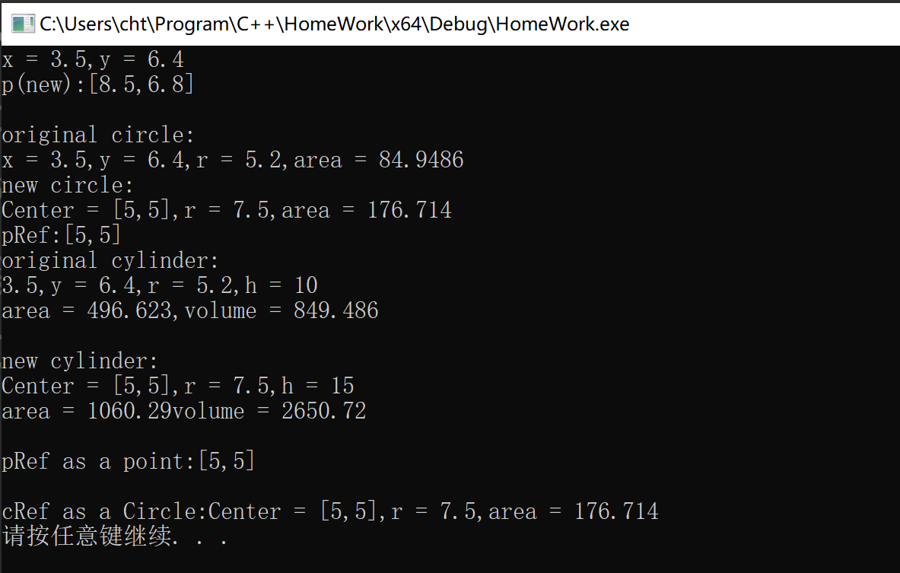
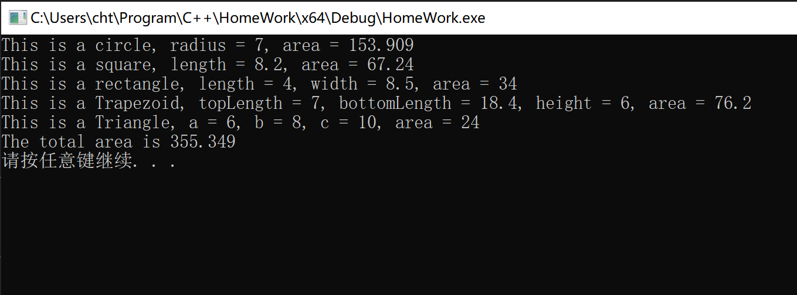
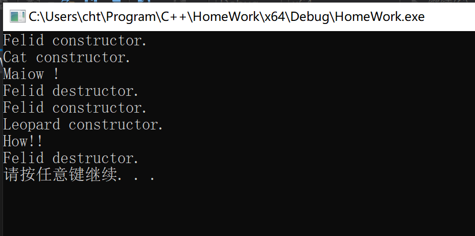
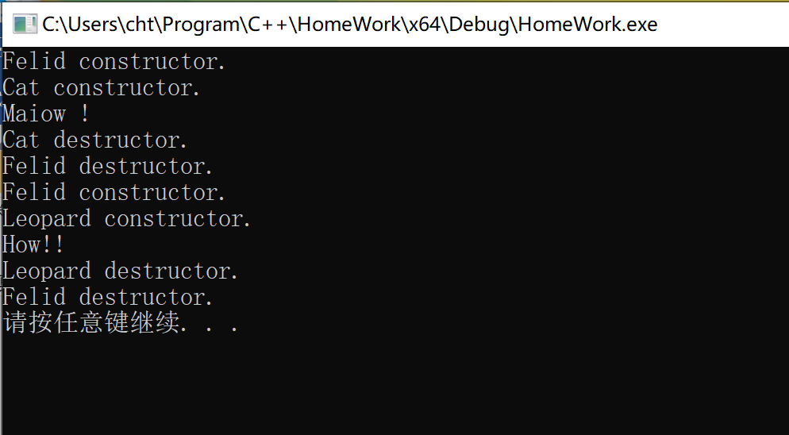
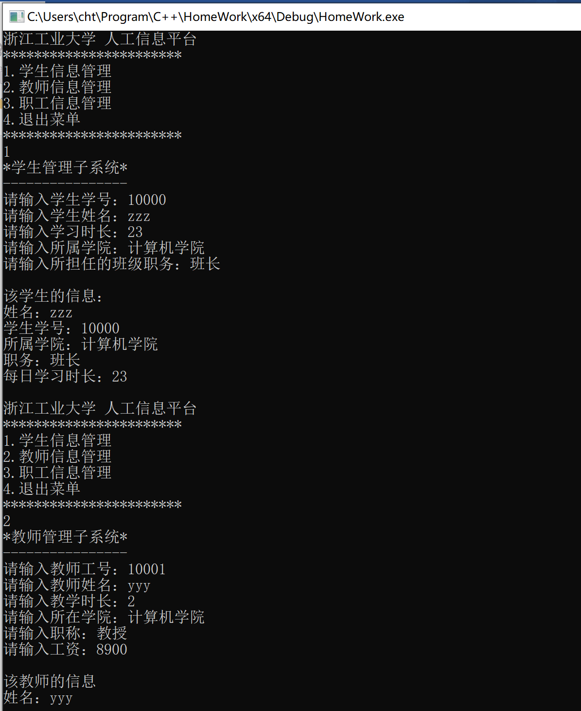

## 第七次实验报告

***

#### 实验题目(摘要)

1. 课后题1

2. 课后题5

3. 分析动物的代码

4. 交通工具类

5. 职工管理类

#### 答题环节

1. 课后题1

上机运行成功，运行截图如下：



2. 分析动物的代码

(1) 当**析构函数**没有设置为`virtual`时，`delete`操作时只调用了父类的撤销函数，并没有调用子类的撤销函数，说明再这种情况下，有一部分内存空间并没有得到释放，所以有部分内存泄漏，结果如预期所想。

(2) 当**析构函数**设置为`virtual`时（一般只需在顶级父类中声明即可），其调用的将会是真实对象的`destructor`，然后系统一级级地撤销父类的资源。这样就可以避免内存泄露的问题。

(3) 差别是加了`virtual`是使用`delete`会调用到真实对象的`destructor`，这样做的意义是正确清理所有的资源，防止内存泄漏，特别是涉及动态的资源时。

#### 实验细节和感受

1. 动态多态性

    (1) 动态多态性只能通过指针来实现（引用是基于指针来实现的）。因为如果一个变量并不是指针，则其一定不会指向其派生类的对象，这样就不会给动态多态发挥余地的机会。

    (2) 动态多态性的意义在于提高了类的可读性，能够将一系列相关的类通过某些函数上的联系组合在一起，提高类的设计效率。

    (3) 一般将继承体系中最上一级的基类的析构函数设计成虚函数，这样就能够让`delete`实现正确撤销，从而不会发生一部分内存仍没有释放的情况。

> 其他关于继承体制下的虚函数问题已在上个实验报告中指出，下面是能够验证上述观点的一个例子。

```cpp
#include<iostream>
using namespace std;

class EA 
{
public:
    int a;
    char b;
    long c;
};

class EB : public EA
{
public:
    int d;
};

int main()
{
    EA* pa = NULL;
    EA a;
    EB b;
    cout << "The location of var b is " << addressof(b) << " The size is " << sizeof(b) << " byte(s)" << endl;
    //addressof 相当于 &取地址运算符
    //将子类的对象(拷贝)赋值给父类对象（会丢失数据）
    a = b;
    cout << "The location of var a is " << addressof(a) << " The size is " << sizeof(a) << " byte(s)" << endl;
    //将b对象的地址赋给a，这叫做类型兼容，但是因为指针类型是EA*，所以通过该指针无法访问到EB的对象，但是其内存中的内容并没有变。
    pa = &b;
    cout << "The location of var is " << pa << " The size is " << sizeof(*pa) << " byte(s)" << endl;
    //静态强制转换(内存内容没有变)
    EB* pb = static_cast<EB*>(pa);
    cout << "The location of var is " << pb << " The size is " << sizeof(*pb) << " byte(s)" << endl;
    return 0;
}
```

```md
#运行结果
The location of var b is 000000AC6AD0F998 The size is 16 byte(s)
The location of var a is 000000AC6AD0F968 The size is 12 byte(s)
The location of var is 000000AC6AD0F998 The size is 12 byte(s)
The location of var is 000000AC6AD0F998 The size is 16 byte(s)
```

#### 运行截图

1. 课后题1


2. 课后题5



3. 分析动物的代码（优化前）



4. 分析动物的代码(优化后)



5. 交通工具类


6. 职工管理类

