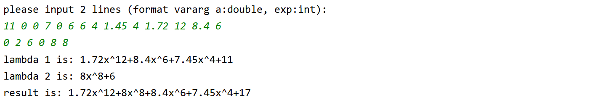

# 第四次实验报告

## 实验题目

用list迭代器实现多项式的合并

## 实验过程

1. 输入的处理，起初使用解析表达式的方法(例如输入为11x^0+0x^7+4)，但发现操作过于复杂，改为使用vararg*的方式进行赋值

2. 对输入表达式的调整，包括排序和合并。先使用`stl::sort()`使表达式从大到小排列，在使用`append`方法合并同类项。

3. 输出表达式的处理，使用单元分割的方法进行输出。

4. 合并表达式的函数`join`，使用了归并排序的方法进行表达式的合并。并使用了`range_for`。

## 效果截图



## 代码

```cpp
#include <iostream>
#include <string>
#include <sstream>
#include <list>

using namespace std;

/**
 * 一个单项式
 */
class math_one{
public:
    math_one(): a(0.0),exp(0){}
    math_one(double a, int exp): a(a),exp(exp){}
    double a;
    int exp;

    friend ostream&operator << (ostream& oStream, math_one& value){
        oStream << value.a;
        if(value .exp >= 1){
            oStream << 'x';
        }
        if(value.exp >= 2){
            oStream << '^' << value.exp;
        }
        return oStream;
    }
};

void print(list<math_one*>* l){
    if(l->empty()){
        cout << '0';
    } else {
        for(auto v: *l){
            if(v->a > 0 && v!= *l->begin()){
                cout << '+';
            }
            cout << *v;
        }
    }

    cout << endl;
}

bool compare(math_one* first, math_one* second){
    return (first->exp > second->exp);
}

void append(list<math_one*>* l, math_one* e){
    int b_exp = -1;

    if(!l->empty()){
        b_exp = l->back()->exp;
    }
    if(e->a == 0){

    } else if(b_exp == e->exp){
        l->back()->a+= e->a;
    } else {
        l->push_back(e);
    }
}

list<math_one*>* format(list<math_one*>* l){
    auto nl = new list<math_one*>(*l);
    nl->sort(compare);
    //cout << "r"; print(nl);
    l->clear();
//    int b_exp = -1;
    for(auto v: *nl){
        append(l, v);
//        if(v->a == 0){
//
//        } else if(v->exp == b_exp){
//            l->back()->a+= v->a;
//        } else {
//            l->push_back(v);
//            b_exp = v->exp;
//        }
    }
    //*l = *nl;

    return l;
}

list<math_one*>* join(list<math_one*>* a, list<math_one*>* b){
    auto l = new list<math_one*>();
    auto p = b->begin();
    for(auto v: *a){
        while(p!= b->end() && compare(*p,v)){
            append(l,*p);
            //l->push_back(*p);
            ++p;
        }
        append(l, v);
        //l->push_back(v);
    }

    while(p != b->end()){
        append(l,*p);
        //l->push_back(*p);
        ++p;
    }
    return format(l);
}

list<math_one*> * parse(const string& input){
    auto l = new list<math_one*>;
    double a; int exp;
    istringstream iStrStream = istringstream(input);
    while(!iStrStream.eof() && iStrStream >> a && iStrStream >> exp){
        l->push_back(new math_one(a, exp));
    }

    return l;
}

int main(){
    cout << "please input 2 lines (format vararg a:double, exp:int): " << endl;
    string inputA, inputB;
    getline(cin,inputA);
    getline(cin,inputB);
    list<math_one*> *first, *second, *sub;
    cout << "lambda 1 is: ";
    first = format(parse(inputA));
    print(first);
    cout << "lambda 2 is: ";
    second = format(parse(inputB));
    print(second);

    sub = join(first, second);
    cout << "result is: ";
    print(sub);

    delete first;
    delete second;
    delete sub;

    return 0;
}
```