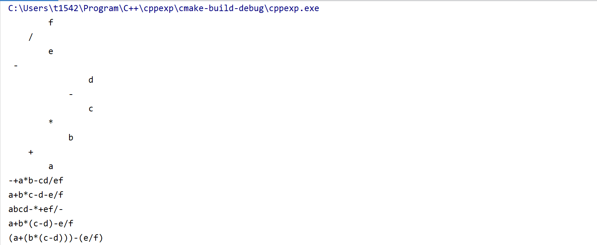

# 第六次实验报告

## 实验题目

通过一个表达式(中缀或后缀形式)构造一棵表达式树，并进行前序遍历、中序遍历输出

## 实验过程

1. 通过后缀表达式，使用`stack`容器辅助实现后缀表达式转化成表达式树的功能。

2. 支持输出中缀表达式，并兼容符号的优先级和结合性。

3. 目前只考虑`+-*/`四种运算。

## 效果截图



其中，第1部分为横向打印二叉树。第2-4部分为前序、中序、后序遍历输出。第5-6部分为中缀表达式输出。

## 代码

main.cpp

```cpp
#include <iostream>
#include "tree.h"
#include <sstream>

using namespace std;
int main() {
    auto expression = bnode_fac::build_with_suffix("abcd-*+ef/-");
    bnode_fac::l_print(expression);

    bnode_fac::print_pre_order(expression, "");
    cout << endl;
    bnode_fac::print_mid_order(expression, "");
    cout << endl;
    bnode_fac::print_post_order(expression, "");
    cout << endl;
    bnode_fac::print_mid_expression(expression);
    cout << endl;
    bnode_fac::print_full_mid_expression(expression);
    cout << endl;

    bnode_fac::clear(expression);
    return 0;
}
```

tree.h

```cpp
//
// Created by cht on 2019/12/18.
//
#pragma once
#include <iostream>
#include <string>
#include <sstream>
#include <vector>
#include <stack>
#include <iomanip>
#include <map>

using namespace std;

template <typename T>
class bnode{
public:
    explicit bnode(T value):value(value), left(nullptr), right(nullptr){}
    explicit bnode(T value, bnode<T>* left, bnode<T>* right):value(value),left(left),right(right){}
    T value;
    bnode<T>* left;
    bnode<T>* right;
};

class bnode_fac{
public:
    /**
     * special method.
     * 使用后缀表达式构造一棵二叉树
     * @param expression
     * @return
     */
    static bnode<char>* build_with_suffix(const string& expression){

        //cout << expression;
        string operators = "+-*/";
        stack<bnode<char>*> w;
        for (char c: expression){
            if(operators.find(c)!=string::npos){
                auto first = w.top();
                w.pop();
                auto second = w.top();
                w.pop();
                w.push(new bnode<char>(c,second,first));
            } else {
                w.push(new bnode<char>(c));
            }
        }
        return w.top();
    }

    /**
     * special method
     * 打印友好的中缀表达式，满足符号的有限顺序和结合律。
     * @param node
     */
    static void print_mid_expression(bnode<char>* node){
        string ops = "+-*/";
        map<char,int> opa = {{'+',1},{'-',1},{'*',2},{'/',2}};
        if(node == nullptr)
            return;
        if(ops.find(node->value)!= string::npos){
            char c = node->value;
            char left = node->left->value;
            char right = node->right->value;

            if(ops.find(left)!=string::npos && opa[left] < opa[c]){
                cout << "(";
                print_mid_expression(node->left);
                cout << ")";
            } else {
                print_mid_expression(node->left);
            }

            cout << c;

            if(ops.find(right)!=string::npos && opa[right] <= opa[c]){ //相同符号左结合，所以也要加括号
                cout << "(";
                print_mid_expression(node->right);
                cout << ")";
            } else {
                print_mid_expression(node->right);
            }
        } else {
            cout << node->value;
        }
    }

    /**
     * 打印清晰的中缀表达式，全部加括号。
     * @param node
     */
    static void print_full_mid_expression(bnode<char>* node){
        string ops = "+-*/";
        if(node == nullptr)
            return;
        if(ops.find(node->value)!= string::npos){
            char c = node->value;
            char left = node->left->value;
            char right = node->right->value;

            if(ops.find(left)!=string::npos){
                cout << "(";
                print_full_mid_expression(node->left);
                cout << ")";
            } else {
                print_full_mid_expression(node->left);
            }

            cout << c;

            if(ops.find(right)!=string::npos){
                cout << "(";
                print_full_mid_expression(node->right);
                cout << ")";
            } else {
                print_full_mid_expression(node->right);
            }
        } else {
            cout << node->value;
        }
    }

    template <typename T>
    static void print_pre_order(bnode<T>* node, const string& separator = ""){
        if(node == nullptr)
            return;
        cout << node->value << separator;
        print_pre_order(node->left, separator);
        print_pre_order(node->right, separator);
    }

    template <typename T>
    static void print_mid_order(bnode<T>* node, const string& separator = ""){
        if(node == nullptr)
            return;
        print_mid_order(node->left, separator);
        cout << node->value << separator;
        print_mid_order(node->right, separator);
    }

    template <typename T>
    static void print_post_order(bnode<T>* node, const string& separator = ""){
        if(node == nullptr)
            return;
        print_post_order(node->left, separator);
        print_post_order(node->right, separator);
        cout << node->value << separator;
    }

    /**
     * 横向打印
     * @tparam T
     * @param node
     * @param start
     * @param spacing
     */
    template <typename T>
    static void l_print(bnode<T>* node, int start = 0, int spacing = 4){
        if(node == nullptr){
            return;
        }

        l_print(node->right, start + spacing, spacing);

        cout << setw(start) << " ";
        cout << node->value << endl;
        l_print(node->left,start + spacing, spacing);
    }

    /**
    * 内部函数:删除所有的节点
    * @param node
    */
    template <typename T>
    static void clear(bnode<T>*& node){
        if(node == nullptr){
            return;
        }
        clear(node->left);
        clear(node->right);

        delete node;
        node = nullptr;
    }
};
```