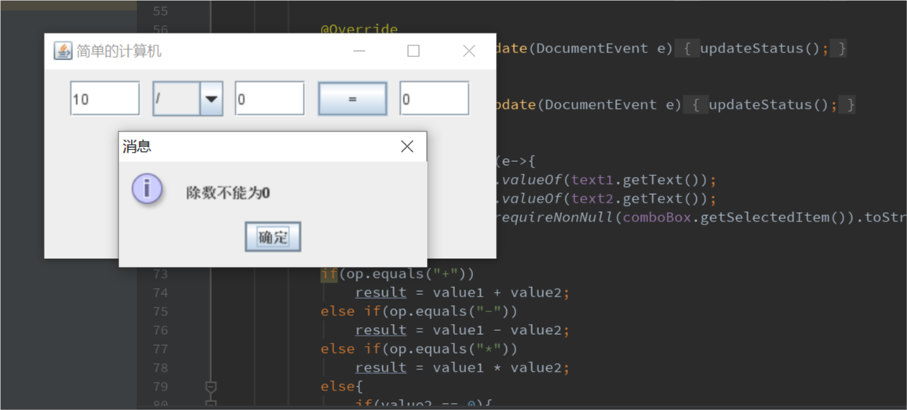

# 第7次实验报告

## 实验题目

1. 完成一个简单的计算机程序

## 实验过程

通过此次实验熟悉了JFrame,JPanel以及布局的概念。此次实验使用的主要布局为FlowLayout，除此之外，还有GridLayout,BorderLayout,GridBagLayout。

还使用了JTextField.getDocument()的监听器实现输入的检查判断。

```java
private void updateStatus(){
        if(isDigit(text1.getText()) && isDigit(text2.getText())){
            button.setEnabled(true);
        } else {
            button.setEnabled(false);
        }
    }
```

```csharp
public class Program
{
    public static void main(string[] args)
    {
        Console.WriteLine("123");
    }
}
```

实验截图

