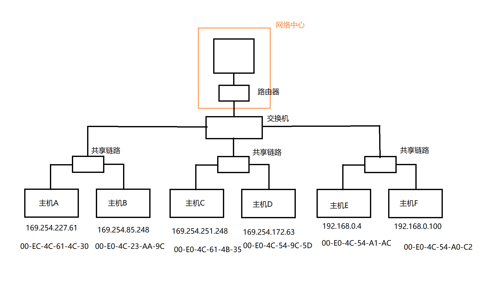
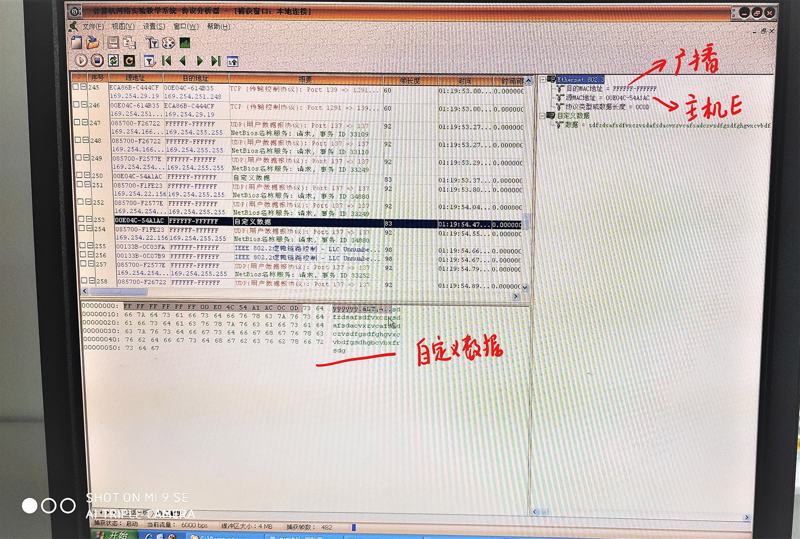
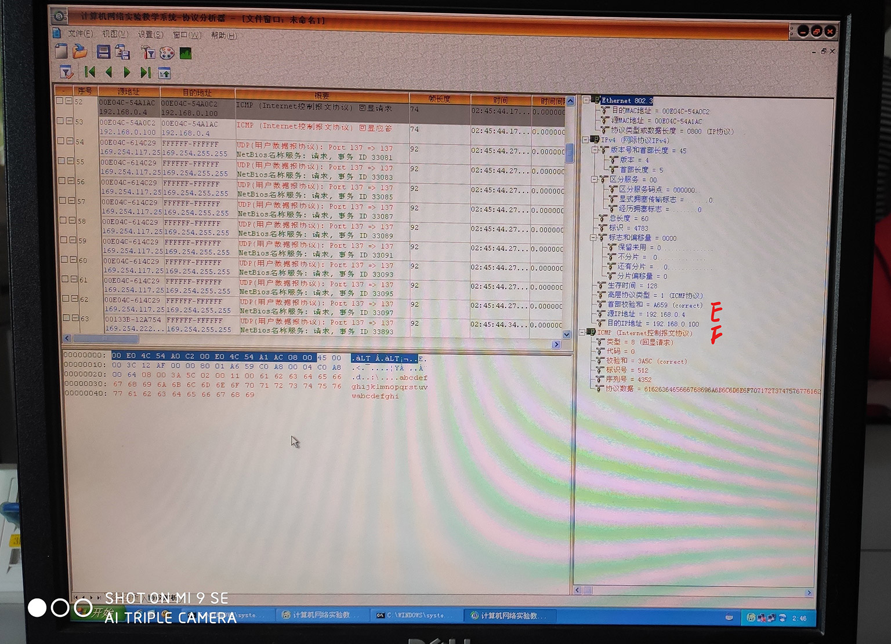

# 实验一 以太网数据帧的构成

## 实验目的

1. 掌握以太网的报文格式
2. 掌握MAC地址的作用
3. 掌握MAC广播地址的作用
4. 掌握仿真编辑器和协议分析器的使用方法

## 实验环境配置

采用网络结构一

## 实验原理

### 两种不同的MAC帧格式

常用的以太网MAC帧格式有两种标准，一种是DIX Ethernet V2标准；另一种是IEEE的802.3标准。 目前MAC帧最常用的是以太网V2的格式。下图画出了两种不同的MAC帧格式。

### MAC层的硬件地址

1. 在局域网中，硬件地址又称物理地址或MAC地址，它是数据帧在MAC层传输的一个非常重要的标识符。 
2. 网卡从网络上收到一个 MAC 帧后，首先检查其MAC 地址，如果是发往本站的帧就收下；否则就将此帧丢弃。这里“发往本站的帧”包括以下三种帧：

- 单播(unicast)帧（一对一），即一个站点发送给另一个站点的帧。
- 广播(broadcast)帧（一对全体），即发送给所有站点的帧(全1地址)。
- 多播(multicast)帧（一对多），即发送给一部分站点的帧。 

## 实验步骤

按照拓扑结构图连接网络，使用拓扑验证检查连接的正确性。

### 练习一：编辑并发送MAC广播帧

1. 主机E启动仿真编辑器。 
2. 主机E编辑一个MAC帧，
目的MAC地址：FFFFFF-FFFFFF。
源MAC地址：主机E的MAC地址。
协议类型或数据长度：大于0x0600。
数据字段：编辑长度在46—1500字节之间的数据。 
3. 主机A、B、C、D、F启动协议分析器，打开捕获窗口进行数据捕获并设置过滤条件（源MAC地址为主机E的MAC地址）。 
4. 主机E发送已编辑好的数据帧。 
5. 主机A、B、C、D、F上停止捕获数据，察看捕获到的数据中是否含有主机E所发送的数据帧。 

- 结合练习二的实验结果，简述FFFFFF-FFFFFF作为目的MAC地址的作用。

发现A、B、C、D、F均受到了来自E发送的MAC帧，说明`FF-FF-FF-FF-FF-FF`是一个全局广播地址。此地址将不会被交换机过滤。

### 练习二：领略真实的MAC帧

本练习将主机A和B作为一组，主机C和D作为一组，主机E和F作为一组。现仅以主机A和B为例，说明实验步骤。 

1. 主机B启动协议分析器，新建捕获窗口进行数据捕获并设置过滤条件（提取ICMP协议）。 
2. 主机A ping主机B；察看主机B协议分析器捕获的数据包，分析MAC帧格式。 
3. 将主机B的过滤器恢复为默认状态。 
4.	将主机B、D、F的过滤器恢复为默认状态。

定义我们组为E和F两台主机，我们发现E向F发送4次ping请求后。E和F均侦听到了ICMP数据报。且MAC帧中封装了IP和ICMP数据报。

### 练习三：理解MAC地址的作用

1. 主机B、D、E、F启动协议分析器，打开捕获窗口进行数据捕获并设置过滤条件（源MAC地址为主机A的MAC地址）。 
2. 主机A ping 主机C。 
3. 主机B、D、E、F上停止捕获数据，在捕获的数据中查找主机A所发送的数据帧，并分析该帧内容。 
记录实验结果: 

|  | 本机MAC地址 | 报文源MAC地址 | 报文目的MAC地址 | 是否收到?为什么 |
| --- | --- | --- | -- | --- |
| 主机B | 00-E0-4C-23-AA-9C | 00-EC-4C-23-AA-9C | 00-E0-4C-61-4B-35 | 收到，B位于A、B共享链路内，所以B能够收到从A发出的信号 |
| 主机D | 00-E0-4C-54-9C-5D | 00-EC-4C-23-AA-9C| 00-E0-4C-61-4B-35 | 收到，虽然不是MAC地址，但其位于C、D共享链路内，给C的数据报也被D的网卡接受到了 |
| 主机E | 00-E0-4C-54-A1-AC | 00-EC-4C-23-AA-9C | 00-E0-4C-61-4B-35 | 未收到，目的MAC地址位于C、D共享链路组内，数据报被交换机拦截 |
| 主机F | 00-E0-4C-54-A0-C2  | 00-EC-4C-23-AA-9C | 00-E0-4C-61-4B-35 | 未收到，同上 |  

## 思考问题

1. 为什么IEEE802标准将数据链路层分割为MAC子层和LLC子层？

MAC子层主要用于直接和物理层进行对接，其封装了数据链路层确定链路最核心的细节，将实现细节向上级(网络层)隐藏。同时，LLC基于MAC协议实现逻辑链路控制(LCP)和网络控制(NCP)，向上级提供了接口，实现必要的网络连接所需要的功能。使用分层理论将问题划分为两个不同的部分，便于实现。

2. 为什么以太网有最短帧长度的要求？ 

以太网是一种共享网络，其冲突检测基于CSMA/CD。其理想的信道利用率为

$$U =\frac{T_{0}}{T_{0}+\tau}$$

$\tau$为传播时延，$T_{0}$为数据发送的时间，因此，$\tau$应小一些，所以其限制了局域网的最远端接距离。而$T_{0}$为数据发送时间，基于此公式$T_{0}$不应该太小，且$T_{0}$应该不小于$\tau$，这样才能确定是否发生了冲突，所以定义以太网帧的最短帧为10Mbps带宽下$\tau$时间内发送的数据量，一般为64bit。

## 实验体会

1. ARP地址解析是从IP地址解析到MAC地址的一种协议。源IP发送IP数据报时，需要先发送广播ARP并找到目标的MAC地址，并将目标地址封装到以太网帧。

2. MAC地址有48bit，其中第8个比特为0的为单播地址，为1的为多播地址，全为1(即为`FF-FF-FF-FF-FF-FF`)为广播地址。广播在ARP的地址协议中就经常用到。

3. ICMP(Internet控制报文协议)是IP协议的一个组成部分，主要为判断网络的连接状况提供协议支持。

4. 共享链路(集线器)相当于一条共享网络，不具有识别和筛选MAC地址的作用。而交换机是运行在数据链路层上的设备，其可以识别MAC的源地址和目标地址，从而做到正确的向正确的网络接口转发数据。从此可以看到，使用交换机可以减少数据碰撞的可能，从而提高数据传输的效率。