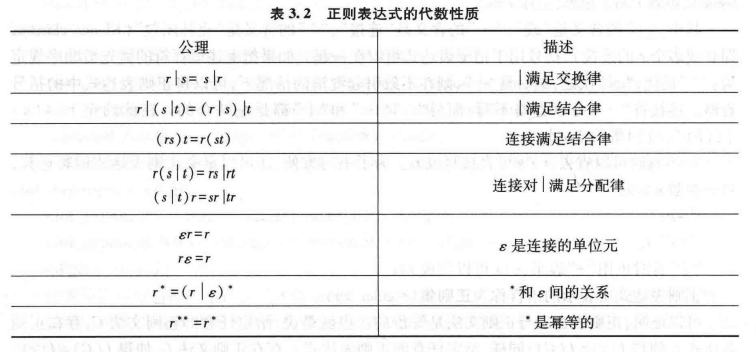

# 词法分析

## 词法分析器的功能

词法分析器将字符串分析生成token串（流）。

### 单词的分类与表示

关键字、标识符、常数、运算符、分界符

### 词法分析器的输出

对于标识符和常数，它们的属性值通常可以按如下两种方式来指定。

1. 用标识符本身的“值”表示
2. 用指针表示
   
### 源程序的输入缓冲与预处理

1. 超前搜索和回退
2. 缓冲区 包括双缓冲区和带标记的缓冲区。
3. 空白字符的剔除

### 词法分析阶段的错误处理

1. 非法字符检查
2. 关键字拼写错误检查
3. 不封闭错误检查
4. 重复说明检查
5. 错误恢复和续编译

## 单词的描述

### 正则文法

### **正则表达式**

**正则表达式的代数性质**

1. 正闭包

$$
r^*=r^+|\varepsilon\\
r^+=r^*r=rr^*
$$

2. 0或1个

$$
r? = r|\varepsilon
$$

3. 字符类

$$
[a-z]=a|b|\cdots|z
$$

### 正则表达式与正则文法的等价性

#### 根据正则文法构造等价的正则表达式

1. 根据正则文法G构造正则表达式联立方程组。
2. 解联立方程组，求等价的正则表达式$r$