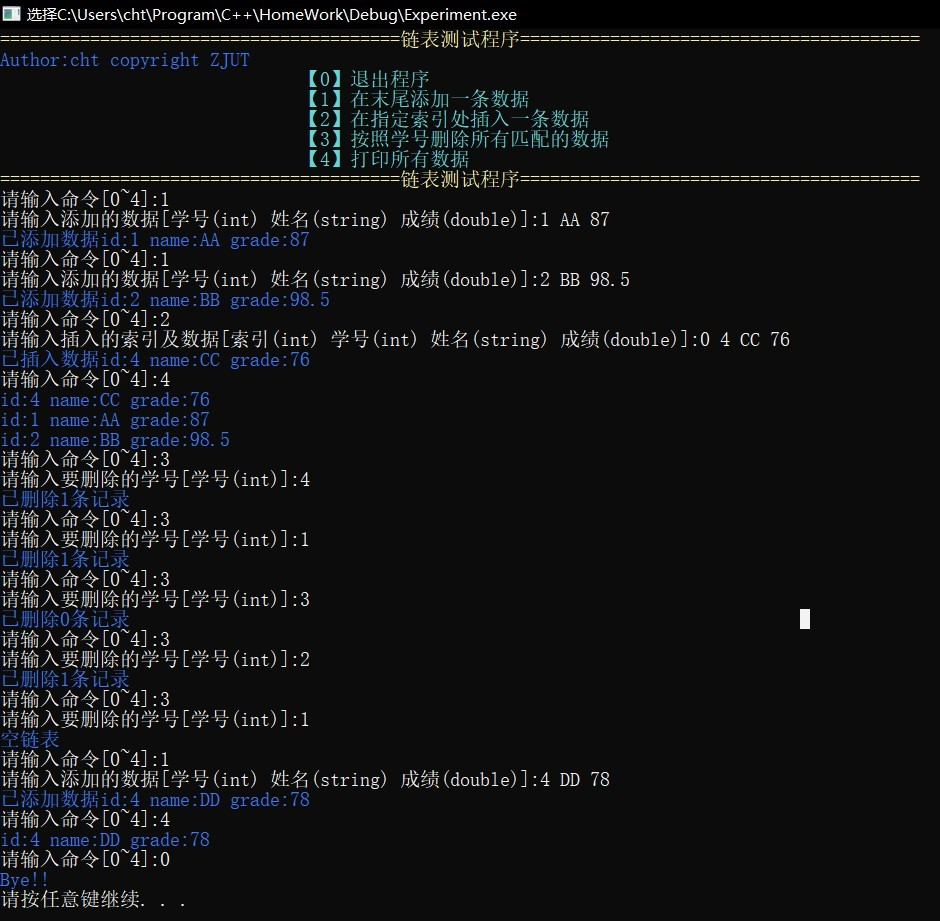
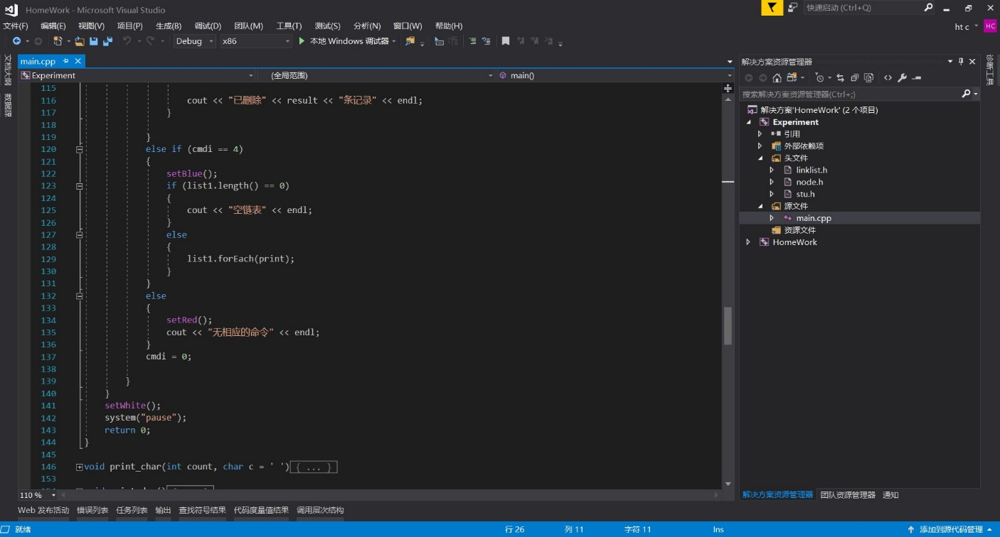

## 第一次实验报告

***

### 设计构思

- 链表采用一个模板类linklist来维护每个节点node。并在linklist储存first节点以及last节点以便于添加的操作。
- 基于C++没有引用类型的概念，在node中采用指针来存储数据，以减少内存的占用量。
- 利用C++中函数指针的特性，便于进行迭代操作。

### 已解决的问题

- 关于变量生命周期的问题
stu *p = new stu();
stu p = *new stu();
两种变量定义方式变量的生命周期不同，前者只有指针被销毁，后者整个变量(内存空间)被销毁。

### 无法解决的问题

- cin流输入错误信息导致的问题，当输入错误的信息时，会出现死循环的问题，而且使用cin.clear()和cin.sync()都无法解决这个问题。

### 程序运行截图

### 程序可以实现的功能

按照用户的需求操作一个链表，包括添加一条记录，删除一条记录，插入一条记录，打印所有记录的功能。

### 额外说明

- 模板类分文件会导致程序不能运行（链接出现异常）的问题，查阅资料后，发现并没有较好的分文件的方法。（实际上，stl的模板库也是把实现直接写在.h文件里的）
- 友元函数（主要时重载cin和cout）也会出现类似于①的问题，导致程序能找到声明但是找不到定义的问题。

### 代码编辑界面

### 总结

- C++的内存管理和变量的生命周期是一个比较头疼的问题，C++很容易出现要调用的变量已经销毁的问题，而且动态分配内存空间要考虑到内存泄漏的问题。 当然，例如Java,C#这些语言则不需要考虑这些问题，GC会管理内存空间。当然相对来说与内存的直接交互能力就会稍微差一些。

- C++中没有Lambda表达式，表示不习惯。

### 后续优化

- 添加了添加多条数据的功能
- 修复了输入错误数据导致程序崩溃的bug。
