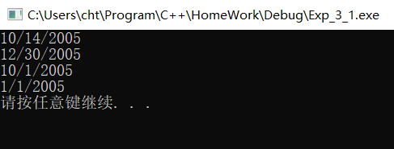
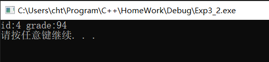
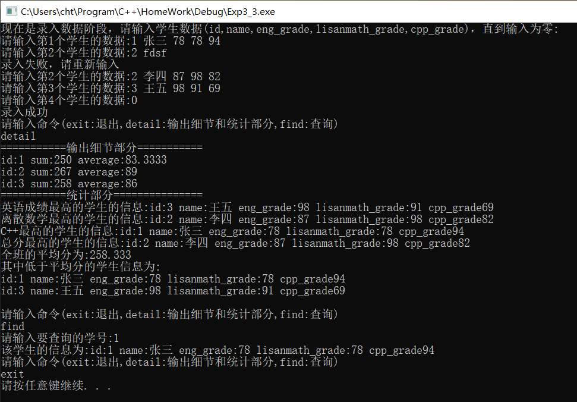
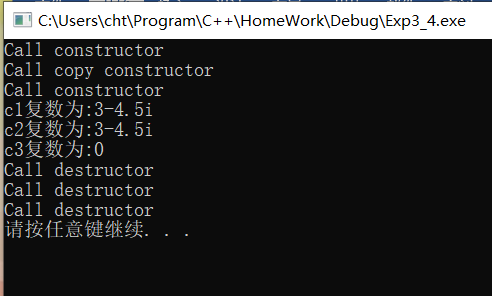
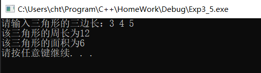
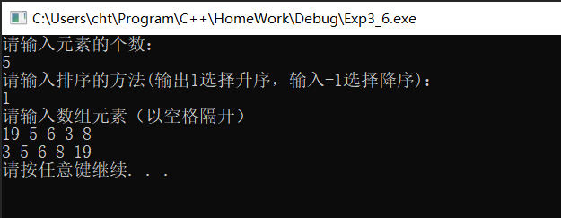

## 实验3：类和对象（一）

***

### 一、实验内容：

1. 第9章课后题3。
2. 第9章课后题5。
3. 关于学生类的操作。
4. 关于复数类的操作。
5. 关于三角形类的操作。
6. 整数型排序类。
7. 关于const类型的整理。

### 二：实验细节：

1. （题1）关于分文件下构造器的默认参数的问题

    情况1：

    ```cpp
    @attach (“Date.h”)
    class Date
    {
    public:
        Date(int m,int d,int y);
    };
    @attach(“Date.cpp”)
    Date::Date(int m=1,int d=1,int y=2015):month(m),day(d),year(y)
    {
    }
    @attach(“main.cpp”)
    Date d1(10,14,2005);
    Date d2(12,30);
    Date d3(10);
    Date d4;
    Error: 编译错误：没有与参数列表匹配的构造函数”Date::Date”实例，类”Date”不存在默认构造函数。
    ```

    情况2：

    ```cpp
    @attach (“Date.h”)
    class Date
    {
    public:
        Date(int m=1,d=1,y=2015);
    };
    @attach(“Date.cpp”)
    Date::Date(int m=1,int d=1,int y=2015):month(m),day(d),year(y)
    {
    }
    @attach(“main.cpp”)
    Date d1(10,14,2005);
    Date d2(12,30);
    Date d3(10);
    Date d4;
    Error: 链接错误：“Date::Date“重定义默认参数：参数1
    ```

总结：当函数存在默认参数时，若其分文件，则只将默认参数列表写在头文件中。

2. （题2）关于静态函数的问题

    ```cpp
    @attach(“main.cpp”)
        student stu[5] = 
    {
        student(1,81),
        student(2,74),
        student(3,85),
        student(4,94),
        student(5,64),
    }
    student *max_stu = student::max(stu,5);
    //student *max_stu = stu[0].max(stu,5);
    ```

    Tip:虽然能够通过实例访问静态成员，但是为了可读性，通常通过域名::成员的方式访问。
    总结：静态成员属于类本身，因为一个对象也存在着自己类型的信息（在很多的语言中，可以使用特殊的方法获取对象的类型信息，即Type），所以静态成员也能够被实例调用，如果static的访问级别是private的，只能在类的作用域内部访问该静态方法，静态方法通常用于构建辅助函数。（静态成员包括静态函数和静态字段）

3. （题3）快速测试

    ```cpp
    @attach(“main.cpp”)
        do
    {
        student stu;
        stu.set_stu_inf();
        if(stu.get_stu_num() > 0)
    {
        arr_stu[len] = stu;
        len++;
    }
    } while(true);
    //arr_stu[0] = student(1, "张三", 56, 78, 98);
    //arr_stu[1] = student(2, "李四", 92, 78, 46);
    //arr_stu[2] = student(3, "王五", 87, 94, 78);
    //len = 3;
    ```
    Tip: 快速测试是为了偷懒（省的在控制台数文本）而设计的。

4. 关于const的总结
    
    const常常出现在变量限定，指针限定，函数限定的地方。const具有“常的含义”，其作用可以通俗地理解为保持…不变的特性。

    - 变量定义时(非指针)加const，实际上就是定义一个常对象（一般来说，常基类型数据也属于常对象），其所存储的数据不可更改。在简单的int等类型加const，其数据不可更改，在对象前加const，则其数据（即成员）不可更改。因为对象的数据不可更改，所以定义对象时必须对其初始化，常对象不可调用非const函数。
    例子 const int a = 12; const student a(1,张三);
    - 指针定义时，可以在两处地方加const，在类型前加const表示其指向的数据不可更改（可以用变量的地址赋值，但不能通过指针修改其指向的值），而在指针前加const表示其指向不可更改（这与引用有相似指出）。
    例如:
    ```cpp
    int a=1,b=2;
    const int *pa = &a;
    pa = &b;
    *pa = 4;

    int a=1,b=2;
    const int * const pa = &a;
    pa = &b;
    ```
    - 当函数用const修饰时，其声明该函数不会修改数据成员。当一个函数没有修改数据成员但没有标识为const时，const对象也无法调用其值。
    ④ 在拷贝构造函数调用时，其参数定义为只读的引用，所以在拷贝构造函数调用时，不能访问其非const数据成员。同时，为了告诉用户这个方法不会随意修改数据，通常也会将这些方法标识为const.

### 三、实验截图

题1：


 
题2：


 
题3：


 
题4：


 
题5：


 
题6：
 


### 四、实验总结：

这次实验题目比较多，前前后后调试花了比较长的时间，主要是熟悉一下类的机制（构造，解构），还有静态成员的问题。当然，也知道了const关键词的具体用法和作用。
