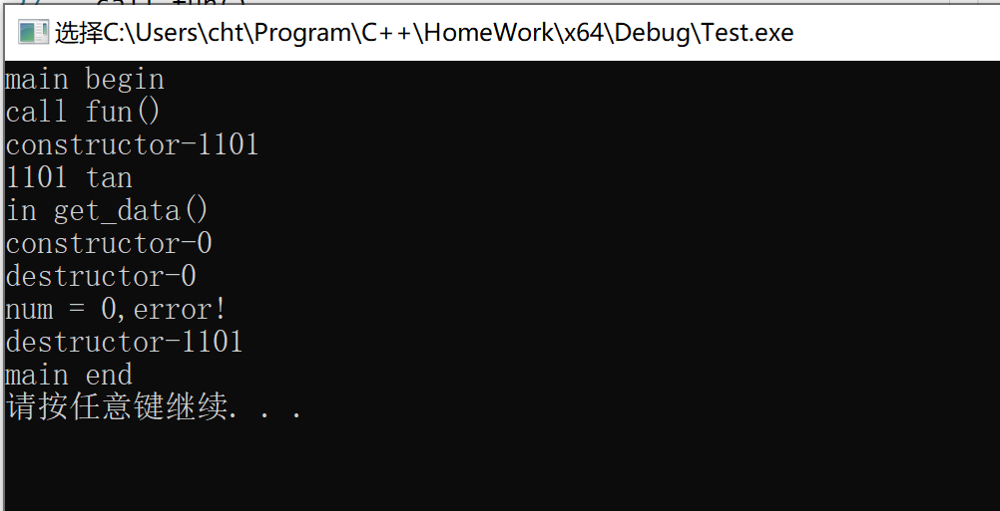
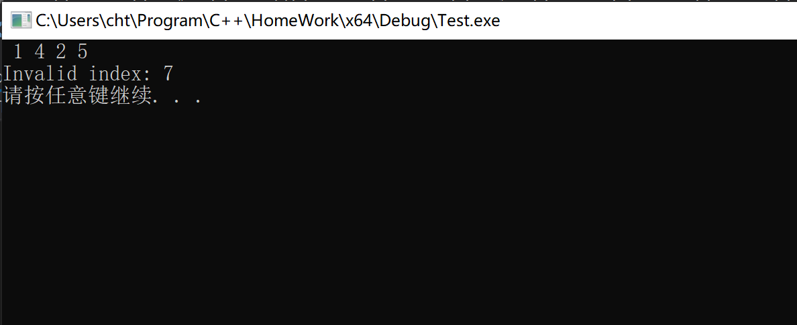
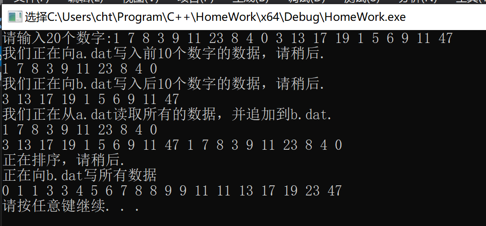
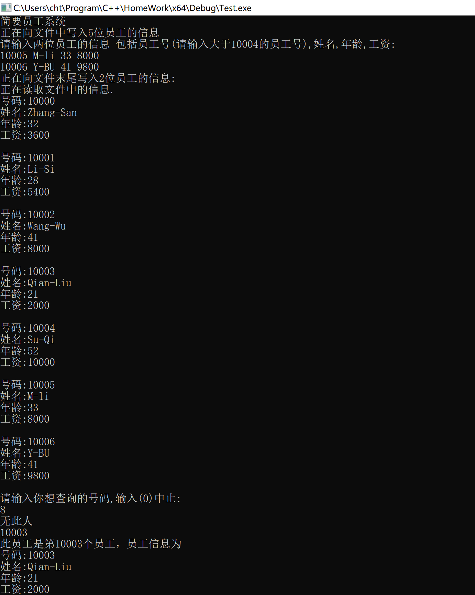
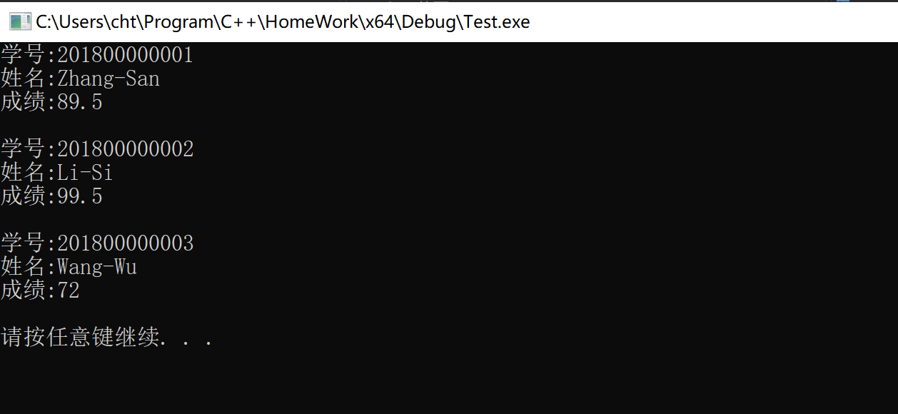
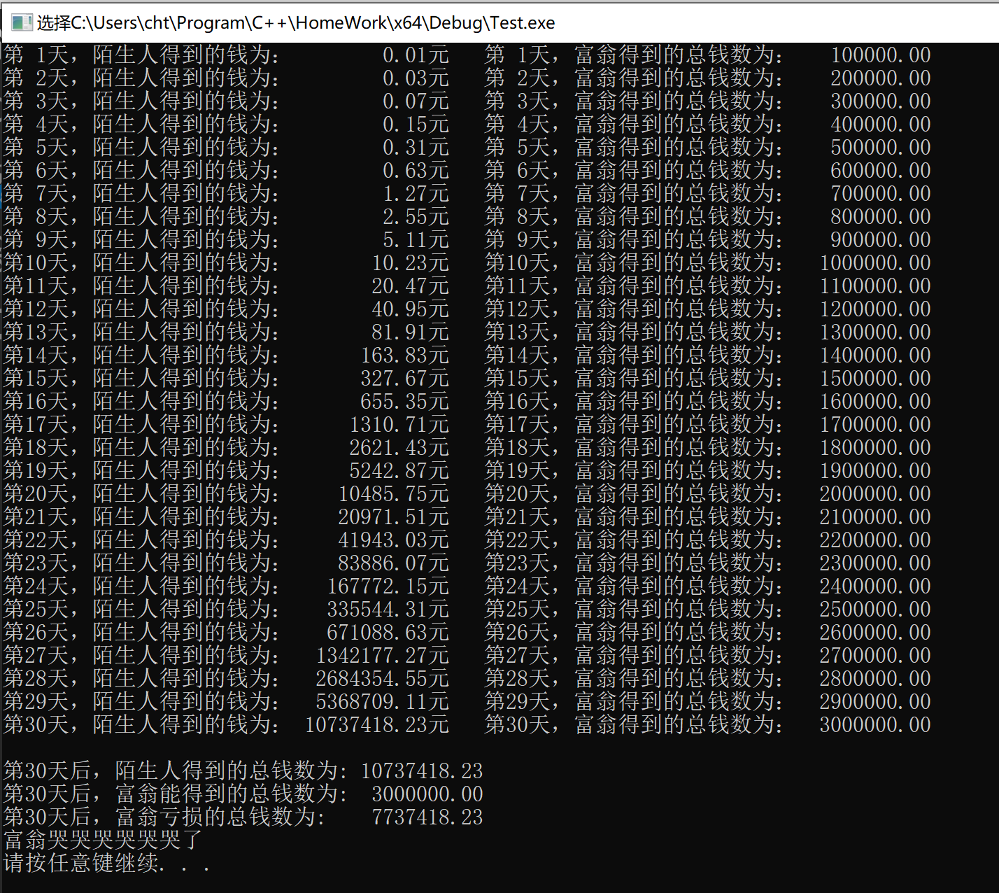

## 第八次实验报告

***

#### 实验题目(摘要)

1. 第13章课后题4

2. 第13章课后题5

3. 二进制数据的存储

4. 第14章课后题2

5. 数组越界判断

6. 富翁换钱计划

#### 实验细节

1. 第14章课后题2，分析代码执行结果并进行上机验证。

预测代码执行结果

```
main begin
call fun()
constructor-1011
1011 tan
in get_data()
constructor-0
num = 0,error!
destructor-0 #error!
destructor-1011
main end
```

实际代码执行结果



2. 数组越界判断

预测代码执行结果

```
 1 4 2 5
Invalid index: 7

```

实际代码执行结果



3. 关于文件二进制存储的问题

二进制文件的存储不像`utf-8`文件一样，可以用高级的流来输入和输出。其存储方式和柜子很像，一般为了压缩空间，每个柜子的大小是固定的，刚好可以容纳某个类型。在这里假设`char`占1个字节，`int`占四个字节。例如有下列的结构体：

```cpp
struct myBuffer
{
    int scores[2];
    char name[20];
};
```

我们可以知道，这个结构体所占的空间是固定的，始终为`28bytes`，所以我们可以用一个`28bytes`的格子去容纳他，假设有一个数组（其中有10个元素），则将其写入二进制文件后，其数据占`280bytes`。

我们知道这个存储方式具有非常严格的排列方式，我们可以通过`文件的位置`读取我们想要的方式，然而，我们能够发现，这种文件存储方式虽然能够节省资源，但是其可扩展性和可阅读性并不是很高，当然，最棘手的问题当然是其不能很好地兼容一些动态存储的类型，最典型的就是`string`了，所以，用传统的二进制来存储就会遇到很大的问题。对于一些比较短的字段(例如`name`)，推荐使用字符数组去替代他，否则就会出现无法读取的尴尬情况。当然我们也能够通过*设计文件结构*来达到存储数据的目的。下面我举个例子来说明如何存储`vector`和`string`等类型。

> 如果你测一下`sizeof(string)`你会发现他是`40`字节，无论它的内容是什么，而且，更奇怪的是含有`string`的类对象的`size`是很奇怪的值，可以用没有规律来形容吧。

一般来说，可以使用`\000`的标识为来实现二进制存储`string`的数据，例如下面的例子。`vector`的存储可以先存储长度，然后存储每一项数据。

```cpp
#file extra.cpp

#define 类的定义和实验请看extra.cpp

int main() 
{
	Student stud1 = { "10000","Zhang-San",20 };
	BinaryStreamWriter writer;
	writer.open("a.dat");
	writer << "hello world" << 1008782L << stud1;
	writer.close();
	
	string data;
	long data2;
	Student stud2;
	
	BinaryStreamReader reader;

	reader.open("a.dat");
	reader >> data >> data2 >> stud2;
	reader.close();

	cout << "data = " << data << ", data2 = " << data2 << endl
		<< stud2 << endl;

	system("pause");
	return 0;
}
```

当然，这只是一个很简单的例子，数据库和`xml,json`文件的操作方法也是和这个差不多的。

4. 流形式的输入和输出的特征

对于一个小的文件来说，直接读取所有的文本内容是一件很平常的事情。但是如果对于*大的文件*来说，一次读取所有内容会占用很大的内存空间，这在实际应用中是不适合的，因此，为了减少内存的不必要占用，在读取和写入的操作中，通常使用**流**，这种类似的技术也称为**非缓存技术**。

假设你要复制一个*20GB*的文件，很显然直接将内容写到内存，然后将其写入磁盘是不可能的事情。一般在文件的拷贝操作中，我们都会分配一个`1KB`或者`2KB`的缓冲区(根据需要设置)，用于当作中转站，从而实现文件的复制。实际上，输入输出流为了处理**字符和数据的转换**，也会开辟一块缓冲区来进行操作。例如下面的代码可以实现文件的复制操作。

```cpp
#include<iostream>
#include<fstream>
#include<string>

using namespace std;

#define BUFFER_SIZE 2048 //缓冲区的大小，一般设置成2KB

int main() 
{
	string fileSource;
	string fileTarget;

	cout << "请输入源文件名:";
	cin >> fileSource;
	cout << "请输入目标文件名:";
	cin >> fileTarget;
	fstream fr;
	fstream fw;
	fr.open(fileSource,ios::binary | ios::in);
	fw.open(fileTarget, ios::binary | ios::out);

	char buffer[BUFFER_SIZE];
	int totalByte = 0;

	while (fr) //判断当前是否已经读取到文件末尾
	{
		fr.read(buffer, BUFFER_SIZE); //读取2B的内容
		fw.write(buffer, fr.gcount()); //往目标文件写入内容。
		totalByte += fr.gcount();
		//cout << totalByte << endl;
	}

	fr.close();
	fw.close();

	system("pause");

	return 0;
}
```

5. 异常捕获的机制

当出现异常时，程序会从当前**函数的栈**开始，往外弹栈，如果没有被`catch`则继续往外弹栈，知道碰到`catch`块或者由系统中止函数的运行。所以在这个过程中会涉及到**清理**工作，即撤销当前函数已经存在的对象。

> 在C++中，抛出异常的类型是任意的，但是为了直观和便于阅读，通常抛出异常的类型都是派生自`std::exception`的。

然而，如果是动态申请的对象，*在抛出异常时*，我们往往来不及手动清理现场，从而导致内存的泄露，而`C++`又恰好没有`finally`子块用来手动处理事发现场，所以及时清理**动态空间**是一个很关键的问题。

在清理过程中，会自动调用非动态成员的析构函数(因为其生命周期)结束了，所以我们可以利用这一点将**指针**挂在**类对象**上(我们通常称这种类为**句柄/handle**)，这样就可以通过类的析构函数来间接地清理动态空间。

> 对象的生命周期

通过一系列的实验能够得出，动态对象的生命周期是单独的，它只有遇到`delete`才会结束生命周期，而非动态对象的生命周期是其所在的`block`，因为出了这个`block`这个对象就不可见了，所以系统就会及时地回收对象，所以这个也能够解释**第1题**类对象的析构函数如何时调用的。

#### 实验截图

1. 第13章课后题4



2. 第13章课后题5



3. 二进制数据的存储



4. 第14章课后题2


5. 数组越界判断


6. 富翁换钱计划

