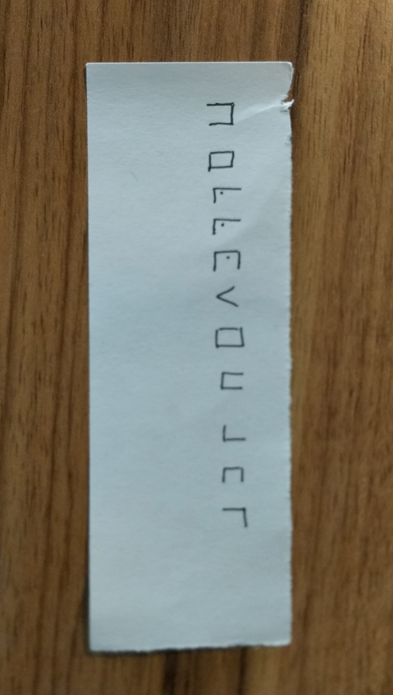
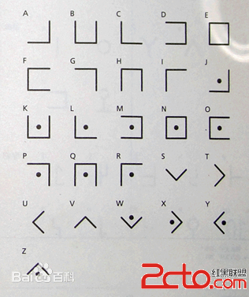

# 密码学

## 36 √

2020/7/19

知识点：`base36`

特征：纯数字，只出现英文和字符

题目描述：
```
59714216646867023270440406545399263948228435794919139272931
```

解题思路：

题目的名字叫36，又给了一串数字，大致是和base36有关的东西。

自己写了个脚本，进行[-10,10)次的的编码，发现编码1次就出现了flag。

答案：

```
flagis2fya2r884fnoekustyxmecv7a98blhwj
```

## BF √

知识点：`brain fuck`

[简书介绍](https://www.jianshu.com/p/f72ea736e994)

[在线工具](https://tool.bugku.com/brainfuck/?wafcloud=1)

特征：只出现`<>+[]-.`

题目表述：
```
>+++++++++[<+++++++++>-]<++.>+++[<++++++>-]<.>+++++[<------->-]<.>+++++[<++++++>-]<+.>+++++[<----->-]<--.>+++++[<+++++++>-]<.>+++[<++++++>-]<.>++++[<----->-]<-.----.>+++++[<--------->-]<.-.----.>++++++[<+++++++++>-]<.>+++++[<--------->-]<-.>++++++[<+++++++>-]<+.++.>+++++[<--------->-]<-.-----.+.-.>++++++[<++++++++>-]<-..>++++++[<-------->-]<.>+++++++[<+++++++++++>-]<-.
```

解题思路：

找到brainfuck到text的工具，使用即可

答案

```
SeBaFi{fb540f8ce7232aa1}
```

## hard rsa

知识点：`rsa`

没有思路，暂时跳过。

## jefferson

知识点：`转轮加密`

[解题思路](https://www.cnblogs.com/0yst3r-2046/p/11810574.html)

题目描述：

```
加密表：
0:  < ABCDEFGHIJKLMNOPQRSTUVWXYZ <

1:	< ZWAXJGDLUBVIQHKYPNTCRMOSFE <
2:	< KPBELNACZDTRXMJQOYHGVSFUWI <
3:	< BDMAIZVRNSJUWFHTEQGYXPLOCK <
4:	< RPLNDVHGFCUKTEBSXQYIZMJWAO <
5:	< IHFRLABEUOTSGJVDKCPMNZQWXY <
6:	< AMKGHIWPNYCJBFZDRUSLOQXVET <
7:	< GWTHSPYBXIZULVKMRAFDCEONJQ <
8:	< NOZUTWDCVRJLXKISEFAPMYGHBQ <
9:	< XPLTDSRFHENYVUBMCQWAOIKZGJ <
10:	< UDNAJFBOWTGVRSCZQKELMXYIHP <
11：< MNBVCXZQWERTPOIUYALSKDJFHG <
12：< LVNCMXZPQOWEIURYTASBKJDFHG <
13：< JZQAWSXCDERFVBGTYHNUMKILOP <

密钥为：2,3,7,5,13,12,9,1,8,10,4,11,6
密文为：N,F,Q,K,S,E,V,O,Q,O,F,N,P
```

解题思路：

上网搜题目，发现jefferson是一个人，这题的思路就是jefferson的惯用技俩。不过需要注意到的是，这题还用到了密钥，应该是加密表的调整后的顺序。

第一步：使用jefferson的惯用技俩，使用转轮的方式使密码处于一列。

```
1:	< NTCRMOSFEZWAXJGDLUBVIQHKYP <
2:	< FUWIKPBELNACZDTRXMJQOYHGVS <
3:	< QGYXPLOCKBDMAIZVRNSJUWFHTE <
4:	< KTEBSXQYIZMJWAORPLNDVHGFCU <
5:	< SGJVDKCPMNZQWXYIHFRLABEUOT <
6:	< ETAMKGHIWPNYCJBFZDRUSLOQXV <
7:	< VKMRAFDCEONJQGWTHSPYBXIZUL <
8:	< OZUTWDCVRJLXKISEFAPMYGHBQN <
9:	< QWAOIKZGJXPLTDSRFHENYVUBMC <
10:	< OWTGVRSCZQKELMXYIHPUDNAJFB <
11：< FHGMNBVCXZQWERTPOIUYALSKDJ <
12：< NCMXZPQOWEIURYTASBKJDFHGLV <
13：< PJZQAWSXCDERFVBGTYHNUMKILO <

```

第二步：调整密码表的顺序

```
密钥为：2,3,7,5,13,12,9,1,8,10,4,11,6
2:	< FUWIKPBELNACZDTRXMJQOYHGVS <
3:	< QGYXPLOCKBDMAIZVRNSJUWFHTE <
7:	< VKMRAFDCEONJQGWTHSPYBXIZUL <
5:	< SGJVDKCPMNZQWXYIHFRLABEUOT <
13：< PJZQAWSXCDERFVBGTYHNUMKILO <
12：< NCMXZPQOWEIURYTASBKJDFHGLV <
9:	< QWAOIKZGJXPLTDSRFHENYVUBMC <
1:	< NTCRMOSFEZWAXJGDLUBVIQHKYP <
8:	< OZUTWDCVRJLXKISEFAPMYGHBQN <
10:	< OWTGVRSCZQKELMXYIHPUDNAJFB <
4:	< KTEBSXQYIZMJWAORPLNDVHGFCU <
11：< FHGMNBVCXZQWERTPOIUYALSKDJ <
6:	< ETAMKGHIWPNYCJBFZDRUSLOQXV <
```

做不了了。不知道是那一步做错了。反正看不到flag

答案：

```

```

## ok √

知识点：`brain fuck`

[在线工具](https://tool.bugku.com/brainfuck/?wafcloud=1)

题目表述

```
见文件
```

解题思路：


看到熟悉的符号，估计又是brain fuck。

先从brain fuck转到text

```
..... ..... ..... ...!? !!.?. ..... ..... ..... ..?.? !.?.. ..!.? .....
....! ?!!.? ..... ...?. ?!.?. ...!. ?.... ..... ..!?! !.?!! !!!!! !!!?.
?!.?! !!!!! !!!!! !!!!! !!!!! .?... ..... ...!? !!.?. ..... ....? .?!.?
..... ..... ..!.? ..... ..... .!?!! .?!!! !!!!! !!?.? !.?!! !!!.? .....
..... .!?!! .?... ..... ..?.? !.?.. ..... ..... ..... ...!. ?.... .....
!?!!. ?.... ....? .?!.? ....! .?... ..... ..... ....! ?!!.? !!!!! !!!!!
!!!!! !?.?! .?!!! !!!!! !!!!! !!.!! !!!.? ..... ..... ..... !?!!. ?....
..... ..... ?.?!. ?!.?. ..... ..... ..!?! !.?!! !!!!! !!!!! ?.?!. ?!!!!
!!!!! !!!!! !!!.? ..... ..... ...!? !!.?. ..... ..... .?.?! .?... .....
..... ..... ..!.? ..... ..... ...!? !!.?! !!!!! !!!!! !?.?! .?!!! !!!!!
!!!!! !!!!! !!!!! ..... !.?.. ..... ..... .!?!! .?... ..... ....? .?!.?
..... ..... ..... .!.?. ..... ..... ..!?! !.?!! !!!!! !!!!! ?.?!. ?!!!!
!!!!! !!!!! !!!.! !!.!! !!!!! ..... ..... .!.!! !!!!! !!!!! !!!.. .....
..... ...!. !!!!! !!!!! !!!!! !!.?. ..... ..... ....! ?!!.? ..... .....
....? .?!.? ..!.? ..... ..... ...!? !!.?! !!!!! !!!!! !?.?! .?!!! !!!!!
!!!!! !!!!! !...! .?... ..... ..... !?!!. ?.... ..... ...?. ?!.?. .....
..... .!... ....! .!.?. ..... ..... ....! ?!!.? !!!!! !!!!! !!!!? .?!.?
!!!!! ..... ..... ..... ..!.? ..... ..... ...!? !!.?. ..... ..... .?.?!
.?... ..... ..... ..... !.?.. ..... ..... .!?!! .?!!! !!!!! !!!!? .?!.?
!!!!! !!!!! !!!!! !!!!! !!!.? ..... ..... ...!? !!.?. ..... ..... .?.?!
.?... ..... ..... .!.?. ..... ..... ..!?! !.?!! !!!!! !!!!! ?.?!. ?!!!!
!!!!! !!!!. !!!!! !!!!! !!!!! !!.?. ..... ..... ....! ?!!.? ..... .....
....? .?!.? ..!.! !!.?. ..... ..... ..!?! !.?!! !!!!! !!!!! ?.?!. ?!!!!
!!!!! .?... ..... ..... !?!!. ?.... ..... ...?. ?!.?. ..... ..... .....
..!.? ..... ....! ?!!.? ..... ...?. ?!.?. ..... ..... ...!. ?.
```

发现又是奇怪的符号，估计又是什么奇怪的编程语言。

使用ook! to Text
找到了flag

答案

```
SeBaFi{42c7e68d8749291c67add19f7b80ba9f}
```

## pigpen √

题目描述

| 图1 | 图2 |
| --- | --- |
| 图1 | 图2########################## |
|  |  |


解题思路

应该是某一种奇怪的编码方式，网上找到pigpen编码。注意纸条要横着看。

找到编码表

一一对应

答案

```
HELLOSEBAFI
```