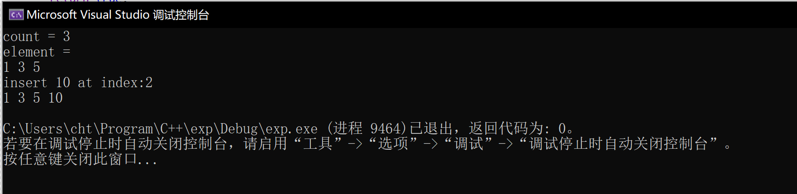

# 第一次实验报告

## 题目

这次实验所有的题目都基于列表，因此我把题目中所需要的函数写成了类的成员函数。

1. 计算列表的长度

2. 在指定位置的后面插入新节点

3. (选做)不使用拷贝的方法实现列表的置换操作

## 实验过程

1. 计算列表的长度比较简单，只需要一个指针`node`即可。循环迭代直到`node`=`null`。并统计出列表的长度

功能由`minilist.h`的第105行函数`length`实现。

2. 在指定的位置后面插入新节点需要2个工作指针。

p1负责记住被插入的位置，p2负责记住下一个位置。

按照`c->next = p2; p1->next = c`即可完成操作。

3. 完成列表的颠倒需要两个工作指针。

主要思想就是两个连续位置的指针p1,p2操作p2->next=p1->next

然后指针组移入下一个位置，当然，注意临时存储p2，并需要处理边界操作(边界操作和中间不太一样)

## 实验感想

基于指针和偏移量的算法难点在于如何重复构造相似的状态以及将状态发生的位置进行偏移。同时也应该注意边界的操作等细小的部分。多做调试就可以解决之前没有想到的方面。

## 实验截图



代码

//minilist.h

```cpp
#pragma once
#include<exception>
#include<initializer_list>
#include<iostream>
#include<algorithm>

using namespace std;

template <typename T>
class node {
public:
	node(T value, node<T>* next = NULL) {
		this->value = value;
		this->next = next;
	}
	T value;
	node<T>* next;
};

template <typename T>
bool myComparer(node<T>** first, node<T>** second) {
	return (&second)->value > (&first)->value;
}

template <typename T>
bool myComparerDesc(node<T>** first, node<T>** second) {
	return (&second)->value < (&first)->value;
}

template <typename T>
class minilist {
public:
	minilist() {
		first = NULL;
		last = NULL;
	}

	minilist(initializer_list<T> l) 
	{
		for (auto p = l.begin(); p < l.end(); p++) {
			append(*p);
		}
	}

	~minilist() {
		clear();
	}

	minilist(const minilist<T>& other) {
		node<T>* c = other.first;
		while (c != NULL) {
			append(c->value);
			c = c->next;
		}
	}

	minilist<T>* clone() {
		minilist<T>* other = new minilist<T>();
		node<T>* c = first;
		while (c != NULL) {
			other->append(c->value);
			c = c->next;
		}

		return other;
	}

	void append(T value) {
		node<T>* c = new node<T>(value);
		if (empty()) {
			first = c;
			last = c;
		}
		else {
			last->next = c;
			last = c;
		}
	}

	T at(int index) {
		node<T>* c = nodeAt(index);
		return c->value;
	}

	//插在第index个节点的后面，若index<0，插在头部。
	bool insertAt(T value, int index) {
		node<T>* c = new node<T>(value);
		if (index < 0) {
			c->next = this->first;
			this->first = c;
		}
		else if (index >= length()) {
			return false;
		}
		else {
			node<T>* p1 = nodeAt(index);
			c->next = p1->next;
			p1->next = c;
		}
		return true;
	}

	//删除在index处的节点
	bool removeAt(int index) {
		if (empty()) {
			return false;
		}
		else {
			if (index == 0) {
				node<T>* c = first;
				first = first->next;
				delete c;
				if (first == NULL) {
					last = NULL;
				}
			} else {
				int length = length();
				if (index >= length) {
					return false;
				} else {
					node<T>* p1 = nodeAt(index - 1);
					node<T>* p2 = p1->next;
					p1->next = p2->next;
					delete p2;
				}
			}
		}
		return true;
	}

	size_t length() {
		size_t _length = 0;
		node<T>* c = first;
		while (c != NULL) {
			_length += 1;
			c = c->next;
		}
		return _length;
	}

	bool empty() {
		return first == NULL;
	}

	node<T>* firstNode() {
		return first;
	}

	friend ostream& operator << (ostream& streamout, minilist<T>& list) {
		node<int>* current = list.first;

		while (current != NULL) {
			streamout << current->value << " ";
			current = current->next;
		}

		return streamout;
	}

	void clear() {
		node<T>* c = first;
		while (c != NULL) {
			node<T>* next = c->next;
			delete(c);
			c = next;
		}
	}

	void mySort(int direction = -1) {
		int _length = length();
		T* arr = new T[_length];
		node<T>* c = first;
		int i = 0;
		while (c != NULL) {
			node<T>* t = c;
			arr[i++] = c->value;
			c = c->next;
			delete t;
		}

		sort(arr, arr + _length);
		first = NULL;
		last = NULL;
		for (int i = 0; i < _length; i++)
		{
			append(arr[i]);
		}
	}

	void join(minilist<T>& other) {
		node<T>* c = other.first;
		while (c != NULL) {
			append(c);
			c = c->next;
		}
	}

	void join_sort(minilist<T>& other, int direction=-1) {
		minilist<T>* cloned = other.clone();
		node<T>* p1 = cloned->first;

		while (p1 != NULL) {
			node<T>* p2 = first;
			node<T>* p3 = NULL;
			if (direction < 0)
			{
				while (p2 != NULL && p1->value > p2->value)
				{
					p3 = p2;
					p2 = p2->next;
				}
				p3->next = p1;
				node<T>* t = p1;
				p1 = p1->next;
				t->next = p2;
			}
		}

		cloned->first = NULL;
		delete cloned;
	}

	//置换list的元素，用到了5个工作指针
	void reserve() {

		int _length = length();

		if (_length >= 1) {
			node<T>* p1 = first;
			node<T>* p2 = p1->next;
			first->next = NULL;
			last = first;

			while (p2 != NULL && p2->next != NULL) {
				node<T>* tp1 = p2->next;
				p2->next = p1;
				p1 = p2;
				p2 = tp1;

			}

			p2->next = p1;
			first = p2;
		}
	}

private:
	node<T>* first = NULL;
	node<T>* last = NULL;

	node<T>* nodeAt(int index) {
		node<T>* c = this->first;
		int i = 0;
		while (i <= index) {
			if (c == NULL) {
				throw exception("invalid index");
			}
			else if (i == index) {
				return c;
			}
			else {
				c = c->next;
				++i;
			}
		}
	}
};
```

//main.cpp
```cpp
#include<iostream>
#include"minilist.h"

using namespace std;

int main() 
{
	minilist<int> list;
	list.append(1);
	list.append(3);
	list.append(5);

	cout << "count = " << list.length() << endl;
	cout << "element = " << endl;
	cout << list << endl;
	cout << "insert 10 at index:2" << endl;
	list.insertAt(10, 2);
	cout << list << endl;
	
	list.reserve();
	cout << list << endl;
}
```