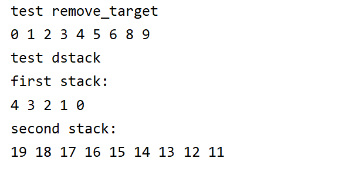

# 第三次实验报告

## 实验题目

1. 利用数组实现双端栈（两栈共享空间）

要求：给出双端栈的设计、实现，并验证所设计双端栈的正确性。

2. 设计一个函数实现在队列中删除第一个出现的target元素，并验证其正确性。

## 实验过程

1. 首先，为了以后数据结构课程和实验的方便，准备了两个庞大的对象`node`和`dnode`以及他们的辅助类，用于对单向链表和双向链表提供较为便捷的操作，这两个类在以后写生成树、约瑟夫环的问题时也是可以使用的。

2. i_queue主要是实现队列容器的接口，`list_queue`时队列的一种实现。

3. i_stack主要是实现双端栈容器的接口，`array_stack`,`dqueue_stack`,`list_stack`是他们的实现。

4. remove_target使用了辅助队列，但由于其底层容器是单链表，所以并没有用到很多的辅助空间，这样操作也更加容易一些。主要是因为在`remove_target`中，队列内部是不可见的，将队首元素插入尾部使用循环法删除元素是不可取的。

## 效果截图



## 实验代码

实验代码包括一下几个文件

```py
main.cpp  # 程序入口
node.h  # 单向链表结构和其辅助类
dnode.h  # 双向链表结构和其辅助类
i_dstack.h  # 双向栈，包括三种实现模式(数组，双端队列，双向链表(自用))
i_queue.h  # 队列及其实现模式(单向链表)
callbacks.h  # 回调函数，可以忽略
```

### main.cpp

main.cpp中,`test_remove_target`测试第2个小题，`test_dqueue`测试第1个小题。

```cpp
#include <iostream>
#include "i_queue.h"
#include "i_dstack.h"

using namespace std;

template <typename T>
void remove_target(i_queue<T>& queue, T target){
    i_queue<T>* other = new list_queue<T>();
    bool find = false;
    while(!queue.empty()){
        auto front = queue.front();
        if((!find && target!=front) || find){
            other->push(front);
        } else {
            find = true;
        }
        queue.pop();
    }

    while(!other->empty()){
        queue.push(other->front());
        other->pop();
    }

    delete other;

}

template <typename T>
void read_queue(i_queue<T>& queue){
    while(!queue.empty()){
        cout << queue.front() << " " ;
        queue.pop();
    }
    cout << endl;
}

void test_remove_target(){
    cout << "test remove_target" << endl;
    i_queue<int>* queue = new list_queue<int>();
    for(int i = 0; i< 10;++i){
        queue->push(i);
    }
    remove_target(*queue,7);
    read_queue(*queue);

    delete queue;
}

void test_dstack(){
    cout << "test dstack" << endl;
    i_dstack<int>* dstack = new array_stack<int>();
    for(int i = 0;i< 5 ;++i){
        dstack->push(i);
    }
    for (int i = 11; i < 20; ++i) {
        dstack->push(i,dstack_direct::second);
    }

    cout << "first stack:" << endl;
    while(!dstack->empty()){
        cout << dstack->top() << " ";
        dstack->pop();
    }
    cout << endl;
    cout << "second stack:" << endl;
    while(!dstack->empty(dstack_direct::second)){
        cout << dstack->top(dstack_direct::second) << " ";
        dstack->pop(dstack_direct::second);
    }
    cout << endl;

}

int main(){
    test_remove_target();
    test_dstack();

    return 0;
}
```

### node.h

```cpp
// ---- Foundation ----
// Created by cht.
// #relates
// node: 节点
// node_fac: node生成器
// #endrelates
#pragma once
#include<initializer_list>
#include<stdexcept>
#include"callbacks.h"

using namespace std;

template <typename T>
class node {
public:
    explicit node(T value, node<T>* next = nullptr):value(value), next(next){}
    T value;
    node<T>* next;
private:

};

class node_fac{
public:
    template <typename T>
    static node<T>* create(initializer_list<T> data){
        auto head = new node<T>(*data.begin());
        auto c = head;
        for(auto p = data.begin() + 1; p < data.end(); ++p){
            c = append(c,*p);
        }
        return head;
    }

    template <typename T, typename T2>
    static node<T>* create(T2 begin, T2 end){
        auto head = new node<T>(*begin);
        auto c = head;
        for(auto p = begin+1;p< end;++p){
            c = append(c,*p);
        }
        return head;
    }

    template <typename T>
    static node<T>* append(node<T>* pre, node<T>* next){
        pre->next = next;
        return next;
    }

    template <typename T>
    static node<T>* append(node<T>* pre, T value){
        auto c = new node<T>(value);
        return append(pre,c);
    }

    template <typename T>
    static void insert(node<T>* pre, node<T>* next, node<T>* insert){
        pre->next = insert;
        insert->next = next;
    }

    template <typename T>
    static void insert(node<T>* pre,node<T>* next, T value){
        auto c = new node<T>(value);
        insert(pre,next,c);
    }

    template <typename T>
    static void remove_next(node<T>* pre){
        node<T>* to_remove = pre->next;
        if(to_remove == nullptr){
            throw logic_error("the removed node is nullptr");
        }
        node<T>* next = to_remove->next;
        pre->next = next;
        delete to_remove;
    }

    template <typename T>
    static node<T>* offset(node<T>* n,int length){
        while(length > 0){
            if(n == nullptr){
                throw overflow_error("node is nullptr in loop");
            }
            n=n->next;
            --length;
        }
        return n;
    }

    template <typename T>
    static node<T>* remove_where(node<T>* head, node<T>* to_remove){
        if(head == nullptr || to_remove == nullptr){
            throw logic_error("node head/to_remove is nullptr");
        } else if(head == to_remove){
            auto c = head->next;
            delete head;
            return c;
        } else {
            auto c = head;
            while(c!= nullptr){
                auto p1 = c;
                auto p2 = c->next;
                if(p2 == to_remove){
                    p1->next = p2->next;
                    delete p2;
                    return head;
                }
                c = c->next;
            }
        }

    }

    template <typename T>
    static node<T>* remove_at(node<T>* head, int index){
        if(index < 0){
            throw range_error("index must be a optimistic number or zero.");
        } else if(index == 0){
            return remove_where(head,head);
        }
        auto c = head;
        while(index > 1){
            if(c== nullptr){
                throw overflow_error("the removed node is nullptr");
            }
            c=c->next;
            --index;
        }

        auto p1 = c->next;
        auto p2 = p1->next;
        c->next = p2;
        delete p1;
        return head;
    }

    template <typename T>
    static void for_any(node<T>* head, action_callback<T>& callback){
        while(head!=nullptr){
            callback.call(head->value);
            head = head->next;
        }
    }

    template <typename T>
    static void destroy(node<T>* head){
        node<T>* curr = head;
        node<T>* temp = nullptr;
        while(curr != nullptr){
            temp = curr;
            curr = curr->next;
            delete temp;
        }
    }
private:

};
```

### dnode.h

```cpp
// ---- Foundation ----
// Created by cht.
// #relates
// dnode: 双端节点
// dnode_fac: dnode工厂类
// #endrelates
#pragma once
#include <stdexcept>
#include "callbacks.h"

using namespace std;

template <typename T>
class dnode{
public:
    explicit dnode(T value, dnode<T>* pre = nullptr, dnode<T>* next = nullptr): value(value), pre(pre), next(next){

    }
    T value;
    dnode<T>* pre;
    dnode<T>* next;
private:

};

class dnode_fac{
public:
    template <typename T>
    static dnode<T>* create(initializer_list<T> data){
        auto first = new dnode<T>(*data.begin());
        auto c= first;
        for(auto p = data.begin()+1; p != data.end(); ++p){
            c= append_back(c,*p);
        }
        return first;
    }

    template <typename T>
    static dnode<T>* append_back(dnode<T>* pre, dnode<T>* next){
        pre->next = next;
        next->pre = pre;
        return next;
    }

    template <typename T>
    static dnode<T>* append_pre(dnode<T>* next, dnode<T>* pre){
        next->pre = pre;
        pre->next = next;
        return pre;
    }

    template <typename T>
    static dnode<T>* append_back(dnode<T>* pre, T value){
        auto c = new dnode<T>(value);
        return append_back(pre,c);
    }

    template <typename T>
    static dnode<T>* append_pre(dnode<T>* next, T value){
        auto c = new dnode<T>(value);
        return append_pre(next,c);
    }

    template <typename T>
    static dnode<T>* for_any(dnode<T>* first,action_callback<T>& callback){
        while(first!=nullptr){
            callback.call(first->value);
            first= first->next;
        }
    }

    template<typename T>
    static dnode<T>* for_any_flag(dnode<T>* first,action_callback<T>& callback){
        auto curr = first;
        while(curr!= nullptr){
            callback.call(curr->value);
            curr = curr->next;
            if(curr == first){
                break;
            }
        }
    }

    template <typename T>
    static bool unique(dnode<T>* head){
        return head->next == nullptr || head->next == head;
    }

    template<typename T>
    static void join(dnode<T>* pre, dnode<T>* next){
        pre->next = next;
        next->pre = pre;
    }

    template <typename T>
    static dnode<T>* remove_front(dnode<T>* front){
        auto c = front;
        auto p = front->next;
        if(p != nullptr){
            p->pre = nullptr;
        }
        delete c;
        return p;
    }

    template <typename T>
    static dnode<T>* remove_back(dnode<T>* back){
        auto c= back;
        auto p = back->pre;
        if(p != nullptr){
            p->next = nullptr;
        }
        delete c;
        return p;
    }

    template <typename T>
    static dnode<T>* remove_self_return_pre(dnode<T>* self){
        auto prev_node = self->pre;
        if(prev_node == nullptr){
            throw logic_error("the prev_node of self is nullptr");
        }
        auto next_node = self->next;
        prev_node->next = next_node;
        if(next_node != nullptr){
            next_node->pre = prev_node;
        }
        delete self;

        return prev_node;
    }

    template <typename T>
    static dnode<T>* remove_self_return_next(dnode<T>* self){
        auto prev_node = self->pre;
        auto next_node = self->next;
        if (next_node == nullptr){
            throw logic_error("the next_node of self is nullptr");
        }
        if(prev_node != nullptr){
            prev_node->next = next_node;
        }
        next_node->pre = prev_node;
        delete self;

        return next_node;
    }

    template <typename T>
    static void remove(dnode<T>* self){
        auto prev_node = self->pre;
        auto next_node = self->next;
        if(prev_node != nullptr){
            prev_node -> next = next_node;
        }
        if(next_node != nullptr){
            next_node->pre = prev_node;
        }
        delete self;
    }

    template <typename T>
    static dnode<T>* offset(dnode<T>* n,int offset){
        if(offset == 0){
        } else if (offset > 0){
            while(offset > 0){
                n = n->next;
                --offset;
            }
        } else  {
            while(offset < 0){
                n = n ->pre;
                ++offset;
            }
        }
        return n;
    }

    template <typename T>
    static void destroy(dnode<T>* head){
        dnode<T>* curr = head;
        dnode<T>* temp = nullptr;
        while(curr!= nullptr){
            temp = curr;
            curr = curr->next;
            if(curr == head){
                break;
            }
            delete temp;
        }
    }
};
```

### i_dstack.h

i_dstack包含了三种实现方法:`array_dstack`,`dqueue_dstack`,`list_dstack`。三种实现都经过了测试。

```cpp
// ---- 上级题目3 ----
// Created by cht.
// 题目1: 使用数组实现双端栈
// 题目2: 使用deque实现双端栈
// 题目3: 使用链表实现双端栈
// #relates
// dstack_direct: 表明调用的是哪一个栈
// i_dstack: 双端栈
// array_stack: 数组双端栈
// deque_stack: 队列双端栈
// list_stack: 双向链表栈
// #endrelates

#pragma once
#include <stdexcept>
#include <deque>
#include "callbacks.h"
#include "dnode.h"

using namespace std;

/**
 * 标识是第一个栈还是第二个栈。
 */
enum class dstack_direct{
    first = 1,
    second = 2
};


template <typename T>
class i_dstack{
public:
    virtual ~i_dstack()= default;

    bool empty(dstack_direct direct = dstack_direct::first){
        if(direct == dstack_direct::first){
            return empty_first();
        } else {
            return empty_second();
        }
    }
    void push(T value, dstack_direct direct = dstack_direct::first){
        if(direct == dstack_direct::first){
            push_first(value);
        } else {
            push_second(value);
        }
    }
    void pop(dstack_direct direct = dstack_direct::first){
        if(direct == dstack_direct::first)  {
            pop_first();
        } else {
            pop_second();
        }
    }

    T top(dstack_direct direct = dstack_direct::first){
        if(direct == dstack_direct::first) {
            return peak_first();
        } else {
            return peak_second();
        }
    }

    virtual bool empty_first() const = 0;
    virtual bool empty_second() const = 0;
    virtual void push_first(T value) = 0;
    virtual void push_second(T value) = 0;
    virtual void pop_first() = 0;
    virtual void pop_second() = 0;
    virtual T peak_first() const = 0;
    virtual T peak_second() const = 0;

    //apply functions
    void show_front(action_callback<T>& callback){
        while(!empty_first()){
            callback.call(peak_first());
            pop_first();
        }
    }

    void show_back(action_callback<T>& callback){
        while(!empty_second()){
            callback.call(peak_second());
            pop_second();
        }
    }

};

class limit_container{
public:
    virtual bool is_full() const = 0;
};

template <typename T>
class array_stack:  public limit_container,public i_dstack<T>{
public:
    ~array_stack() override {
        delete container;
    }

    explicit array_stack(int capacity = 100){
        if(capacity <= 0){
            throw logic_error("capacity is too small");
        }
        container = new T[capacity];
        this->capacity = capacity;
        this->p_front = 0;
        this->p_end = capacity - 1;
    }

    bool is_full() const override {
        return p_front > p_end;
    }

    bool empty_first() const override {
        return p_front <= 0;
    }

    bool empty_second() const override  {
        return p_end >= capacity -1;
    }

    void push_first(T value) override {
        if(is_full()){
            throw logic_error("array is full!");
        }
        container[p_front++] = value;
    }

    void push_second(T value) override {
        if(is_full()){
            throw logic_error("array is full!");
        }
        container[p_end--] = value;
    }

    void pop_first() override {
        if(empty_first()){
            throw logic_error("stack first is empty!");
        }
        --p_front;
    }

    void pop_second() override {
        if(empty_second()){
            throw logic_error("stack second is empty!");
        }
        ++p_end;
    }

    T peak_first() const override {
        if(empty_first()){
            throw logic_error("stack first is empty!");
        }
        return container[p_front-1];
    }

    T peak_second() const override {
        if (empty_second()) {
            throw logic_error("stack second is empty");
        }
        return container[p_end + 1];
    }

private:
    T* container = nullptr;
    int capacity = 0;
    int p_front = 0;
    int p_end = 0;
};

template <typename T>
class deque_stack: public i_dstack<T> {
public:
    ~deque_stack() override = default;

    bool empty_first() const override {
        return size_first == 0;
    }

    bool empty_second() const override {
        return size_second == 0;
    }

    void push_first(T value) override {
        container.push_front(value);
        ++size_first;
    }

    void push_second(T value) override {
        container.push_back(value);
        ++size_second;
    }

    void pop_first() override {
        if(empty_first()){
            throw logic_error("stack first is empty! on pop");
        }
        container.pop_front();
        --size_first;
    }

    void pop_second() override {
        if(empty_second()){
            throw logic_error("stack second is empty! on pop");
        }
        container.pop_back();
        --size_second;
    }

    T peak_first() const override {
        if(empty_first()){
            throw logic_error("stack first is empty! on peak");
        }
        return *container.begin();
    }

    T peak_second() const override  {
        if(empty_second()){
            throw logic_error("stack second is empty! on peak");
        }
        return *container.end();
    }

private:
    deque<T> container;
    int size_first = 0;
    int size_second = 0;
};

template <typename T>
class list_stack: public i_dstack<T>{
public:
    ~list_stack() override {
        dnode_fac::destroy(first);
    }

    bool empty_first() const override {
        return first_bottom == nullptr;
    }

    bool empty_second() const override {
        return second_bottom == nullptr;
    }

    void push_first(T value) override {
        if (first_bottom == nullptr) {
            if (second_bottom != nullptr) {
                first_bottom = dnode_fac::append_pre(second_bottom,value);
            } else {
                first_bottom = new dnode<T>(value);
            }
            first = first_bottom;
        } else {
            first = dnode_fac::append_pre(first,value);
        }
    }

    void push_second(T value) override {
        if (second_bottom == nullptr) {
            if (first_bottom != nullptr) {
                second_bottom = dnode_fac::append_back(first_bottom, value);
            } else {
                second_bottom = new dnode<T>(value);
            }
            second = second_bottom;
        } else {
            second = dnode_fac::append_back(second,value);
        }
    }

    T peak_first() const override {
        if (first == nullptr) {
            throw range_error("stack first is empty! on peak");
        }
        return first->value;
    }

    T peak_second() const override {
        if (second == nullptr) {
            throw range_error("stack second is empty! on peak");
        }
        return second->value;
    }

    void pop_first() override {
        if (first == nullptr) {
            throw range_error("stack first is empty! on pop");
        }
        auto c = first;
        first = dnode_fac::remove_front(first);
        if(first == nullptr){
            first_bottom = nullptr;
        }
    }

    void pop_second() override {
        if (second == nullptr) {
            throw range_error("stack first is empty on pop");
        }
        auto c = second;
        second = dnode_fac::remove_back(second);
        if(second == nullptr){
            second_bottom = nullptr;
        }
    }

private:
    dnode<T>* first = nullptr;
    dnode<T>* second = nullptr;
    dnode<T>* first_bottom = nullptr;
    dnode<T>* second_bottom = nullptr;
};
```

### i_queue.h

i_queue目前包含`list_queue`的实现。

```cpp
// ---- 上级题目3 ----
// Created by cht.
// 题目1: 使用数组实现双端栈
// 题目2: 使用deque实现双端栈
// 题目3: 使用链表实现双端栈
// #relates
// i_queue: 队列容器
// list_queue: 链表队列
// #endrelates
#include "node.h"
#include <stdexcept>

#pragma once

template <typename T>
class i_queue{
public:
    virtual ~i_queue()= default;
    virtual void push(T value) = 0;
    virtual T front() const = 0;
    virtual void pop() = 0;
    virtual bool empty() const = 0;
};

template <typename T>
class list_queue: public i_queue<T>{
public:
    list_queue(): head(nullptr), tail(nullptr){

    }

    ~list_queue(){
        node_fac::destroy(head);
    }

    void push(T value) override {
        if(head == nullptr){
            head = new node<T>(value);
            tail = head;
        } else {
            tail = node_fac::append(tail,value);
        }
    }

    T front() const override {
        if(empty()){
            throw range_error("the queue is empty");
        } else {
            return head->value;
        }
    }

    void pop() override {
        if(empty()){
            throw range_error("the queue is empty");
        } else {
            head = node_fac::remove_where(head,head);
        }
    }

    bool empty() const override {
        return head == nullptr;
    }
private:
    node<T>* head = nullptr;
    node<T>* tail = nullptr;
};
```

### callbacks.h

回调接口，用于测试用的。

```cpp
// -- Foundation ---
// 回调表达式
// created be cht
// #relate
// #endrelate

#pragma once
#include <iostream>
#include "flags.h"
using namespace std;

typedef void (*action)();

class callback {
};

template <typename T>
class action_callback: virtual public callback{
public:
    virtual void call(T arg) = 0;
};

template <typename T, typename Tout>
class func1_callback:virtual  public callback{
public:
    virtual Tout call(T arg) = 0;
};

template <typename T1, typename T2,typename Tout>
class func2_callback:virtual public callback{
public:
    virtual Tout call(T1 arg1, T2 arg2) = 0;
};


//frequent usages.
template <typename T>
class comparer_callback:virtual public func2_callback<T,T,bool>{

};

template <typename T>
class filter_callback:virtual public func1_callback<T,bool>{

};

//defaults.
template <typename T>
class print_callback:virtual public action_callback<T>{
public:
    void call(T arg) override {
        cout << arg << endl;
    }
};

template <typename T>
class print_space_callback:virtual public action_callback<T>{
public:
    void call(T arg) override {
        cout << arg << " ";
    }
};


```