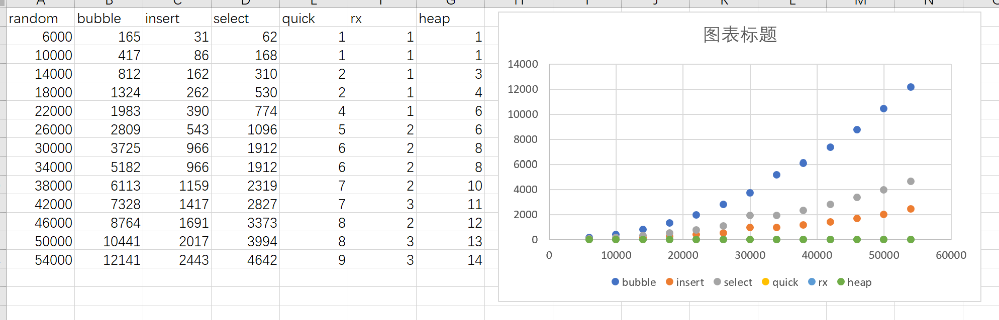

# 第五次实验报告

## 实验题目

要求采用三种不同的初始数据测试：1、基本无序。2、递增。3、递减。

测试比较各种排序算法。测试数据一般在5000-10000之间，以保证测试时间足够大，测试每种算法的执行时间并对结果进行分析。

## 实验过程

1. 使用生成器生成三种序列。
2. 应用各种算法，并使用`clock`进行时间分析。

## 效果截图

```
test size:6000
     *random   asc  desc
bubble   165    92   116
insert    31     6    59
select    62    60    59
 quick     1     2     1
    rx     1     0     0
  heap     1     1     1

test size:10000
     *random   asc  desc
bubble   417   280   368
insert    86    11   154
select   168   161   156
 quick     1     3     2
    rx     0     0     0
  heap     3     2     1

test size:14000
     *random   asc  desc
bubble   812   468   625
insert   162    19   298
select   310   308   302
 quick     2     5     3
    rx     1     1     1
  heap     3     3     3

test size:18000
     *random   asc  desc
bubble  1324   768  1017
insert   262    33   489
select   530   516   510
 quick     2     7     4
    rx     1     2     1
  heap     4     4     4

test size:22000
     *random   asc  desc
bubble  1983  1136  1523
insert   390    48   728
select   774   766   767
 quick     4     9     4
    rx     1     1     2
  heap     6     5     4

test size:26000
     *random   asc  desc
bubble  2809  1593  2124
insert   543    69  1010
select  1096  1068  1069
 quick     5    12     5
    rx     2     2     1
  heap     6     5     5

test size:30000
     *random   asc  desc
bubble  3725  2116  2822
insert   720    90  1344
select  1437  1420  1451
 quick     5    10     7
    rx     1     2     2
  heap     8     7     6

test size:34000
     *random   asc  desc
bubble  5182  2777  3884
insert   966   118  1830
select  1912  1860  1888
 quick     6    16     6
    rx     2     2     2
  heap     8     8     7

test size:38000
     *random   asc  desc
bubble  6113  3425  4562
insert  1159   145  2169
select  2319  2275  2333
 quick     7    17     8
    rx     2     2     2
  heap    10     9     8

test size:42000
     *random   asc  desc
bubble  7328  4156  5575
insert  1417   179  2653
select  2827  2763  2795
 quick     7    18    14
    rx     3     3     3
  heap    11     9     9

test size:46000
     *random   asc  desc
bubble  8764  4986  6678
insert  1691   207  3184
select  3373  3307  3352
 quick     8    17     9
    rx     2     3     3
  heap    12    10    10

test size:50000
     *random   asc  desc
bubble 10441  5901  7899
insert  2017   253  3819
select  3994  3932  3991
 quick     8    23    10
    rx     3     3     3
  heap    13    11    10

test size:54000
     *random   asc  desc
bubble 12141  6882  9428
insert  2443   291  4383
select  4642  4580  4603
 quick     9    23    15
    rx     3     3     3
  heap    14    12    11
```



如图分析，`冒牌排序`，`插入排序`，`选择排序`都比较满，且呈现明显的$O(n^2)$的指数上升的趋势。

## 代码

main.cpp

```cpp
#include <iostream>
#include <ctime>
#include <sys/utime.h>
#include "sorthelper.h"
#include "msort.h"

using namespace std;
int main() {
    for(int i = 6000; i < 55000; i+= 4000){
        test_a_size(i);
        cout << endl;
    }
}
```

sorthelper.h

```cpp
//
// Created by cht on 2019/12/18.
//
#pragma once
#include <random>
#include <ctime>
#include "msort.h"
#include <iostream>
#include <iomanip>

using namespace std;
enum class sort_type{
    bubble,
    insert,
    select,
    quick,
    rx,
    heap
};

using namespace std;

default_random_engine  e;

int rand_int(int start, int end){
    uniform_int_distribution<unsigned> u(start, end -1);
    return u(e);
}

void build_data(int* a,int length, int way){
    //int length = 200;
    int max_n = 10000;
    if(way == 0){ //random generate
        for(int i = 0; i < length; ++i){
            a[i] = rand_int(0,max_n);
        }
    } else {
        double step = max_n / (double)length;
        if(way == 1){
            for(int i = 0; i < length; ++i){
                a[i] = (int)( i * step);
            }
        } else {
            for(int i = 0; i < length; ++i){
                a[i] = (int)( (length - 1 - i) * step);
            }
        }
        int swap_count = length / 20;
        for(int i = 0; i< swap_count; ++i){
            int swap_i = rand_int(0, length);
            int swap_j = rand_int(0, length);
            swap(a[swap_i], a[swap_j]);
        }
    }
}

long test_sort(int* a ,int length, sort_type type){
    clock_t start = clock();
    if(type == sort_type::bubble){
        m_bubble_sort(a, a + length);
    } else if(type == sort_type::select){
        m_select_sort(a, a + length);
    } else if(type == sort_type::insert){
        m_insert_sort(a, a + length);
    } else if(type == sort_type::quick){
        m_quick_sort(a, a + length);
    } else if(type == sort_type::rx){
        m_rx_sort(a, a + length, 4);
    } else {
        m_heap_sort(a, a + length);
    }
    clock_t end = clock();
    return end-start;
}

void test_a_size(int size){
    int column_size = 6;
    cout << "test size:" << size << endl;

    cout << setw(column_size) << "*" << setw(column_size) << "random"
        << setw(column_size) << "asc" << setw(column_size) << "desc" << endl;

    sort_type st[] = {sort_type::bubble, sort_type::insert, sort_type::select,
                      sort_type::quick, sort_type::rx, sort_type::heap};
    string sn[] = {"bubble","insert","select","quick","rx","heap"};

    for(int i = 0; i < 6; i++){
        int* random_data = new int[size];
        int* asc_data = new int[size];
        int* des_data = new int[size];
        build_data(random_data, size, 0);
        build_data(asc_data, size, 1);
        build_data(des_data, size, 2);

        cout << setw(column_size) << sn[i];
        cout << setw(column_size) << test_sort(random_data, size, st[i]);
        cout << setw(column_size) << test_sort(asc_data, size, st[i]);
        cout << setw(column_size) << test_sort(des_data, size, st[i]);
        cout << endl;

        delete[] random_data;
        delete[] asc_data;
        delete[] des_data;
    }

}
```

msort.h
```cpp
//
// Created by cht on 2019/12/18.
//
#pragma once

void m_swap(int* first, int* second){
    int temp = *first;
    *first = *second;
    *second = temp;
}

bool compare(int first, int second, int direction = 0){
    if(direction >= 0 && first > second)
        return true;
    if(direction < 0 && first < second)
        return true;
    return false;
}

void m_bubble_sort(int* start, int* end, int direction = 0){
    for(int* pi = start; pi < end - 1 ; ++pi){
        for(int* pj = end - 1; pj > pi; --pj){
            if(compare(*(pj - 1),*pj, direction))
                m_swap(pj - 1, pj);
        }
    }
}

void m_select_sort(int* start, int* end, int direction = 0){
    for(int* pi = start; pi < end - 1; ++pi){
        int* temp = pi;
        for(int* pj = pi + 1; pj < end; ++pj){
            if(compare(*temp, *pj))
                temp = pj;
        }
        m_swap(pi, temp);
    }
}

void m_insert_sort(int* start, int* end, int direction = 0){

    for(int* pi = start + 1; pi < end; ++pi){
        int temp = *pi;
        int* pj = pi;
        for(pj = pi; pj >= start; pj--){
            if(compare (*(pj-1), temp) )
                *pj = *(pj-1);
            else
                break;
        }
        *(pj) = temp;
    }
}

int* quick_v(int* start, int* end, int direction = 0){
    int temp = *start;
    while(start < end){
        while(start < end && !compare(temp,*end)){
            end--;
        }
        *start = *end;
        while(start < end && !compare(*start, temp)){
            start++;
        }
        *end = *start;
    }
    *start = temp;
    return start;
}

void _m_quick_sort(int* start, int* end, int direction = 0){
    if(start < end){
        int* middle = quick_v(start, end, direction);
        _m_quick_sort(start, middle-1 ,direction);
        _m_quick_sort(middle+1, end, direction);
    }
}

void m_quick_sort(int* start, int* end, int direction = 0){
    _m_quick_sort(start, end-1);
}

void adjust_heap(int* a, int node, int size){
    int left = 2*node + 1;
    int right = 2*node +2;
    int max = node;
    if(left < size && a[left] > a[max])
        max = left;
    if(right < size && a[right] > a[max])
        max = right;
    if(max != node){
        m_swap(a+max,a+node);
        adjust_heap(a, max, size);
    }
}

void m_heap_sort(int* start, int* end, int direction = 0){
    int len = end - start;
    for(int i = len/2 - 1; i >= 0; --i)
        adjust_heap(start, i, len);
    for(int i = len-1; i >= 0; --i){
        m_swap(start, start+i);
        adjust_heap(start, 0, i);
    }
}

void m_rx_sort(int* start, int* end, int d){
    int k = 10;
    int length = end - start;
    int* counts = new int[k];
    int* temp = new int[length];
    int index;
    int pval = 1;
    for(int i = 0 ;i < d; i++){
        for (int j = 0; j < k; ++j)
            counts[j] = 0;
        for(int*p = start; p < end; ++p){
            index = (*p / pval) % k;
            counts[index]++;
        }
        for(int j = 1; j < k;++j){
            counts[j] += counts[j-1];
        }
        for(int*p = end-1; p >= start;--p){
            index = (*p / pval) % k;
            temp[counts[index] - 1] = *p;
            counts[index]--;
        }

        for(int *p =start; p < end; ++p) {
            *p = temp[p - start];
        }
        pval*= k;
    }
    delete[] counts;
    delete[] temp;
}
```