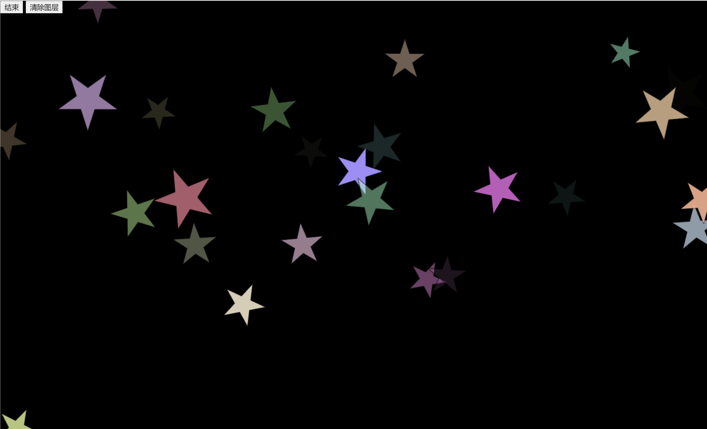
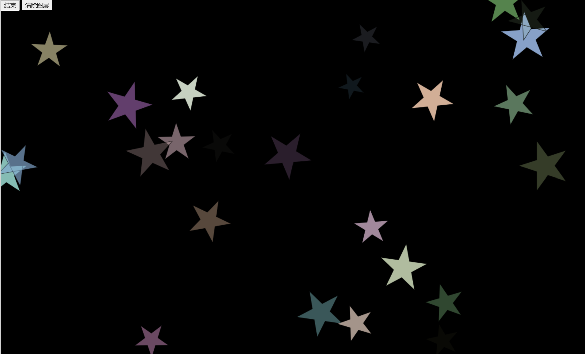

# 游戏程序设计第2次实验

## 实现功能

- [x] 增加随机大小
- [x] 增加随机颜色
- [x] 增加随机数量
- [x] 额外：添加动画的功能
- [x] 额外：窗体大小自适应

## 代码实现

### 窗体自适应

第一版主要用于完成画布大小和窗体大小自适应。这一部分只需要监听window.onResize方法再加document API完成即可。相关代码如下：

index.html

```html
    <!--dynamic resize by star.js-->
    <canvas id="canvasStar" width="600px" height="400px">
        Your browser doesn't support the HTML5 element canvas.
    </canvas>
```

star.js

```js
/**
 * 初始化代码
 */
function init() {
    ...
    window.addEventListener('resize', onWindowResize);
    ...
}

/**
 * 实时调整大小为全屏。
 */
function onWindowResize() {
    starPainter.canvas.setAttribute('width', `${window.innerWidth}px`);
    starPainter.canvas.setAttribute('height', `${window.innerHeight}px`);
    starPainter.doFrame();
}
```

### 精确绘画

第2版主要在画布上画出一个五角星，这里使用到了数学中的知识，使用了正弦和余弦来确定各个顶点的位置。同时使用了`StarProperty`类来表示一个五角星。并使用`StarPaint`类来控制每帧的绘制。

StarPropery（具体依赖的结构类Vector和ColorArgb见js文件）

```js
class StarProperty {
    /**
     * 
     * @param {Vector} position 
     * @param {number} angle 
     * @param {number} radius 
     * @param {ColorArgb} color 
     */
    constructor(
        position,
        angle,
        radius,
        color
    ) {
        this.position = position;
        this.angle = angle;
        this.radius = radius;
        this.color = color;
    }

    /**
     * 星形的位置
     * @type Vector
     */
    position;
    /**
     * 星形的角度
     * @type number
     */
    angle;
    /**
     * 星形的直径
     * @type number
     */
    radius;
    /**
     * @type ColorArgb
     */
    color;
}
```

StarPainter

```js
class StarPainter {
    constructor(canvas) {
        this.canvas = canvas;
        this.canvasContext = canvas.getContext('2d');
        this.collection = [];
    }

    /**
     * @type Element
     */
    canvas;
    /**
     * @type CanvasRenderingContext2D
     */
    canvasContext;
    /**
     * @type Array<StarProperty>
     */
    collection;

    add(property) {
        this.collection.push(property)
        this.doFrame();
    }

    clear() {
        this.canvasContext.clearRect(0, 0, window.innerWidth, window.innerHeight);
    }

    doFrame() {
        this.clear();
        this.collection.forEach(element => {
            this.draw(element);
        });
    }

    /**
     * @param {StarProperty} property 
     */
    draw(property) {
        // 2/5 * pi
        let duration = 4.0 / 5.0 * Math.PI;
        let angle1 = property.angle;
        let context = this.canvasContext;
        context.fillStyle = property.color.getColorStr();
        context.beginPath();
        for(let i = 0; i <= 5; i++) {
            let point = this.getPoint(property, angle1);
            if (i == 0) {
                context.moveTo(point.x, point.y);
            } else if(i < 5)  {
                context.lineTo(point.x, point.y);
            } else {
                let endPoint = this.getPoint(property, property.angle);
                context.lineTo(endPoint.x, endPoint.y);
            }
            angle1 += duration;
        }
        context.stroke();
        context.fill();
    }

    /**
     * 
     * @param {StarProperty} property 
     * @param {number} angle
     */
    getPoint(property, angle) {
        let x = property.position.x + property.radius * Math.sin(angle);
        let y = property.position.y + property.radius * Math.cos(angle);
        return new Vector(x, y);
    }
}
```

### 添加动画功能

由于`StarProperty`只能表示1帧的画面，我们引入了`StarAnimationProperty`来表示动画中的状态，具体代码如下。

```js
class StarAnimationProperty {
    /**
     * 
     * @param {Vector} position 
     * @param {number} angle 
     * @param {number} radius 
     * @param {ColorArgb} baseColor 
     * @param {number} duration 
     */
    constructor(
        position,
        angle,
        radius,
        baseColor,
        duration
    ) {
        this.position = position;
        this.angle = angle;
        this.radius = radius;
        this.baseColor = baseColor;
        this.duration = duration;
        this.tick = 0;
    }

    /**
     * @type Vector
     */
    position;
    /**
     * @type number
     */
    angle;
    /**
     * @type number
     */
    radius;
    /**
     * @type ColorArgb
     */
    baseColor;
    /**
     * @type number
     */
    duration;
    /**
     * @type number
     */
    tick;

    getStarProperty() {
        let alpha = 0;
        if (this.tick <= this.duration / 2) {
            alpha = this.tick * 2 / this.duration;
        } else {
            alpha = 1 - (this.tick - this.duration / 2) * 2 / this.duration;
        }
        let paintColor = new ColorArgb(
            this.baseColor.r,
            this.baseColor.g,
            this.baseColor.b,
            alpha
        )

        return new StarProperty(
            this.position,
            this.angle,
            this.radius,
            paintColor,
        )
    }
}
```

另外，使用了`StarPaint`来控制动画的进程。

```js
class StarControl {
    constructor() {
        this.stoped = true;
        this.global_tick = 0;
        this.collection = [];
    }

    /**
     * 开始动画
     */
    startAnime() {
        if (this.stoped)  {
            this.stoped = false;
            this.handler = window.setInterval(this.timer_each, 50);
        }
        
    }

    /**
     * 停止动画
     */
    stopAnime() {
        if (!this.stoped) {
            this.stoped = true;
            window.clearInterval(this.handler);
        }  
    }

    /**
     * 动画是否停止
     * @type boolean
     */
    stoped;

    /**
     * TimeHander
     * @type number
     */
    handler;

    /**
     * 全局计时
     * @type number
     */
    global_tick;

    /**
     * 集合
     * @type Array<StarAnimationProperty>
     */
    collection;

    /**
     * 100ms触发1次。
     */
    timer_each() {
        // no using <this>, starControl instead.
        //console.log(starControl.global_tick);
        let generateSpan = 4;
        let renderSpan = 1;
        
        if (starControl.global_tick % generateSpan === 0) {
            starControl.generate();
        }

        if (starControl.global_tick % renderSpan === 0) {
            starControl.doFrame();
        }

        starControl.global_tick += 1;
    }

    doFrame() {
        console.log('onFrame')
        this.collection.forEach((value) => {
            value.tick += 1;
        })
        this.collection = this.collection.filter((value, index) => {
            return value.tick < value.duration;
        })
        starPainter.collection = this.collection.map((value) => {
            return value.getStarProperty();
        })
        starPainter.doFrame();
        console.log(starPainter.collection)
    }

    /**
     * 创建一个动画对象
     */
    generate() {
        
        /**
         * 生成一个30到60的随机数
         */
        let radius = Math.random() * 30 + 30;
        let angle = Math.random() * 2 * Math.PI;
        console.log('onGenerate');
        let positionX = Math.random() * window.innerWidth;
        let positionY = Math.random() * window.innerHeight;
        
        let color = ColorArgb.random();

        let starAnimationProperty = new StarAnimationProperty(
            new Vector(positionX, positionY),
            angle,
            radius,
            color,
            100
        )
        this.collection.push(starAnimationProperty);
        console.log(starControl.collection)
        
    }
```

在这里，有4个时间关联的参数。
1. timer计时器的timeout值，表示多少ms触发timer_each方法。目前使用50ms表示1个单位。
2. generateSpan表示生成五角星的间隔时间，目前使用4个单位，即200ms。
3. renderSpan表示重新绘制的间隔，目前使用1个单位，即50ms。（因此动画理论上有20帧，经测量，GPU消耗5%，正常）
4. starAnimationProperty中的duration表示动画持续时间，目前为100个单位，即5000ms。

## 实现效果

由于颜色的rgb随机的值为128~255，因此贴合黑色的背景。



