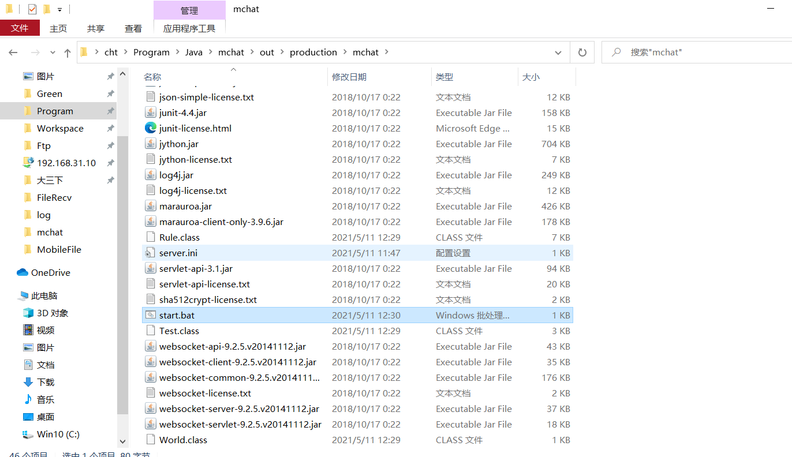
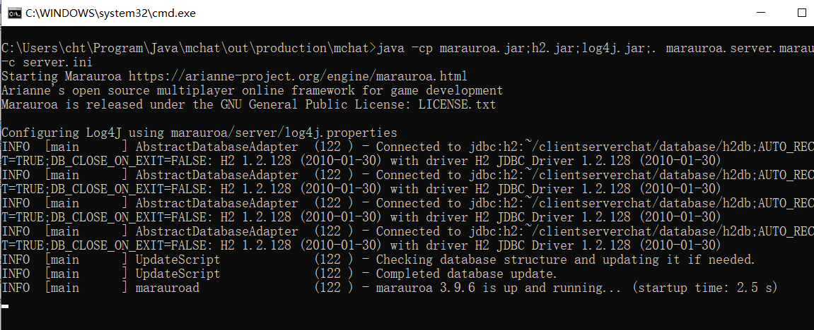
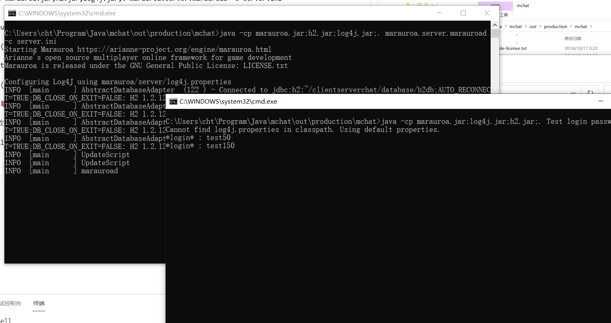

# 实验三 marauroa

## 实验目的

基于Marauroa引擎，开发客户端-服务器结构的聊天程序，注意完成1-3个选做功能。

## 实验步骤

### 服务器

1. 构建Marauroa

首先，创建一个java项目，然后导入marouroa中的两个jar文件以及libs中的文件到libs文件夹。注意，要将marouroa-3.9.6.jar重命名为marouroa.jar文件。

然后编写Rule.java和World.java的代码

之后创建一个server.ini，运行密钥生成代码生成一个密钥如下

```
database_adapter=marauroa.server.db.adapter.H2DatabaseAdapter
jdbc_url=jdbc:h2:~/clientserverchat/database/h2db;AUTO_RECONNECT=TRUE;DB_CLOSE_ON_EXIT=FALSE
jdbc_class=org.h2.Driver

# TCP port
tcp_port=5555

# World and RP configuration. Don't edit.
world=World
ruleprocessor=Rule

turn_length=300
# Encryption key
n = 12463999419646025042364895093029871040332419590084970342569420953274011026976428665201607568223029789676096443506255657889408251953241239386257386764647060908143242138508121959798350364775049905523551710142022697114984473546901293756086477686113691725662514736195805130134932469473172281979129071915732572426407701
e = 15
d = 9140266241073751697734256401555238762910441032728978251217575365734274753116047687814512216696888512429137391904587482452232718099043575549922083627407844660793733725060253767778523703453702676772734667742068831108786610613097846428677992651330211890869403152706163299129199625894751554730858958641571993839142123
```

2. 创建start.bat文件，内容如下

```
java -cp marauroa.jar;h2.jar;log4j.jar;. marauroa.server.marauroad -c server.ini
```

3. 进行Build Project，得到下列的结果。



4. 运行start.bat，得到下列的结果



### 客户端

1. 按照教程写好Client.java以及Test.java类

2. 创建client.bat文件，内容如下

```
java -cp marauroa.jar;log4j.jar;h2.jar;. Test login password
```



### Swing客户端