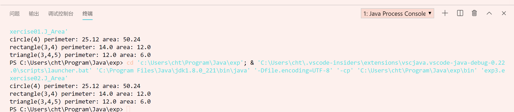

# 实验报告03

## 实验题目

- 1.2.3. 理解动态多态性的概念，接口和抽象类的使用方法。

4. 使用接口实现动态多态性

5. 使用抽象类实现动态多态性

## 实验过程

4. 使用接口实现动态多态性

> 代码请见`code\src\exp3\exercise01`

5. 使用抽象类实现动态多样性

> 代码请见`code\src\exp3\exercise02`

### J_Area类的代码

```java
package exp3.exercise01;

public class J_Area{
    public static void main(String[] args){
        J_Shape shape;
        String templateString = "%s perimeter: %s area: %s";
        shape = new J_Circle(4);
        System.out.println(String.format(templateString, "circle(4)", shape.getPerimeter(), shape.getArea()));
        shape = new J_Rectange(3,4);
        System.out.println(String.format(templateString, "rectangle(3,4)", shape.getPerimeter(), shape.getArea()));
        shape = new J_Triangle(3,4,5);
        System.out.println(String.format(templateString, "triangle(3,4,5)", shape.getPerimeter(), shape.getArea()));
    }
}
```

使用了模板字符串

### 实验运行结果



