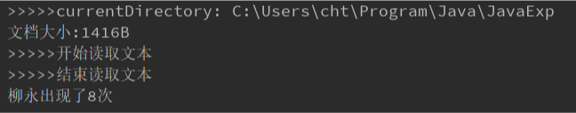
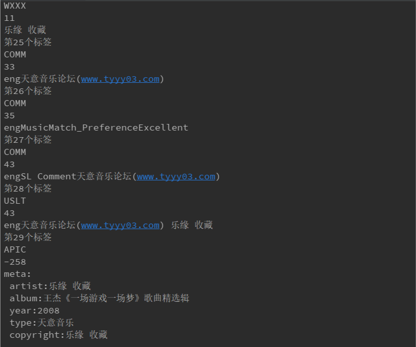

# 第6次实验报告

## 实验题目

1. 统计文本的各种信息，以及替换操作。
2. 通过二进制读取获得mp3的元数据

## 实验过程

通过此次实验熟悉使用了InputStream,InputStreamReader,BufferedStreamReader,RandomAccessFile等与IO操作有关的类。

### 1



### 2

首先通过互联网学习的方式了解了每个字段的意义以及结构。

在实验过程中遇到了几个问题，第一个是编码的问题，在使用gbk作为编码后得到解决，第二个是出现-258size的问题，至今这个bug找不出来。但由于前面关键数据已经读取出来，因此就不排查了。

中间数据结果

```java
3
68392
第1个标签
TPE1
10
 乐缘 收藏
第2个标签
TALB
33
 王杰《一场游戏一场梦》歌曲精选辑
第3个标签
TYER
5
 2008
第4个标签
TCON
9
 天意音乐
第5个标签
TCOP
10
 乐缘 收藏
第6个标签
TOPE
5
 王杰
第7个标签
TCOM
5
 王杰
第8个标签
TORY
5
 2008
第9个标签
TIT3
33
 王杰《一场游戏一场梦》歌曲精选辑
第10个标签
TENC
10
 乐缘 收藏
第11个标签
TPE2
33
 王杰《一场游戏一场梦》歌曲精选辑
第12个标签
TPE3
10
 乐缘 收藏
第13个标签
TEXT
10
 乐缘 收藏
第14个标签
TOLY
10
 乐缘 收藏
第15个标签
TRSN
29
 天意音乐论坛(www.tyyy03.com)
第16个标签
TPUB
10
 乐缘 收藏
第17个标签
TIT2
30
 015.王傑 - 一場遊戲一場夢(國)
第18个标签
TRCK
3
 15
第19个标签
WOAF
28
天意音乐论坛(www.tyyy03.com)
第20个标签
WOAR
28
天意音乐论坛(www.tyyy03.com)
第21个标签
WOAS
28
天意音乐论坛(www.tyyy03.com)
第22个标签
WORS
28
天意音乐论坛(www.tyyy03.com)
第23个标签
WCOM
28
天意音乐论坛(www.tyyy03.com)
第24个标签
WXXX
11
  乐缘 收藏
第25个标签
COMM
33
 eng 天意音乐论坛(www.tyyy03.com)
第26个标签
COMM
35
 engMusicMatch_Preference Excellent
第27个标签
COMM
43
 engSL Comment 天意音乐论坛(www.tyyy03.com)
第28个标签
USLT
43
 eng 天意音乐论坛(www.tyyy03.com) 乐缘 收藏
第29个标签
APIC
-258
Exception in thread "main" java.lang.NegativeArraySizeException
	at exp6.Mp3Meta.readMp3(Mp3Meta.java:75)
	at exp6.Mp3MetaReader.main(Mp3MetaReader.java:10)

Process finished with exit code 1
```

实验截图

