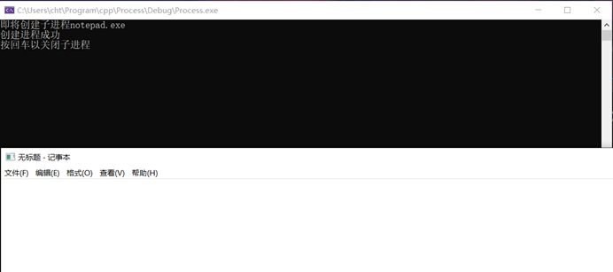
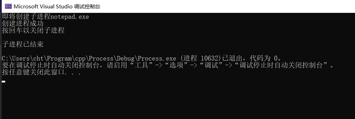
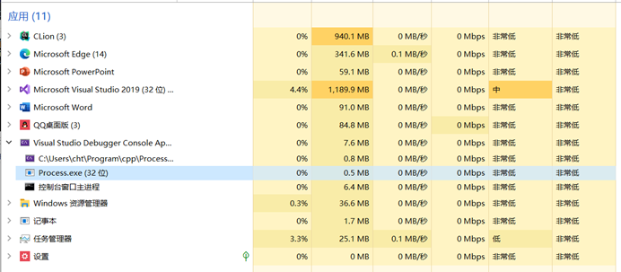

# 操作系统实验一 进程控制与描述

## 实验目的

利用Windows提供的API函数，编写程序，实现进程的创建和终止（如创建写字板进程及终止该进程），加深对操作系统进程概念的理解，观察操作系统进程运行的动态性能，获得包含多进程的应用程序编程经验。

## 实验内容

进程的创建和终止。编写一段程序，可以创建一个进程，并终止当前的进程。试观察记录程序执行的结果，并分析原因。

## 实验步骤

### 编写程序

编写一段程序，这段程序将会打开notepad.exe，并在用户敲击空格后终止该程序。

### 调试和运行

## 实验结果

如图1和图2所示，回车之后，调用TerminateThread和TerminateProcess会使得记事本的进程结束，此时将不会弹出保存确认框，由此可以推断出调用该方法将会强制终止进程。
需要注意的是，这里的lpApplicationName参数是一个宽字符类，进程常量的声明时，需要使用L作为前缀，这是因为在C++中，char占八位，而宽字符是占16位的，使用宽字符的拷贝，连接操作时，需要使用到wcs开头的方法。

系统创建新进程时，会执行系统调用，在Windows下使用CreateProcess执行系统调用时，控制权会转移到系统内核，并由系统服务创建新进程，这时，我们会发现，直接关闭我们编写的程序并不会导致notepad.exe关闭。
可执行文件在进行加载时，需要先分配一段内存空间以及PCB（在Windows接口中以Handle的形式存在），由于Handle就是进程的标识，因此获得标识的一方可以终止该进程，需要注意的是，如果需要获取其他进程的Handle，需要额外的权限（管理员权限），否则，系统将会拒绝该系统调用。
