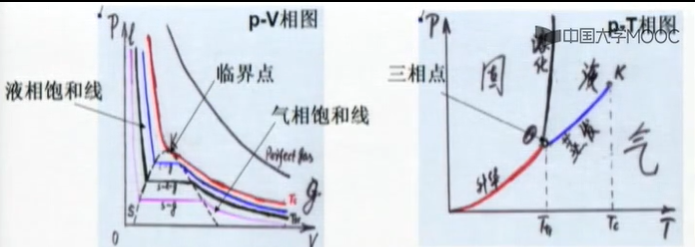

# 热力学 第一章

## 一、热学的基本假设与研究方法

什么是热运动，**热运动的微观本质**。热运动的规律，**唯象规律，第一原理推导**

核心：物质的状态方程，热力学第一、第二定律

### 系统的概念

把物体的某一部分或者空间某一确定的区域从事物中分割出来加以研究，这个对象叫做“系统”。分为*孤立系统*，*绝热系统*，*开放系统*。

### **统计方法**

统计方法是处理多粒子系统的最有效的定量方法。

### 理想化方法

抽象是科学家研究的基本方法。

### 演绎的方法

从基本概念出发，用数学、物理进行演绎。

### 基本假设

宏观：状态方程、物理学第零、第一、第二、第三定律。

微观：原子分子说，微观状态各态历经，独立子系统微观状态等几率分布。

宏观与微观的关系：宏观量是微观量的统计平均。

## 状态参量与平衡态

### 热运动的本质

建立微观无需运动和宏观确定性的关系

### 热力学第二定律

宏观：熵：热温比，物理意义：**能量转移的不对称性**

微观：系统无序的度量。物理意义：**时间反演破坏**。

### 热力学系统

在给定范围内**由大量微观粒子组成的体系**

#### 分类

系统与外界的关系：开放系，封闭系，绝热系，孤立系。

系统的组成成分：单元系，多元系。

系统的均匀性：单相系，复相系。

### 广延量、强度量

### 平衡态

在没有外界影响的条件下，系统的各个部分的宏观性质在长时间内不发生任何变化的状态。

### 非平衡态

### 稳定态

在外界干扰下，宏观性质长期不变的状态。

**对于热平衡状态，只有在系统处于平衡态的条件下，状态参量才有确定的数值和意义。**

### **弛豫时间**

由初始状态到平衡态经历时间，当系统趋向稳定态的时间远小于状态变化的时间时，可以近似地将系统视为稳定态。

## 二、温度

### 温度的概念

直观定义：标记物体冷热程度的物理量。两个处于热平衡的物体冷热程度是相同的，它们的温度也是相同的。

特点：（1）温度是热物理学中特有的物理量。（2）温度是状态参量（3）温度的高低表示热的程度（强度量），不是热的数量。

本质：**温度是组成物体的大量分子无规则运动剧烈程度的表现。**

### 查理定律

$p=p_0(1+\alpha_pt)$ 其中t为摄氏温度。$\alpha_p\approx1/273.16$

定义温标$\Theta=t_{cs}+1/\alpha_p=273.15+1/\alpha_p$

定体温标

$$\Theta_V(p)=1/\alpha_p \times\lim_{p_0\rightarrow0}(P/P_{tr})$$

### 盖·吕萨克定律

$V=V_0(1+\alpha_V{t})$其中t为摄氏温度。$\alpha_V\approx1/273.16$

定义温标 $\Theta=t_{cs}+1/\alpha_V$

定压温标 $$T_p(V)=1/\alpha_V\lim_{p_0\rightarrow0}(\frac{V}{V_{tr}})$$

> **不同的物质会对测量出的温度产生影响，因此需要气体无限稀薄。**

### 热力学第零定律

**如果两个热力学系统中的每一个都与第三个热力学系统处于热平衡，则它们彼此也必定处于热平衡。**

### 温标：温度的数值表示法

（1）测温物质：根据热力学第零定律，可以选定作为标准的第三个物体作为测温物质。

（2）测温属性：选定测温物质的某物理量作为测量温度的属性。

（3）固定标准点：规定标准点的状态及其温度值。

### 理想气体温标

理想气体：分子有质量无体积，分子间无作用力的体系为理想体系。**理想气体的性质与物质无关。**（微观：分子有质量无体积，分子间无作用力）

### 热力学温标

建立在热力学第二定律基础上的，不依赖于任何物质的具体测温属性的温标。

### 常用的温标

摄氏：一个大气压下，水在固-液相变点（冰点）的温度为0摄氏度，水在气-液相变点（气点）的温度为100摄氏度。

华氏：32-212
# 三、状态方程

> 状态方程是非常重要的一节课。

一个热力学系统达到热力学平衡时，其状态参量之间满足的一定函数关系，称为该热力学系统的状态方程。（简称物态方程）

### 经验体系

查理定律：若保持气体体积不变，则气体温度与压强之间有确定的函数关系T=T(p;V)

盖。吕萨克定律：若保持气体压力不变，则气体温度与体积之间有确定的函数关系。T=T(V;p)

波义耳定律：若保持气体温度不变，则气体压强与体积之间有确定的函数关系。p=p(V;T)

对于一个没有外立场作用的单元均匀系统，气体的状态方程可以写成f(T,p,V)=0（只有两个独立参量）

### 理想气体

理想气体：分子有质量无体积，分子间无作用力为理想体系。理想气体的性质与物质无关。

### 三相图

重要

### 理想气体状态方程

$$ pV_{m}=RT $$

$$V=\upsilon V_m$$

$$R = \lim_{p_0\rightarrow0}(\frac{p_{tr}V_{m,tr}}{273.16}) = 8.3143J/(mol*K) $$

推导过程

在水的三相点有$p_{tr}V_{m,tr}=c(\theta_{tr})$，定体积温度计有$pV_{m,tr}=c(\theta)$

根据查理定律

$$T=273.16(\frac{p}{p_{tr}})_{p_{tr}=0}=273.16(\frac{pV_{m,tr}}{p_{tr}V_{m,tr}})_{p_{tr}=0}=273.16\frac{c(\theta)}{c(\theta_{tr})}$$

$$c(\theta)=\frac{c(\theta_{tr})}{273.16}T=\frac{p_{tr}V_{m,tr}}{273.16}T=RT=pV_m$$

### 道尔顿分压定律

$$ p = \sum p_{i} $$

### **范德瓦尔斯方程**

范德瓦尔斯方程是理想气体向真实气体的推广。对理想气体作了两点修正。微观图像与宏观测量之间的桥梁。

1. 理想气体没有体积。真实气体要占据一定体积，修正$p(V_{m}-b)=RT$

考虑碰撞事件(A->B)，减少的体积为$\frac{3}{4}\pi d^3$，(B->A)和(A->B)为同一个事件，因此总共减少的体积为$\frac{N_A}{2}\cdot\frac{3}{4}\pi d^3=4N_AV_0$

$$b=\frac{1}{2}N_{A}(\frac{4}{3}\pi d^3) = 4N_{A}V_{0}$$

> 这个证明方法并不是很恰当。

2. 理想气体不考虑分子间作用力

考虑分子间作用力（主要是吸引力），碰撞器壁的分子由于受到容器内分子吸引力的影响动量减小，就要引入内压强$\Delta p$

$$p=\frac{RT}{V_m-b}-|\Delta p|$$。

内压力正比于碰撞器壁的粒子数$N'$。

$$|\Delta p|\varpropto N'N \varpropto N^2 \varpropto \rho^2 \varpropto \frac{1}{V_m^2}$$

可以推出

$$(p+\frac{a}{V_m^2})(V_m-b)=RT$$

> 这个方程是后面很多方程的基础

对摩尔质量为$\upsilon$的方程，有

$$(p+\frac{\upsilon^2a}{V^2})(V-\upsilon b)=\upsilon RT$$

可以证明，如果分子间作用力为苏则朗势，则$a=4V_{0}\varepsilon_0N_A^2$

$\psi(r)=-\varepsilon_0(\frac{d}{r})^\delta$

### 范德瓦尔斯方程等温线

$$V_m^3-V_m^2(b+\frac{RT}{p})+V_m\frac{a}{p}-\frac{ab}{p}=0$$

特点：（1）出现气-液相变（2）出现临界点（3）可以从临界点的测量得到a,b

临界点有：

$$(\frac{\partial p}{\partial V_m})_{V_c}=0;(\frac{\partial^2p}{\partial V_m^2})_{V_c}=0$$

$$p=\frac{RT}{V_m-b}-\frac{a}{V_m^2}$$

$$(\frac{\partial p}{\partial V_m})_{V_c}=0 \Longrightarrow \frac{-RT_c}{(V_{mc}-b)^2}+\frac{2a}{V_{mc}^3}=0$$

$$(\frac{\partial^2p}{\partial V_m^2})_{V_c}=0 \Longrightarrow \frac{2RT_c}{(V_{mc}-b)^3}-\frac{6a}{V_{mc}^4}=0$$

解得：

$$V_{mc}=3b,T_c=\frac{8a}{27Rb}$$

带入范式方程：

$$(p+\frac{a}{V_m^2})(V_m-b)=RT \Longrightarrow$$

$$ (p_c+\frac{a}{9b^2})2b=\frac{8a}{27Rb}R \Longrightarrow$$

$$p_c=\frac{a}{27b^2}$$

测量范式方程系数：

$$RT_c=(p_c+3p_c)(V_m-\frac13V_{mc})$$

$$R=\frac83\frac{p_cV_{mc}}{T_c}$$

宏观和微观的关系

$$b=\frac{V_{mc}}3,V_{mc}=\frac38\frac{RT_c}{p_c} \Longrightarrow b=\frac{RT_c}{8p_c}$$

$$p_c=\frac{a}{27b^2}, a=27b^2p_c \Longrightarrow a=\frac{27}{64}\frac{R^2T_c^2}{p_c}$$

由此可以计算气体分子的体积和相互作用力

$$b=4N_AV_0 \space\space a=4V_0\varepsilon_0N_A^2$$

> **范德瓦尔斯方程建立了微观量和宏观量的联系，可以通过宏观测量值估计单个分子的大小和分子间的相互作用力。**

其他展开方式

维利展开:

$$pV=A+Bp+Cp^2+\cdots$$

卡末林-昂奈斯公式

$$pV=A+\frac{B'}{V}+\frac{C'}{V^2}+\cdots$$

### 真实气体温度测量

例题：证明范德瓦尔斯方程满足当$p_0\rightarrow0$时，$\alpha_p$与气体种类无关，并计算$\alpha_p-p_0$斜率。

查理定律：$p=p_0(1+\alpha_p{t})$

范德瓦尔斯方程

$$p=\frac{nRT}{V-nb}-\frac{n^2a}{V^2}$$

以摄氏温标为温度的范德瓦尔斯方程为

$$p=\frac{nR(T_0+t)}{V-nb}-\frac{n^2a}{V^2}$$

$$p=(\frac{T_0nR}{V-nb}-\frac{n^2a}{V^2})(1+\frac{nR}{(V-nb)(\frac{T_0nR}{V-nb}-\frac{n^2a}{V^2})}t)$$

$$\lim_{p_0\rightarrow0}\alpha_p=\frac{1}{T_0}$$

得到

$$p_0=\frac{T_0nR}{V-nb}-\frac{n^2a}{V^2}$$

$$\alpha_p=\frac{R}{T_0R-\frac{na(V-nb)}{V^2}}$$

设$V\gg nb$，则$V-nb\approx V$

$$p_0=\frac{T_0nR}{V}-\frac{n^2a}{V^2}$$

$$\alpha_p=\frac{R}{T_0R-\frac{na}{V}}\Longrightarrow n=\frac{VR}{a}(T_0-\frac{1}{\alpha_p})$$

带入第一个式子，得到

$$p_0=\frac{T_0R^2}{a}(T_0-\frac{1}{\alpha_p})-\frac{R^2}{a}(T_0-\frac{1}{\alpha_p})^2$$

得出

$$\frac{\partial\alpha_p}{\partial p_0}|_{\alpha_p={1}/{T_0}}=\frac{a}{T_0^3R^2}$$

> **理论计算得出$\alpha_p-p_0$的斜率应该是正的，这与实际情况不符合。**

## 状态方程的应用

体膨胀系数或等压膨胀系数

$$\alpha=\frac{1}{V}(\frac{\partial V}{\partial T})_p$$

等体压强系数

$$\beta=\frac{1}{p}(\frac{\partial p}{\partial T})_V$$

等温压缩系数

$$\kappa=-\frac{1}{V}(\frac{\partial V}{\partial p})_T$$

三个系数并不独立，利用状态方程的概念（偏微分之间的关系），可以得到三者的关系

$$\alpha=\kappa\beta p$$

对于理想气体$pV_m=RT$

有e

$$\alpha=\frac{1}{T}; \beta=\frac{1}{T};\kappa=\frac{1}{p}$$

## 理想气体的微观图像

### 物质的微观结构

> 压强和平均动能以及温度成正比，从而建立温度与微观的关系。

**原子分子学说**。所有“物质”都有“分子、原子”组成，它们的线性尺度~0.1nm

**无序运动**。物质分子处于不停顿的无规则运动状态。**不停顿**：单个分子动量不为0；**无规则**：整体质心动量为0.布朗运动是布朗粒子在其周围分子无规律撞击下所作的无规则跳动。

### 分子之间存在相互作用力

固体、液体很难压缩——分子之间存在排斥力（量子力学解释自旋相关）

气体冷却或压缩可以形成液体——分子之间存在吸引力（库仑力、范德瓦尔斯力）

**分子之间的作用力只与分子的位置有关——位势**

$$\vec{F}=\frac{d\vec{p}}{dt}=-\nabla\varphi$$

定义$\varphi(r\rightarrow\infty)=0$

$$\varphi(r)=\int_r^{\infty}\vec{F}\cdot d\vec{r}$$

#### 常见的分子之间的相互作用的形式

钢球势：

苏则朗势：

林纳德——琼斯势：

$$\varphi(r)=4\varepsilon_0\lfloor(\frac{d}{r})^{12}-(\frac{d}{r})^6\rfloor$$

一般情况

$$\varphi(r)=\frac{\lambda}{r^s}-\frac{\mu}{r^t}\quad s\in[9,15],t\in[4,7]$$

### 理想气体的微观模型

基本假设

1. 理想气体由**大量**运动的微观粒子组成。每个粒子都是**质量**为m的质点，它的行为**服从牛顿运动定律**。

质点

在标准情况下

$$\frac{\overline{L}}{\overline{r}}\approx 30$$

2. 粒子间**无相互作用**。粒子只与容器发生碰撞，所有碰撞都是**弹性碰撞**。

3. 组成理想气体的粒子的运动完全无序，各向同性的。完全无序体系无宏观运动。

推论：**细致平衡原理**（根据完全无序的假设）

达到平衡态的气体中能实现的任一正向的元过程，必定有一逆元过程与相平衡。

严格意义上，**第三条与第二条矛盾**。在实际中无分子间碰撞不可能达到系统的各向同性。但对于稀薄气体，分子间碰撞的体积效应对平衡态的影响可以忽略不计。

### 理想气体的压强公式

压强：单位时间内作用在单位面积上的冲量的平均值

冲量：动量的改变量，传递的动量（流）。$m(\overrightarrow v'-\overrightarrow v)=\overrightarrow F \Delta t$

$$dI(v_{ix})=2mv_{ix}*n(v_i)v_{ix}\Delta t \Delta S$$

由于各向同性原理，因此$v_{ix}>0$的概率为$\frac{1}{2}$

$$dI=\sum_{v_{ix}>0}(dI(v_i))=2mv_{ix}*n(v_i)v_{ix}
dtdS$$

$$dI=\sum_{v_{ix}}mn(v_i)v_{ix}^2dtdS$$

$$\overline{v_x^2}=\overline{v_y^2}=\overline{v_z^2}=\frac{1}{3}\overline{v^2}$$

$$p=\frac{\overline{dI}}{dtdS}=mn\overline{v_x^2}=\frac13mn\overline{v^2}=\frac23n\overline{E}$$

对于非理想气体，系统压强既和分子平均动能有关，也和分子平均势能有关。由于分子势能形式与物质有关，所以**没有普适性公式**。

### 温度的统计意义与微观本质

理想气体状态方程：$pV=\nu RT$

记$R=N_Ak_B;k_B=1.38066\times10^{-23}J/K$

$$k_B为玻尔兹曼常数。$$

$$p=(\frac{\nu N_A}{V})k_BT=nk_BT=\frac{2}{3}n\overline{E} \Longrightarrow \overline{E}=\frac32k_BT$$

**理想气体的温度正比于组成系统的微观粒子无规则运动的平均动能。**

### 理想气体的传热过程

考虑两个粒子$m_1,m_2$对心碰撞，碰撞后两粒子的速度变化为：

$$v_{1x}\rightarrow v_{1x}';v_{2x}\rightarrow v_{2x}'$$

动量守恒：

$$m_1v_{1x}-m_2v_{2x}=m_1v_{1x}'-m_2v_{2x}'$$

能量守恒

$$\frac12m_1v_{1x}^{2}+\frac12m_2v_{2x}^{2}=\frac12m_1v_{1x}^{'2}+\frac12m_2v_{2x}^{'2}$$

得到

$$v_{1x}+v_{2x}=v_{1x}'+v_{2x}'$$

解得

$$v_{1x}'=\frac{2m_2v_{2x}+(m_2-m_1)v_{1x}}{m_1+m_2};v_{2x}'=\frac{2m_1v_{1x}+(m_1-m_2)v_{2x}}{m_1+m_2}$$

取能量转化平均值

$$\overline{\Delta E}=\frac{2m_1m_2}{(m_1+m_2)^2}(m_1\overline{v_{1x}^2}-m_2\overline{v_{2x}^2})$$

平均来讲，碰撞将动能大的粒子的能量转移给动能小的粒子。使得原来动能大的粒子能量减小，原来动能小的粒子能量增加。多次碰撞的结果是粒子的平均动能一致，这就是热力学第零定律的微观机制。

