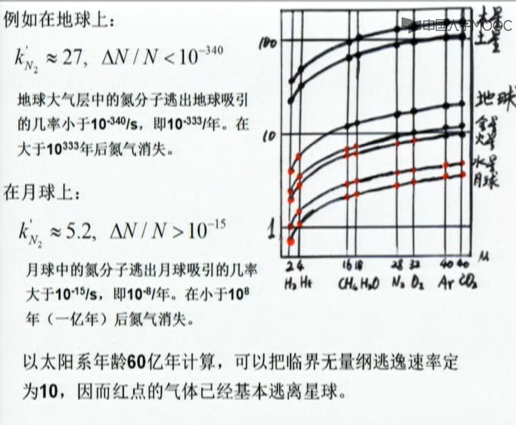

# 热力学 第二章 平衡态系统的统计分布律

## 第一节 无序系统

在完全无序这一假设下得到的关于微观无序系统的一些物理规律，就是平衡态系统的统计规律。

统计规律。微观上千变万化，宏观上有一定数值和规律的现象为统计规律

### 例一、醉鬼问题

> 不为0是因为两个变量并不是独立变量

一个最初站在一个路灯下醉鬼忽然想起来走一走，我们想知道他走了M步后离路灯的距离

$$R^2=(\sum_{i=1}^MX_i)^2+(\sum_{i=1}^MY_i)^2\quad X_i^2+Y_i^2=1$$

$$R^2=\sum_{i=1}^M(X_i^2+Y_i^2)=M\quad R=\sqrt{M}$$

统计性质：计算只能给出醉鬼的平均距离，不能计算出分布

各态历经：如果有一群醉鬼同时开始游动，在$\sqrt{M}$位置上找到醉鬼的数目最多。它与一个醉鬼重复多次游走的结果一致

统计误差：只用平均值不能反映醉鬼的行为。必须在计算中引入计算的不确定性

统计误差的规律：
$$\frac{\delta R}{R}=1/\sqrt{R}$$

### 例二、布朗运动

> 得到布朗运动的扩散速率与平均动能成正比，也就是与温度成正比。

基本图像：粒子受无序驱动力驱动在流体中运动

牛顿定律：

$$m\frac{d^2\overline{r}}{dt^2}=-6\pi a\eta\frac{d\overline{r}}{dt}+\overline{F}(t)$$

$$m\frac{d^2s}{dt^2}=-6\pi \eta\frac{ds}{dt}+F_s(t)$$

条件：$$\overline{F_s(t)}=0,\frac12m\overline{(\frac{ds}{dt})^2}=\frac12m\overline{(\frac{ds_m}{dt})^2}=\frac12k_BT$$

$$\frac{d^2(s^2)}{2dt^2}=\frac{d}{2dt}(\frac{d(s^2)}{dt})=\frac{d}{dt}(s\frac{ds}{dt})=(\frac{ds}{dt})^2+s\frac{d^2s}{dt^2}$$

$$\frac{m}{2}\frac{d^2(\overline{s^2})}{dt^2}-k_BT=-2\pi a\eta\frac{d(\overline{s^2})}{dt}$$

令

$$Z(t)=\frac{d(\overline{s^2})}{dt}\quad \frac{mdZ}{2dt}-k_BT=-3\pi a\eta Z$$

$$Z(t)=\frac{k_BT}{3\pi a\eta}(1-e^{-\frac{6\pi a\eta}{m}t})\approx\frac{k_BT}{3\pi a\eta}$$

$$\overline{s^2}=\frac{k_BT}{2\pi a\eta}t=2Dt，其中D=\frac{k_BT}{6\pi a\eta}为Elnstein扩散系数$$

## 第二节 概率论简介

### 一、事件及其概率

随机事件：随机实验中，对实验可能出现的事件称为事件

概率：在一定条件下，一系列可能发生的事件组合中，发生某一事件的机会和可能性

互补相容事件：$$P(A_i+A_j)=P(A_i)+P(A_j)$$

独立事件：$$P(A_iA_j)=P(A_i)P(A_j)$$

独立相容事件：

$$P(A_i+A_j)=P(A_i)+P(A_j)-P(A_i)P(A_j)$$

例一：生日问题

计算n个朋友同一天生日的概率

24个朋友中至少有两个同生日的概率为54%

### 二、随机变量与分布函数

#### 分立随机变量

随机变量的特征数值

平均值

$$\overline{x}=\sum_iP(x_i)x_i$$

n次矩

$$\overline{\Delta x^n}=\overline{(x-\overline{x})^n}$$

二次矩是随机变量偏离平均值的度量，又叫色散，其平方根为均方差

有意义的统计系统必须要求各次矩有限，各次矩无限的系统是复杂系统

#### 连续随机变量

概率密度函数

$$f(x)=\lim_{\Delta x\rightarrow0}\frac{P(x\rightarrow x+\Delta x)}{\Delta x}=\frac{dP}{dx}$$

均方差：

$$\sigma=\sqrt{\overline{(x-\overline{x})^2}}=\sqrt{\overline{x^2}-\overline{x}^2}$$

$$简单系统：\lim_{N\rightarrow\infty}\sigma=0，复杂系统：\lim_{N\rightarrow\infty}\sigma=\infty$$

#### 一些常见的分布

1. 二项分布

$$P(n_1)=C_{N}^{n_1}p^{n1}q^{N-n_1}$$

性质：

$$涨落即方差的含义，相对涨落是标准差和均值的比值。$$

$$平均值=pN，涨落=Npq，相对涨落=\frac{1}{\sqrt{N}}(\frac{q}{p})^{1/2}$$

##### 二项分布的两个极限形式

当$p\approx q$时，趋于高斯分布

$$f(x)=\frac{1}{\sqrt{2\pi}\sigma}\exp(-\frac{(x-a)^2}{2\sigma^2})$$

当$p\rightarrow0，Np\rightarrow\lambda$时，趋于泊松分布

$$P_\lambda(n_1)=(\frac{\lambda^{n_1}}{n_1!})e^{-\lambda}$$

2. 高斯分布

令$x=\frac{r-\mu}{\sigma}$，高斯分布变为正态分布

$$f(x)=\frac{1}{\sqrt{2\pi}}e^{-\frac{1}{2}x^2}$$

$$P(\sigma)=68\%，P(2\sigma)=95.4\%，P(3\sigma)=99.7\%$$

3. 麦克斯韦分布

径向分布

$$G(r)=\int_0^{2\pi}f(r,\theta)d\theta=\frac{1}{2\pi\sigma^2}\int_0^{2\pi}r\cdot e^{-\frac{r^2}{2\sigma^2}}d\theta=\frac{r}{\sigma^2}e^{-\frac{r^2}{2\sigma^2}}$$

最大概然位置

$$r_p=\sigma$$

平均位置

$$\overline{r}=\sqrt{\frac{\pi}{2}}\sigma$$

方均位置

$$\overline{r^2}=2\sigma^2$$

## 第三节 麦克斯韦分布律

### 速度分布

基本假设：气体分子通过碰撞达到并维持平衡态。此时分子的位置分布和速度分布都不随时间变化。位置分布为平均分布，速度分布为高斯分布。

各向同性：$$f(v_x,v_y,v_z)=f(v_x^2+v_y^2+v_z^2)$$

方向独立：$$f(v_x^2+v_y^2+v_z^2)=g(v_x^2)g(v_y^2)g(v_z^2)$$

推论：$$\frac{\partial\ln f(v^2)}{\partial(v^2)}=\frac{\partial\ln f(v_x^2)}{\partial(v_x^2)}=\frac{\partial\ln f(v_y^2)}{\partial(v_y^2)}=\frac{\partial\ln f(v_z^2)}{\partial(v_z^2)}=-\alpha$$

应用推导高斯分布的过程

$$g(v_i)=\frac{1}{\sqrt{2\pi}\sigma}e^{-\frac12(\frac{v_i-\mu}{\sigma})^2}$$

$$\sigma^2=\overline{v_i^2}-{\overline{v_i}^2}=\frac{2}{m}\cdot\frac12m\overline{v_i^2}=\frac{2}{3m}\overline{E}=\frac{k_BT}{m}$$

$$f(v_x,v_y,v_z)=g(v_x)g(v_y)g(v_z)=(\frac{m}{2\pi k_BT})^{3/2}e^{\frac{-m}{2k_BT}(v_x^2+v_y^2+v_z^2)}$$

性质：

1. $f(\vec{v}=0)有极大值$

2. 随T增大$f(\vec{v})$变化减缓

3. 随m增大$f(\vec{v})$变化加剧

### 速率分布

$$dP(\vec{v})=f(v_x,v_y,v_z)dv_xdv_ydv_z=f(v,\theta,\phi)v^2\sin\theta dvd\theta d\phi$$

$$f(v,\theta,\phi)=(\frac{m}{2\pi k_BT})^{3/2}\exp[\frac{-mv^2}{2 k_BT}]$$

$$f(v)=\int_0^{2\pi}d\phi\int_0^\pi(\frac{m}{2\pi k_BT})^{3/2}\exp[\frac{-mv^2}{2 k_BT}]v^2\sin\theta d\theta$$

$$=4\pi v^2(\frac{m}{2\pi k_BT})^{3/2}\exp[\frac{-mv^2}{2 k_BT}]$$

性质：

1. 温度高时，找到高速率粒子的概率越大。

### 高斯积分

$$g_0=\int_0^\infty e^{-\alpha x^2}dx=\frac{\sqrt{\pi}}{2\sqrt{\alpha}}$$

$$g_1=\int_0^\infty xe^{-\alpha x^2}dx=\frac{1}{2\alpha}$$

$$g_2=\int_0^\infty x^2e^{-\alpha x^2}dx=\frac{\sqrt{\pi}}{4(\alpha)^{3/2}}$$

$$g_3=\int_0^\infty x^3e^{-\alpha x^2}dx=\frac{1}{2\alpha^2}$$

$$g_4=\int_0^\infty x^4e^{-\alpha x^2}dx=\frac{3\sqrt{\pi}}{8(\alpha)^{5/2}}$$

2. 最概然速率

$$v_p=\sqrt{\frac{2k_BT}{m}}$$

3. 平均速率

$$\overline{v}=\sqrt{\frac{8k_BT}{\pi m}}$$

4. 方均速率

$$\overline{v^2}=\frac{3k_BT}{m}$$

5. 方均根速率

$$v_{rms}=\sqrt{\frac{3k_BT}{m}}$$

$$v_{rms}:\overline{v}:v_p=\sqrt{3}:\sqrt{8/\pi}:\sqrt{2}$$

### 麦克斯韦分布律的应用

#### 1.逃逸速度

$$v_{rms}=\sqrt{\overline{v^2}}=\sqrt{\frac{3k_BT}{m}}=\sqrt{\frac{3N_Ak_BT}{M}}=\sqrt{\frac{3RT}{M}}$$

$$\frac12mv_e^2=\frac{GM_um}{R_u}\rightrightarrows v_e=\sqrt{2g_uR_u}$$

$$k=\frac{v_e}{v_{rms}}=\sqrt{\frac{2gmR_u}{3k_BT}}=\sqrt{\frac{2gM_uR_u}{3RT}}$$

在地球上

$$k_{N_2}=22.0，k_{O_2}=23.5，k_{H_2}=5.88$$

用$v_p=\sqrt{2k_BT/m}$做速度单位，引出无量纲速率$u=v/v_p$

$$f(u)du=f(v)dv;f(u)=\frac4{\sqrt{\pi}}u^2e^{-u^2}$$

计算无量纲速率大于$k'$的气体分子比率

$$\frac{\Delta N(u\gt k')}{N}=\int_{k'}^{\infty}f(u)du$$

#### 2. 泻流速率

泻流：对面积dS的小孔，当dS的**线度**小于粒子的**平均自由程**时，粒子束流从小孔dS射出的现象的称为泻流，用$\Gamma$表示

分析，对于速度处于$\vec{v}\sim\vec{v}+d\vec{v}$的粒子，在$dt$时间内碰到器壁$dS$上的粒子数为

$$d\Gamma dtdS=[n(\vec{v})dv_xdv_ydv_z]v_xdtdS=nf(v_x,v_y,v_z)v_xdtdSdv_xdv_ydv_z$$

$$\Gamma dtdS=n\int_0^\infty v_x[\iint_{v_y,v_z}f(v_x,v_y,v_z)dv_ydv_z]dv_xdtdS$$

$$=n\int_0^\infty v_xf(v_x)dv_xdtdS$$

$$f(v_x)=(\frac{m}{2\pi k_BT})^{1/2}e^{-\frac{mv_x^2}{2k_BT}}$$

$$\Gamma=n\sqrt{\frac{m}{2\pi k_BT}}\frac{k_BT}{m}=\frac14n\sqrt{\frac{8k_BT}{\pi m}}=\frac14n\overline{v}$$

在标准情况下

$$n\approx 3\times10^{19}cm^{-3},\overline{v}\approx300m/s,\Gamma\approx2\times10^{23}cm^{-2}s^{-1}$$

> 泻流速度非常快，泻流出去的粒子的平均能量比容器内大。

## 第四节 近独立子系统的最概然分布

