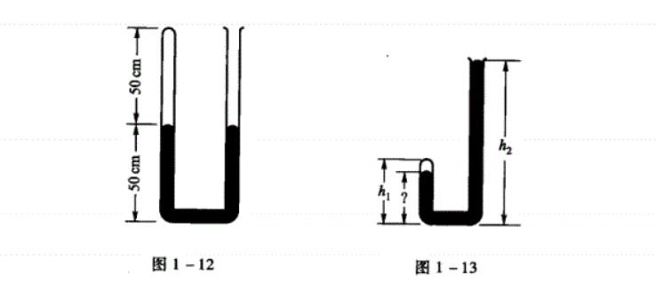
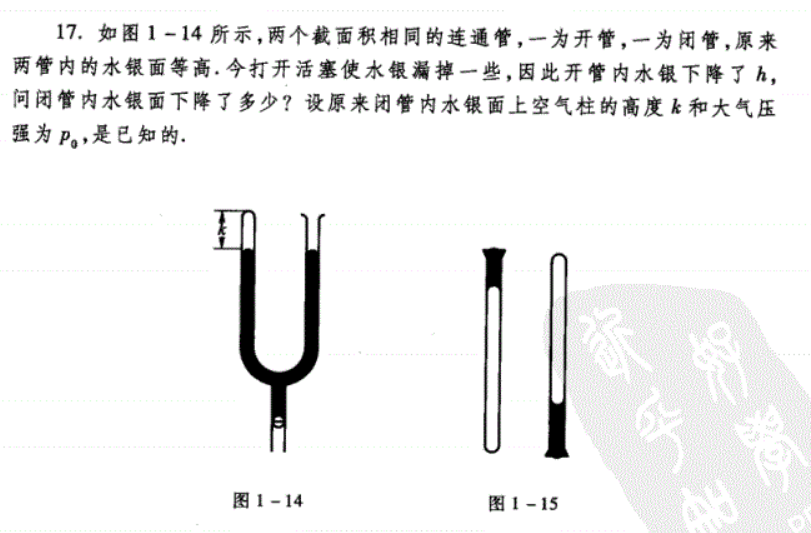

# 热力学 第一章习题

## 1

定容气体温度计的测温泡浸在水的三相管内时，其中气体的压强为$50mmHg$

1. 当温度计测量$300K$的温度时，气体的压强是多少？
2. 当气体的压强为$68mmHg$时，待测温度是多少？

## 2

用定容气体温度计测得冰点的理想气体温度为273.15K，试求温度计内的气体在冰点时的压强与水在三相点时压强之比的极限值。

## 3

当热力学系统处于非平衡态时，温度的概念是否适用？

## 5

在建立温标时，是否必须规定：热的物体具有较高的温度；冷的物体具有较低的温度？是否可作相反的规定

## 7

理想气体温标是否依赖于气体的性质？在实现理想气体温标时，一种气体比其他气体更优越？

## 9

理想气体的状态方程$pV=\nu RT$是根据那些实验定律导出的？这些定律的成立各有什么条件？

## 11

若使下列参量增大一倍，而其他参量保持不变时，则理想气体的压强将如何变化？

1. 温度$T$
2. 体积$v$
3. 物质的量$\nu=\frac{m}{M}$

## 13

盖吕萨克（Gay-Lussac）定律：当一定质量的气体的压强保持不变时，其体积随温度作线性变化：

$$V=V_0(1+\alpha_v t)$$

式中$V$和$V_0$分别表示温度为$t℃$和$0℃$时气体的体积，$\alpha_V$叫做气体的体膨胀系数。

查理定律（Charles）定律：当一定质量气体的体积保持不变时，其压强随温度作线性变化：

$$p=p_0(1+\alpha_p t)$$

式中$p$和$p_0$分别表示温度为$t℃$和$0℃$时气体的压强，$\alpha_p$叫做气体的压强系数

试由理想气体的物态方程推证以上二定律，并求出$\alpha_V$和$\alpha_P$的值。

## 15

1. 自行车的内胎会晒爆
2. 热水瓶的塞子有时会自动跳出来
3. 乒乓球挤瘪后，放在热水里泡一会儿会重新鼓起来。

## 3

用定容气体温度计测量某种物质的沸点，原来测温泡在水的三相点时，其中气体的压强$p_{tr}=500mmHg$；当测温泡浸入待测物质中时，测得的压强值为$p=734mmHg$。当从测温泡中抽出一些气体，使$p_{tr}$减为$200mmHg$时，重新测得$p=293.4mmHg$，当再抽出一些气体使$p_{tr}$减为$100mmHg$时，测得$p=146.68mmHg$，试确定待测沸点的理想气体温度。

## 5

在历史上，对摄氏温标是这样规定的；假设测温属性$X$随温度$t$作线性变化，即

$$t=aX+b$$

并规定冰点为$t=0℃$，汽点为$t=100℃$

设$X_i$和$X_a$分别表示在冰点和汽点时$X$的值，试求上式中的常数$a$和$b$

## 7

设一定容气体温度计是按摄氏温标刻度的，它在冰点和汽点时，其中气体的压强分别为$0.400atm$和$0.546atm$

1. 当气体的压强为$0.100atm$时，待测温度是多少？
2. 当温度计在沸腾的硫中时（硫的沸点是$444.60℃$），气体的压强是多少？

## 9

用$L$表示液体温度计中液柱的长度，定义温标$t^*=a\ln L+b$

式中a、b为常数，规定冰点为$t_i^*=0°$，$t_s^*=100°$。设在冰点时液柱的长度为$L_i=5.0cm$，在汽点时液柱的长度为$L_s=25.0cm$，试求$t*=0°到10°$之间的液柱长度差以及$t^*=90°到t^*=100°$之间液柱的长度差。

## 11

一立方容器，每边长$20cm$，其中贮有$1.0atm，300K$的气体，当把气体加热到$400K$时，容器每个壁所受的压力为多大？

## 13

一氧气瓶的容积是$32L$，其中氧气的压强是$130atm$。规定瓶氧气压强降到$10atm$时就得充气，以免混入其他气体而需洗瓶。今有一玻璃室，每天需用$1.0atm$氧气$400L$，问一瓶氧气能用几天。

## 15

截面积为$1.0cm^2$的粗细均匀的$U$形管，其中贮有水银，高度如图1-12所示。金将左侧的上端封闭将其右侧与真空泵相接，问左侧的水银将下降多少？设空气的温度保持不变，压强$74cmHg$

## 17

## 19

求氧气在压强为$10.0atm$、温度为$27℃$时的密度。

## 21

一打气筒，每打一次气可将原来压强为$p_0=1.0atm$，温度为$t_0=-3.0℃$，体积$V_0=4.0L$的空气压缩到容器内。设容器的容积为$V=1.5\times10^3L$，问需要打几次气，才能使容器内的空气温度为$t=45℃$，压强为$p=2.0atm$

# 第一章习题解答

## 1

使用定体温标公式即可

$$54.9mmHg;371.5K$$

## 2

水的三相点是$273.16K$，根据定体温标公式，比值应该为$273.15/273.16$

## 3

温度处于热平衡系统的状态测量，处于非平衡态的热力学系统温度的数值是不确定的，因此温度的概念并不使用。

## 5

温标的含义是通过宏观可测量的比例关系来建立温度的概念，因此可以通过宏观可测量的关系来任意建立温标，即使温标高的物体更冷。

## 7

理想气体是指系统内的气体分子有质量而无体积，没有相互作用，这种气体在大自然中是不存在的，也因此，理想气体温标不依赖于气体的性质，因此比其他气体温标更加优越，因为温度不和气体的性质产生关联。

## 9

$pV=\nu RT$中，有三个关系，其中

1. 查理定律揭示了在体积不变的情况下，气压和温度成正比。
2. 盖吕萨克定律解释了在气压不变的情况下，体积和温度成正比。
3. 波义耳定律解释了在等温的条件下，压强和体积成反比。

由三个定律揭示的规律出发，总结出了理想气体的状态方程

## 11

$pV=\nu RT$

1. 当温度增加一倍时，压强增加一倍。
2. 当体积增加一倍时，压强减半。
3. 当物质的量增加一倍时，压强增加一倍。

## 13

$$pV=\nu RT=\nu R(T_0+t)$$

1. 盖吕萨克定律

有物态方程可得

$$pV_0=\nu RT_0;pV=\nu R(T_0+t)$$

两式相除，得

$$\frac{V}{V_0}=\frac{T_0+t}{T_0}=1+\frac{1}{T_0}t，其中T_0是水的三相点的温度$$

对比可以知道$\alpha_V=\frac{1}{T_0}=1/273.16$

同理可以求出$\alpha_p=1/273.16$

## 15

$pV=\nu RT$

1. 体积不变，温度上升，压强上升
2. 体积不变，温度上升（热水会加热睡眠到塞子间的空气），压强上升
3. 体积不变，温度上升，压强上升

## 3

考察的要点

> 当气体不满足无限稀薄时，温标不是理想气体的温标，此温标和气体的压强成一阶线性的关系

答案是$400.57K$

## 5

## 7

首先算出$t=aX+b$中的系数。可以得出$a=684.93;b=-273.97$

(1)：代入得到$t=684.93*0.100-273.97=-205.48℃$

(2)：代入得到$444.60=684.93*X-273.97$，解方程得到$X=1.107atm$

## 9

$t*=a\ln L+b$，代入，求出$a=100/\ln 5,b=-100$

$代入t_a^*=10，得到L_a=5^{1.1}；代入t_b^*=90，得到L_b=5^{1.9}$

$因此L_a-L_i=5^{1.1}-5=0.87cm；L_s-L_b=25-5^{1.9}=3.72cm$

## 11

> 该答案等待进一步的验证

根据$pV=nRT$，得到$p'=4/3p_0=4/3atm$

$F'=p'S=4/3atm*400cm^2=1.01*10^5Pa\times4*10^{-4}m^2=40.4N$

## 13

使用$pV=nRT$计算即可，答案是$9.6天$

## 15

$21.77cm$

解题过程

$pV=nRT$

设下降$xcm$，

$$\frac{p_1}{p_0}=\frac{V_0}{V_1}=\frac{50}{50+x}，其中p_1是下降后的压强，p_0=75cmHg$$

右侧与真空泵连接后，满足等式：

$$p_1+50-x=50+x$$

解得的结果即答案。

## 17

$pV=nRT$

得到

$$\frac{p_1}{p_0}=\frac{V_0}{V_1}=\frac{k}{k+x}$$

满足等式

$$\frac{k}{k+x}p_0+h-x=p_0（x<h）$$

所得的解即答案。

## 19

$$pV=nRT=\frac{m}{M}RT$$

$$\rho=\frac{m}{V}=\frac{MpV}{RTV}=\frac{Mp}{RT}$$

查书可知$R=8.3142J/(mol*K)$

代入

$$\rho=\frac{32*10*1.01*10^5}{8.3142*(273.16+27)}=12950.84kg/m^3$$

## 21

气体在打的过程中物质的量保持不变，以此为中心计算即可。

计算出的答案是637次